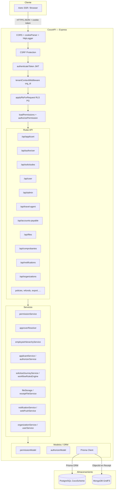
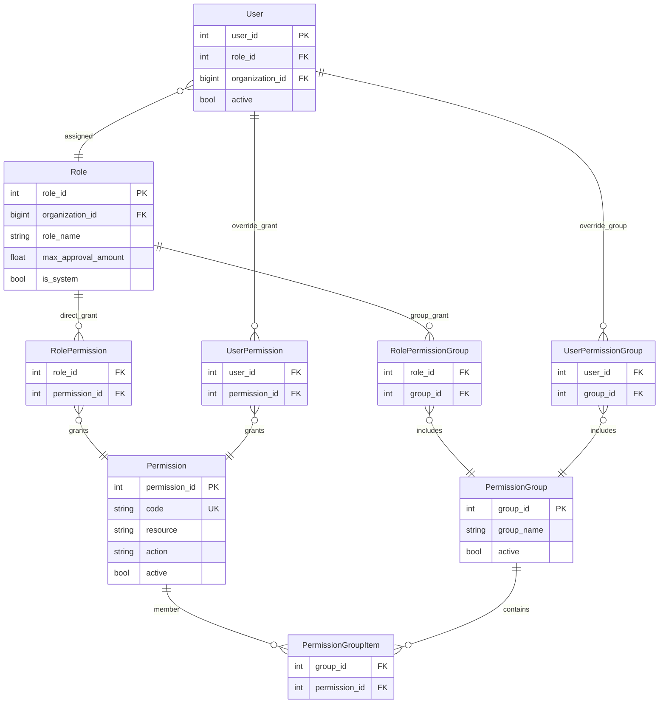
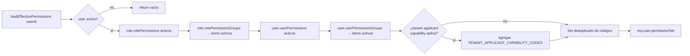
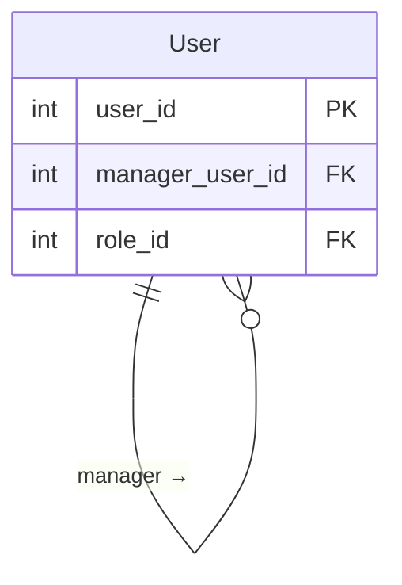
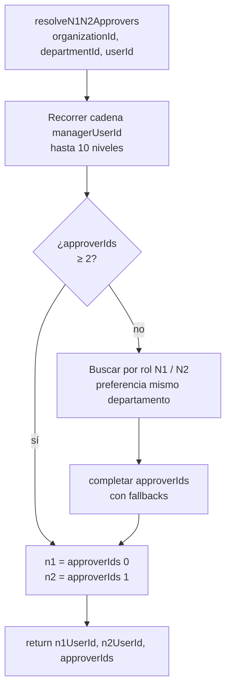
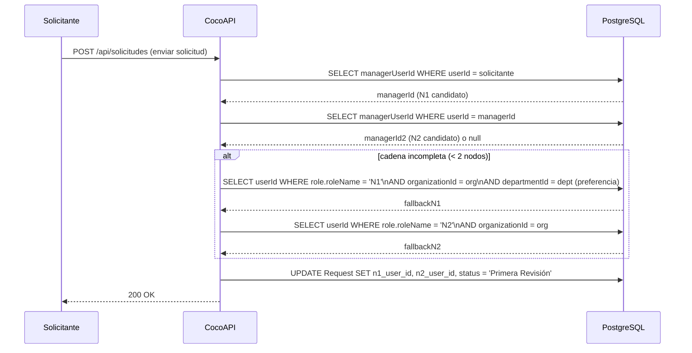

# Arquitectura de Aplicación — Capa de Servicios

| Metadato | Valor |
|----------|--------|
| **Versión del documento** | 1.0.0 |
| **Última actualización** | 2026-06-06 |
| **Referencias** | [app.js](../../../TC3005B.501-Backend/app.js), [permissionMiddleware.js](../../../TC3005B.501-Backend/middleware/permissionMiddleware.js), [permissionService.js](../../../TC3005B.501-Backend/services/permissionService.js), [approverResolver.js](../../../TC3005B.501-Backend/services/approverResolver.js), [employeeHierarchyService.js](../../../TC3005B.501-Backend/services/employeeHierarchyService.js), [schema.prisma](../../../TC3005B.501-Backend/prisma/schema.prisma), [diagramas-c4.md](diagramas-c4.md) (C4 Level 3) |

## 1. Diagrama de capas y servicios

La **CocoAPI** es una aplicación **Express.js** que sigue una arquitectura en capas: petición → middleware → rutas → servicios → modelos → base de datos.



### Tabla de módulos de ruta

| Prefijo | Módulo de ruta | Propósito principal |
|---------|----------------|---------------------|
| `/api/applicant` | `applicantRoutes` | Solicitudes, rutas de viaje, perfil |
| `/api/authorizer` | `authorizerRoutes` | Aprobación N1/N2, alertas |
| `/api/solicitudes` | `solicitudWorkflowRoutes`, `inboxRoutes`, `requestCommentRoutes` | Flujo unificado de solicitud (inbox, aprobar/rechazar, comentarios) |
| `/api/approval-substitutes` | `approvalSubstituteRoutes` | Sustitutos de aprobación durante ausencias |
| `/api/user` | `userRoutes` | Login, sesión, perfil, CSRF token |
| `/api/admin` | `adminRoutes`, `permissionRoutes` | Gestión de usuarios, roles y permisos |
| `/api/travel-agent` | `travelAgentRoutes` | Atención de solicitudes por agencia |
| `/api/accounts-payable` | `accountsPayableRoutes` | Cotización y validación de comprobantes |
| `/api/files` | `fileRoutes` | Carga PDF/XML → MongoDB GridFS |
| `/api/comprobantes` | `comprobantesRoutes` | CFDI (`cfdi_comprobantes`) |
| `/api/notifications` | `notificationRoutes` | Push notifications, inbox de alertas |
| `/api/organizations` | `organizationRoutes` | Multi-tenant: gestión de organizaciones |
| `/api/policies` | `policyRoutes`, `employeeCategoryRouter` | Política de reembolsos y categorías |
| `/api/refunds` | `refundRoutes` | Motor de reglas de reembolso |
| `/api/export` | `exportRoutes` | Exportación contable al ERP (pólizas) |
| `/api/reports` | `reportRoutes` | Reportes gerenciales |
| `/api/workflow-rules` | `workflowRuleRoutes` | CRUD de reglas de flujo por departamento |
| `/api/viaticos-policy` | `viaticasPolicyRoutes` | Topes de hotel y comida por org |
| `/api/keys` / `/api/external` | `apiKeyRoutes`, `externalApiKeyRoutes` | API Keys para integraciones ERP |
| `/api/onboarding/import` | `onboardingImportRoutes` | Importación masiva de usuarios (CSV/JSON) |

---

## 2. Sistema de permisos

### 2.1 Modelo de datos (RBAC)

El sistema usa **RBAC** (control de acceso basado en roles) **granular por organización**. El catálogo de `Permission` es global; los grupos y asignaciones son per-org.



### 2.2 Resolución de permisos efectivos en runtime

Al inicio de cada petición autenticada, `loadEffectivePermissions(userId)` computa el **conjunto efectivo** de códigos de permiso del usuario mediante la siguiente unión:

```
permisos_efectivos =
    role.rolePermissions (directos activos)
  ∪ role.rolePermissionGroups[*].items (grupo activo, permiso activo)
  ∪ user.userPermissions (directos activos)
  ∪ user.userPermissionGroups[*].items (grupo activo, permiso activo)
  ∪ TENANT_APPLICANT_CAPABILITY_CODES (si org.kind y user.active lo permiten)
```

El resultado se guarda en `req.user.permissionSet` (un `Set<string>`) y es **idempotente** dentro de la misma petición.



### 2.3 Cadena de middleware de autorización

Las rutas protegidas usan `requirePermission(...codes)` o `requireAnyPermission(...codes)`:

```
requirePermission("solicitud:create")
  │
  ├─ 1. authenticateToken     → verifica JWT (Bearer o cookie), adjunta req.user
  ├─ 2. tenantContextMiddleware → resuelve organizationId en req.tenantContext
  ├─ 3. applyRlsForRequest    → SET LOCAL app.org_id en la conexión Prisma (RLS PG)
  ├─ 4. loadPermissions       → llama loadEffectivePermissions, guarda en req.user.permissionSet
  └─ 5. authorizePermission   → verifica que TODOS los códigos estén en permissionSet
         (authorizeAnyPermission verifica que AL MENOS UNO esté presente)
```

| Helper | Semántica | Uso típico |
|--------|-----------|------------|
| `requirePermission(...codes)` | AND — todos los códigos requeridos | Operaciones específicas de un solo recurso |
| `requireAnyPermission(...codes)` | OR — al menos un código | Rutas accesibles por varios roles |

### 2.4 Roles de sistema vs. roles personalizados

| Atributo | Rol de sistema (`isSystem: true`) | Rol personalizado |
|----------|-----------------------------------|-------------------|
| Nombre | Inmutable | Editable (2–40 chars) |
| Permisos | Solo via grupos predefinidos; no editables desde API | CRUD completo desde admin |
| `maxApprovalAmount` | Editable | Editable |
| Eliminar | Bloqueado | Permitido si sin usuarios activos |

El campo `Role.maxApprovalAmount` define el **tope de monto** (`requested_fee`) que el rol puede aprobar en un paso de autorización.

---

## 3. Jerarquía de aprobación en runtime

### 3.1 Estructura: adjacency list en `User`

La jerarquía organizacional se almacena como una **adjacency list** en la tabla `User`:

```
User.managerUserId → User.userId (auto-referencia)
```

Cada usuario apunta a su **jefe directo**. La cadena de aprobación se recorre hacia arriba en tiempo de ejecución, sin materializar la jerarquía completa en base de datos.



### 3.2 Resolución de aprobadores N1/N2 (`approverResolver.js`)

Cuando un solicitante envía una solicitud, `resolveN1N2Approvers` determina quiénes serán N1 y N2:



**Reglas de fallback:**
1. Se recorre `managerUserId` hasta 10 niveles; cada nivel es un aprobador potencial.
2. Si la cadena tiene menos de 2 nodos, se completa con el primer usuario activo de rol `"N1"` / `"N2"` en la organización, priorizando el mismo departamento del solicitante.
3. Se garantiza que `approverIds` siempre tenga al menos los IDs de N1 y N2 finales.

### 3.3 Utilidades de jerarquía (`employeeHierarchyService.js`)

| Función | Descripción | Límite |
|---------|-------------|--------|
| `getApprovalChain(userId, maxDepth=8)` | Cadena de aprobación ascendente (jefe, jefe del jefe, …). Lanza `409` si detecta ciclo. | 8 niveles |
| `getSubordinatesRecursive(managerUserId, maxNodes=2000)` | Subordinados transitivos (BFS). | 2 000 nodos |
| `getHierarchyDepth(userId, maxDepth=8)` | Profundidad de la cadena de aprobación disponible. | 8 niveles |
| `wouldCreateManagerCycle(userId, proposedManagerUserId)` | Detecta si asignar un jefe crearía un ciclo antes de guardar. | 32 niveles |

### 3.4 Secuencia de resolución al crear una solicitud



---

## 4. Relación con otros documentos

| Documento | Qué complementa |
|-----------|-----------------|
| [Modelo ER](modelo-er.md) | Tablas `Permission`, `PermissionGroup`, `Role`, `User` (con `manager_user_id`) |
| [Flujos y pantallas](flujos.md) | Capas del sistema, rutas REST, estados de solicitud |
| [Flujos de pantallas por rol](../flujos-pantallas-por-rol.md) | Qué pantallas son accesibles por rol en el frontend |

> **Nota:** La lógica de adjacency list (`managerUserId`) está documentada también en el modelo Prisma `User` (`schema.prisma`, campo `manager_user_id`). `approverResolver.js` y `employeeHierarchyService.js` son los únicos consumidores en runtime.

---

## Nomenclatura

| Término | Significado |
|---------|-------------|
| **API** | Application Programming Interface — endpoints HTTP `/api/*` de CocoAPI. |
| **BFS** | Breadth-First Search — recorrido en anchura usado para subordinados transitivos. |
| **JWT** | JSON Web Token — token de sesión verificado en `authenticateToken`. |
| **N1 / N2** | Autorizador de primer y segundo nivel en la cadena de aprobación. |
| **ORM** | Object-Relational Mapping — capa Prisma entre servicios y PostgreSQL. |
| **RBAC** | Role-Based Access Control — permisos atómicos (`resource:action`) unidos por roles, grupos y asignación directa a usuario. |
| **RLS** | Row-Level Security — filtrado de filas en PostgreSQL por organización activa. |
| **REST** | Representational State Transfer — API HTTP JSON consumida por el frontend. |
