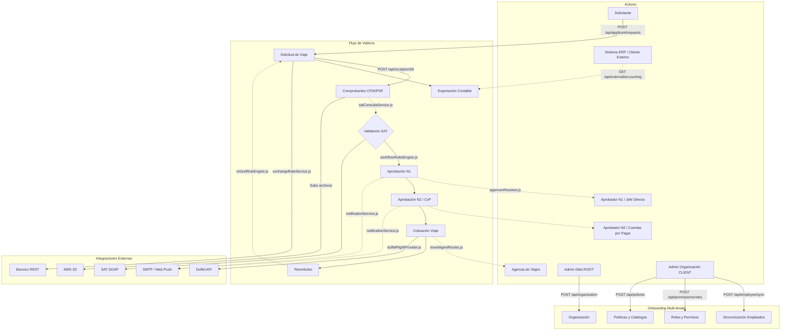
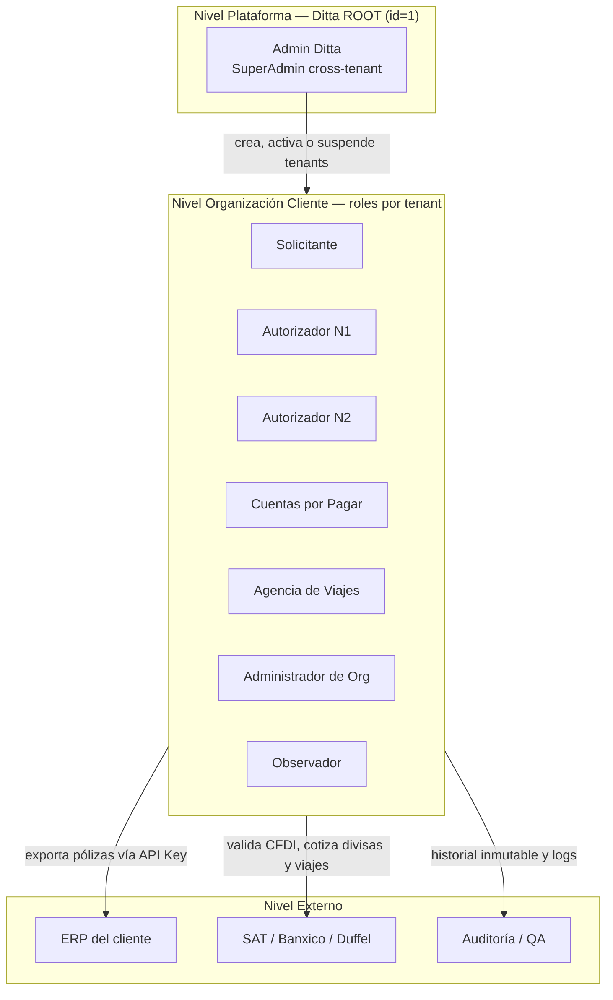
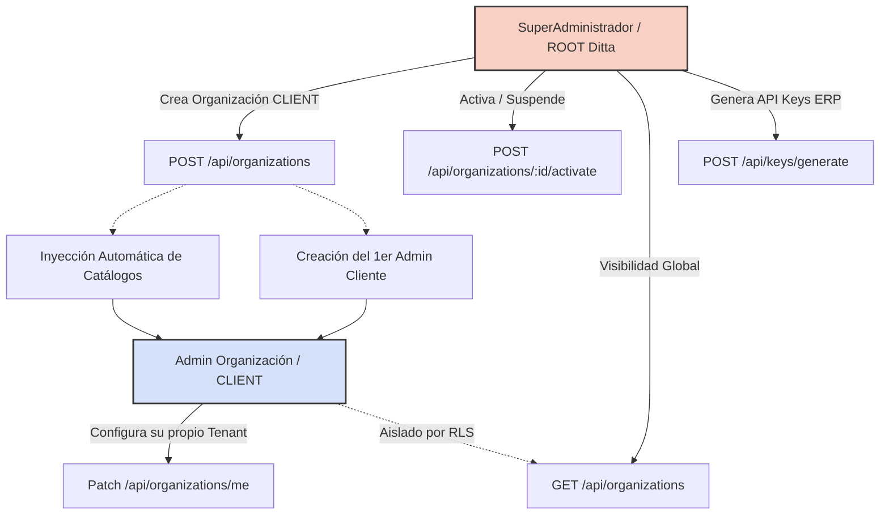

# Arquitectura de Negocio — CocoAPI

A continuación, se presenta la Arquitectura de Negocio derivada del código actual del repositorio (Node.js/Express + Prisma en PostgreSQL).

## Diagrama de Arquitectura de Negocio

*(Nota para Draw.io: Puedes pegar este código Mermaid directamente en Draw.io a través de la opción `Arrange > Insert > Advanced > Mermaid...` para obtener su representación visual equivalente).*

## Justificación y Explicación

### Zonas del Diagrama y Rastro de Evidencia en el Código

1. **Actores:** Modelados no como "tipos de usuario" fijos en código, sino derivados de las rutas que consumen y los permisos (RBAC) que requieren.
   * *Evidencia:* Las rutas del backend están separadas funcionalmente: `applicantRoutes.js` (Solicitante), `authorizerRoutes.js` (N1), `accountsPayableRoutes.js` (N2/CxP), `travelAgentRoutes.js` (Agencia), `adminRoutes.js` (Admin Ditta), y `organizationRoutes.js` (Admin Org). Las peticiones ERP se manejan en `externalApiKeyRoutes.js`.
2. **Onboarding Multi-tenant:** Ditta como organización raíz (ROOT) gestiona empresas (CLIENT). Cada organización aísla sus datos y configura su propia lógica.
   * *Evidencia:* El modelo `Organization` en `schema.prisma` incluye `kind` (ROOT/CLIENT). El RBAC dinámico se configura mediante el middleware `permissionMiddleware.js` (`requirePermission`), asociando `PermissionGroup` y `Role` por organización (endpoints en `permissionRoutes.js`). La sincronización ocurre en `employeeSyncService.js`.
3. **Flujo de Viáticos:** Es el ciclo de vida real de la solicitud (`Request` en `schema.prisma`).
   * *Evidencia:* Un solicitante genera la petición (`applicantRoutes.js`). Sube comprobantes (`comprobantesRoutes.js`, que guarda en AWS S3 vía `storageService.js`). La validación fiscal sucede consultando al SAT con `satConsultaService.js`. 
   * La aprobación no es un rol fijo "Aprobador", sino un motor de reglas `workflowRulesEngine.js` que deriva quién debe autorizar usando `approverResolver.js` y `employeeHierarchyService.js` (recorriendo la jerarquía `jefeInmediato` del modelo `Empleado`).
   * La cotización invoca a `travelAgentRoutes.js` o a `duffelFlightProvider.js`. El cálculo de reembolso final lo procesa `refundRuleEngine.js`, terminando con la generación de pólizas para exportación en `accountingExportService.js`.
4. **Integraciones Externas:** Los sistemas con los que interactúa el código de forma síncrona o asíncrona.
   * *Evidencia:* `satConsultaService.js` (SOAP real o fallback local dependiente de la respuesta), `banxicoService.js` (REST), `duffel.js` y `duffelFlightProvider.js`, Amazon S3 para binarios en `storageService.js`, y envíos a través de `webPushService.js` y correos en la carpeta `email/`.

### Decisiones de Arquitectura de Negocio Derivadas
* **RBAC Dinámico por Permiso, no por Rol:** El código valida acciones atómicas (ej. `requirePermission('approve:request')`), en vez de validar si el usuario se llama "Gerente" o "Admin". Los roles son solo contenedores configurables para el usuario.
* **Aprobaciones Derivadas en Runtime:** No existe una tabla estática "Viaje-AprobadorN1". `workflowRulesEngine.js` evalúa en runtime el monto y características de la solicitud, y si aplica la regla, avanza al nivel necesario calculando al autorizador de forma dinámica mediante la lista de adyacencia de Empleados.
* **Aislamiento por Tenant (RLS):** Cada cliente está encapsulado. Todos los modelos en Prisma, desde `User` hasta `Request` y `PolicyExpenseCap`, contienen el `organizationId` y los queries se protegen automáticamente mediante el middleware de contexto (`tenantContext.js`).

### Diferencias vs. Planeación Original
* **Multi-tenant Dinámico:** Se pensaba una plataforma plana o simple, pero el código actual soporta completamente un modelo de tenants (`OrganizationKind`) con un superadministrador ROOT (Ditta) que opera de forma cruzada, completamente distinto y superior a los Administradores de los clientes.
* **Agencia de Viajes Integrada:** Ya no es un simple mock conceptual o algo a futuro, la integración con Duffel (`duffelFlightProvider.js`) ya está modelada en los servicios para cotizar/reservar directamente desde la plataforma.
* **Generación Snapshot de Pólizas:** Múltiples entidades nuevas (ej. `AnticipoPolizaSnapshot`, `AccountingPoliza`) ahora capturan el estado financiero en fases concretas del ciclo de vida de la solicitud, dando trazabilidad auditable y separando los datos en lugar de solo mutar y sobreescribir campos de una única tabla.

### Mapeo con Épicas / Historias de Usuario
* **US-01 a US-03 (Automatización Fiscal):** Carga de CFDI, parseo, `satConsultaService.js` y almacenamiento seguro en S3.
* **US-04 (Cotización Divisas):** Conexión con `banxicoService.js`.
* **US-08 / US-16 (Aprobación Dinámica):** Evaluado vía `workflowRulesEngine.js` y aprobado en `authorizerRoutes.js`.
* **US-11 / US-17 (API ERP):** Endpoints de extracción vía `externalApiKeyRoutes.js` y formateo en `accountingExportService.js` asegurados con API Keys hasheadas con algoritmo scrypt.
* **US-13 a US-15 (Onboarding):** Mapeo de entidades robusto con `Organization`, `Role`, `Empleado` y sus respectivas rutas de administración de cliente.

---

## Mapa de Stakeholders / Actores del Sistema

Los actores se organizan en tres niveles: la **plataforma** (Ditta como organización ROOT), las **organizaciones cliente** (un tenant por empresa, con sus roles operativos sembrados en el onboarding) y las **partes externas** (sistemas integrados y stakeholders que consumen la trazabilidad).

| Nivel | Actor | Responsabilidad de negocio | Rol / grupo RBAC |
|---|---|---|---|
| Plataforma (Ditta ROOT) | **Admin Ditta** | Onboarding de organizaciones cliente, activación/suspensión, API keys ERP, onboarding masivo | `Admin Ditta` — grupo `DittaSuperAdmin`, exclusivo de la org ROOT |
| Organización cliente | **Solicitante** | Captura solicitudes de viaje, sube comprobantes, comprueba gastos | `Solicitante` (`BaseColaborador` + `TravelRequestAuthor`) |
| Organización cliente | **Autorizador N1** | Primera aprobación (jefe directo, resuelto por jerarquía de empleados) | `N1` (+ `TravelRequestApprover`, tope 50 000) |
| Organización cliente | **Autorizador N2** | Segunda aprobación para montos mayores | `N2` (+ `TravelRequestApprover`, tope 500 000) |
| Organización cliente | **Cuentas por Pagar (CxP)** | Valida comprobantes contra el SAT, procesa el reembolso, exporta contabilidad | `Cuentas por pagar` (`AccountsPayableOps`) |
| Organización cliente | **Agencia de viajes** | Cotiza y reserva vuelos/hospedaje (Duffel o atención manual) | `Agencia de viajes` (`TravelAgencyOps`) |
| Organización cliente | **Administrador** | Gestiona usuarios, roles, permisos, políticas y catálogos de su tenant | `Administrador` (`OrgAdmin`) |
| Organización cliente | **Observador** | Solo lectura y alertas, sin capacidad de autorizar | `Observador` (`TravelNotifyOnly`) |
| Externo | **ERP del cliente** | Extrae las pólizas contables generadas | M2M vía `/api/external/*` con API Key (sin rol de usuario) |
| Externo | **SAT / Banxico / Duffel** | Validación fiscal de CFDI, tipo de cambio, inventario de vuelos/hospedaje | Integraciones de servicio (sin sesión de usuario) |
| Externo | **Auditoría / QA** | Revisa trazabilidad de aprobaciones y comprobantes; el equipo QA valida la resolución de permisos por rol vía E2E (Cypress) | Consulta de historial y logs; sin rol operativo dedicado |

---

## Roles como Contenedores de Permisos

Síntesis del modelo RBAC desde la perspectiva de negocio. El detalle técnico completo (catálogo, semántica, endpoints y seed) vive en [permisos.md](permisos.md).

* **El nombre del rol no otorga acceso.** El backend protege cada acción con permisos atómicos en formato `resource:action` (48 permisos en 21 namespaces a la fecha), validados vía `requirePermission(...)`. Un rol es solo un contenedor configurable que agrupa esos permisos.
* **Los roles acumulan grupos de permisos.** Los permisos se empaquetan en grupos reutilizables (`PermissionGroup`) y cada rol suma varios grupos. Por ejemplo, N1 y N2 obtienen `BaseColaborador` + `TravelRequestAuthor` + `TravelRequestApprover`: conservan toda la capacidad de solicitante **y además** la de aprobador.
* **Resolución aditiva en runtime.** Los permisos efectivos de un usuario son la unión deduplicada de cuatro conjuntos: permisos directos del rol, grupos del rol, permisos directos del usuario y grupos del usuario. No existe `deny` explícito: para quitar un permiso se cambia el rol.
* **N1 vs N2 es una regla de monto, no de permisos.** Ambos comparten el mismo grupo aprobador; se distinguen por su tope de autorización (`maxApprovalAmount`: 50 000 vs 500 000), que evalúa el motor de reglas de workflow.
* **Roles por organización, configurables en caliente.** Cada tenant se siembra con 7 roles default (Solicitante, N1, N2, Agencia de viajes, Cuentas por pagar, Administrador, Observador) y puede crear roles custom o reasignar grupos vía los endpoints admin, sin release de software. Solo las altas/bajas del catálogo global de permisos requieren release.
* **`DittaSuperAdmin` es exclusivo del ROOT.** El rol `Admin Ditta` (y con él `api_key:manage` y `onboarding:import`) solo existe en la organización ROOT; las organizaciones cliente nunca lo reciben.

---

## Modelo Operativo del SuperAdministrador de Ditta (ROOT)

Para entender a fondo la separación de poderes en la plataforma, a continuación se detallan las capacidades de negocio exclusivas del actor **SuperAdministrador de Ditta (ROOT)**, contrastándolas con el **Administrador de Organización (CLIENT)**.

### Diagrama de Capacidades ROOT vs CLIENT

### Funciones de Negocio del SuperAdministrador (Implementadas)

El código actual respalda de forma directa las siguientes operaciones para el tenant `ROOT`:

*   **Creación de Organizaciones (Onboarding Inicial):** Tiene la capacidad exclusiva de dar de alta a un nuevo cliente en la plataforma, generando el "cascarón" inicial en estado `CONFIGURING`.
    *   *Evidencia:* `POST /api/organizations` en `organizationRoutes.js` y función `createOrganization` en `organizationService.js`. El código invoca un bypass de la seguridad a nivel fila (`withRls(1n, { bypass: true })`) para poder escribir fuera de su propio tenant.
*   **Despliegue Automático (Bootstrapping) de Catálogos y Usuarios:** Al crear una organización, el SuperAdmin desencadena la inyección de los catálogos obligatorios y crea la cuenta del primer administrador de ese cliente.
    *   *Evidencia:* Llamadas a `bootstrapOrganizationCatalogs` y `ensureOrganizationAdmin` dentro de `organizationService.js`.
*   **Visibilidad Global de la Plataforma (Cross-tenant):** Puede consultar el directorio maestro con todas las organizaciones (clientes) creadas, ignorando las restricciones que aíslan a los usuarios normales.
    *   *Evidencia:* `GET /api/organizations` ruteado a `listOrganizations` en `organizationService.js`.
*   **Activación y Suspensión de Operaciones:** Puede cambiar el estado operativo de una empresa (`ACTIVE` vs `SUSPENDED`), bloqueando o permitiendo el acceso global a todo el tenant cliente. (El propio tenant ROOT no puede ser suspendido por regla de negocio).
    *   *Evidencia:* Rutas `POST /api/organizations/:id/activate` y `/suspend` en `organizationRoutes.js`.
*   **Emisión de Credenciales de Integración (API Keys):** Es el responsable de generar (y en su defecto revocar o auditar) los secretos para que los sistemas ERP del cliente puedan extraer la información contable generada.
    *   *Evidencia:* Rutas `POST /generate`, `DELETE /:id/revoke` y `GET /:id/logs` en `apiKeyRoutes.js` (a diferencia de `externalApiKeyRoutes.js` que es lo que el ERP consume).

### Distinción Crítica: ROOT vs CLIENT

Para evitar confusiones en el diseño:
*   **El SuperAdmin Ditta (ROOT):** Opera sobre la plataforma. Gestiona "quién" es cliente. Nunca interactúa con el día a día de viáticos de los empleados (no aprueba viajes, no sube facturas). Sus datos residen en el tenant con `id = 1n` o con su identificador ROOT respectivo.
*   **El Admin de Organización (CLIENT):** Opera sobre su propia empresa. Sincroniza a sus empleados (`employeeSyncService.js`), asigna grupos de permisos RBAC a su personal (`permissionRoutes.js`) y modifica las políticas. No tiene visibilidad alguna fuera de su propio entorno.

### Funciones de Negocio (No Implementadas / Planeadas)

A nivel arquitectura, existen conceptos transversales que **no** están implementados en el código actual:

*   **Facturación y Gestión de Planes (Billing):** No hay código en el backend para cobrar suscripciones, medir cuotas mensuales o limitar features por "plan" contratado.
*   **Métricas Globales de Uso (Dashboards Cruzados):** Aunque el backend registra el uso de API Keys, no existen controladores o endpoints de analítica que agreguen datos de "cuántos viáticos globales se generaron en la plataforma" para uso del SuperAdmin.
*   **Herencia Dinámica de Catálogos:** Los catálogos se copian ("bootstrap") al crear la organización, pero si Ditta actualiza un catálogo global en el futuro, los clientes existentes no lo heredan dinámicamente en runtime (funciona por inserción estática en el instante cero).
