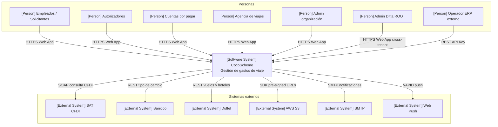
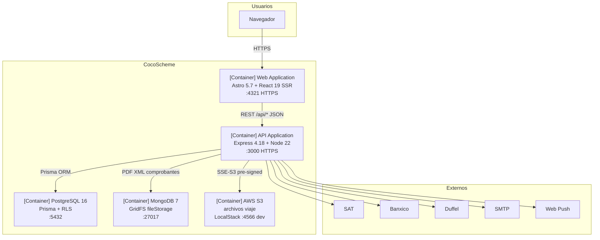
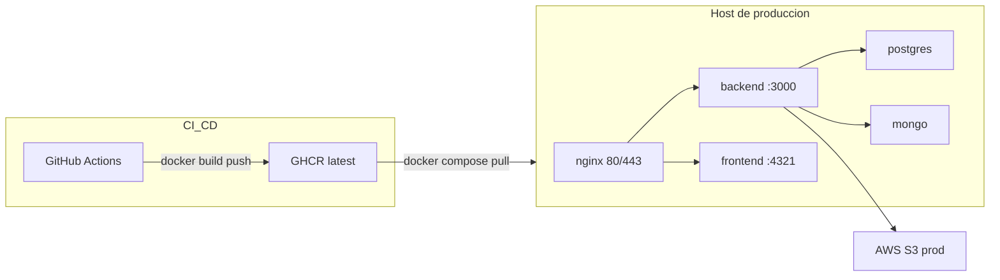
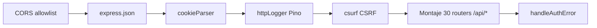
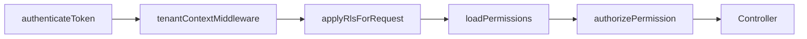
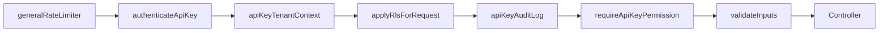

# Diagramas C4 — CocoAPI / CocoScheme

| Metadato | Valor |
|----------|--------|
| **Versión** | 1.0.0 |
| **Última actualización** | 2026-06-06 |
| **Responsables** | Héctor Lugo · Mariano Carretero |
| **Verificación** | 2026-06-06 — 30 routes, 71 services, 49 modelos Prisma |
| **Documento padre** | [Documento de Arquitectura](documento-arquitectura.md) |
| **Service Blueprint** | [service-blueprint.md](service-blueprint.md) |

## Leyenda de notación

| Prefijo en diagrama | Significado C4 |
|---------------------|----------------|
| `[Person]` | Actor humano o rol de negocio |
| `[Software System]` | Sistema de software (CocoScheme) |
| `[External System]` | Sistema externo |
| `[Container]` | Contenedor desplegable (app, BD, storage) |
| `[Component]` | Componente dentro del backend |

Los diagramas usan **Mermaid flowchart** con semántica C4. Para capas de aplicación detalladas, ver también [arquitectura-aplicacion.md](arquitectura-aplicacion.md).

---

## C4 Level 1 — System Context

Vista del sistema central **CocoScheme** y sus actores e integraciones externas.

### Relaciones principales

| Origen | Destino | Propósito |
|--------|---------|-----------|
| Actores humanos | CocoScheme | Operación del ciclo de viaje vía Web App (Astro SSR) |
| Operador ERP | CocoScheme | Consumo de pólizas y datos contables (`/api/external`) |
| CocoScheme | SAT | Validación de estado de CFDI (SOAP) |
| CocoScheme | Banxico | Tipo de cambio USD→MXN (REST, serie SF43718) |
| CocoScheme | Duffel | Búsqueda/reserva de vuelos y hospedaje |
| CocoScheme | AWS S3 | Archivos de viaje con URLs prefirmadas |
| CocoScheme | SMTP / Web Push | Notificaciones email y push |

---

## C4 Level 2 — Container

Contenedores desplegables dentro de CocoScheme y su entorno.

### Tabla de contenedores

| Container | Tecnología | Puerto | Persistencia |
|-----------|------------|--------|--------------|
| Web Application | Astro 5.7 + React 19 + Tailwind 4, Node SSR | 4321 | Stateless |
| API Application | Express 4.18 + Node 22 + Prisma 6.16 | 3000 | Vol. `certs` (TLS) |
| PostgreSQL | PostgreSQL 16, esquema `CocoScheme`, RLS 38 tablas | 5432 (5434 host dev) | Vol. `pgdata` |
| MongoDB GridFS | MongoDB 7, bucket comprobantes CFDI | 27017 | Vol. `mongodata` |
| AWS S3 | S3 real prod / LocalStack 3.5 dev | 4566 dev | Bucket + vol. LocalStack |
| GHCR | Imágenes `tc3005b-501-backend` / `frontend` | — | Registry GitHub |

### Despliegue — desarrollo vs producción

| Aspecto | Desarrollo | Producción |
|---------|------------|------------|
| **Compose backend** | [`docker-compose.dev.yml`](../../../TC3005B.501-Backend/docker-compose.dev.yml) — postgres, mongo, localstack, s3-init, migrate, backend hot-reload | [`docker-compose.yml`](../../../TC3005B.501-Backend/docker-compose.yml) — postgres, mongo, backend (GHCR) |
| **Compose frontend** | [`docker-compose.dev.yml`](../../../TC3005B.501-Frontend/docker-compose.dev.yml) — astro dev bind-mount | Imagen GHCR; despliegue en host (pendiente documentar) |
| **S3** | LocalStack + bucket `coco-consulting-local` | AWS S3 real |
| **Migraciones** | Job `migrate` one-shot en cada `up` | Entrypoint `RUN_MIGRATIONS=true` |
| **Red Docker** | `cocoscheme-dev` / `cocoscheme-frontend-dev` | `cocoscheme` bridge |
| **NODE_ENV** | `development` | `production` |

**Pipeline CI/CD:** push a `main` → lint + Prisma validate + tests (`.github/workflows/ci.yml`) → build imagen production → push GHCR (`.github/workflows/docker-publish.yml`) → despliegue con `docker compose pull && up -d` en el host de producción.

Guía operativa local: [setup-docker.md](../getting-started/setup-docker.md).

---

## C4 Level 3 — Component (Backend API)

Componentes dentro del contenedor **API Application** (`TC3005B.501-Backend`).

### A. Pipeline de middleware

**Global** ([app.js](../../../TC3005B.501-Backend/app.js)):

**Por ruta protegida** ([permissionMiddleware.js](../../../TC3005B.501-Backend/middleware/permissionMiddleware.js)):

**Por ruta ERP externa** ([apiKeyAuth.js](../../../TC3005B.501-Backend/middleware/apiKeyAuth.js)):

> `mongoSanitize` y `rateLimit` se aplican **por ruta** (p. ej. `fileRoutes`, login), no en el stack global. CSRF se omite en `NODE_ENV=test` y en `/api/external/*`.

### B. Route modules — 30 archivos, 11 dominios

| Dominio | Archivos | Prefijo montaje |
|---------|----------|-----------------|
| Autenticación y usuarios | `userRoutes.js` | `/api/user` |
| Solicitudes y workflow | `applicantRoutes`, `authorizerRoutes`, `inboxRoutes`, `solicitudWorkflowRoutes`, `requestCommentRoutes`, `approvalSubstituteRoutes` | `/api/applicant`, `/api/authorizer`, `/api/solicitudes`, `/api/approval-substitutes` |
| Roles operativos | `travelAgentRoutes`, `accountsPayableRoutes`, `gastoTramoRoutes` | `/api/travel-agent`, `/api/accounts-payable`, `/api/viajes` |
| Administración | `adminRoutes`, `permissionRoutes` | `/api/admin` |
| Multi-tenant / onboarding | `organizationRoutes`, `onboardingImportRoutes` | `/api/organizations`, `/api/onboarding/import` |
| Políticas y reglas | `policyRoutes` (+ `employeeCategoryRouter`), `viaticasPolicyRoutes`, `refundRoutes`, `workflowRuleRoutes` | `/api/policies`, `/api/employee-categories`, `/api/viaticos-policy`, `/api/refunds`, `/api/workflow-rules` |
| Fiscal / comprobantes | `comprobantesRoutes`, `fileRoutes` | `/api/comprobantes`, `/api/files` |
| Contabilidad | `exportRoutes`, `chartOfAccountRoutes` | `/api/export`, `/api/chart-of-accounts` |
| Reservas Duffel | `flightsRoutes`, `hotelsRoutes` | `/api/flights`, `/api/hotels` |
| Tipo de cambio | `exchangeRateRoutes`, `fxRoutes` | `/api/exchange-rate`, `/api/fx` |
| Notificaciones | `notificationRoutes` | `/api/notifications` |
| API keys / ERP | `apiKeyRoutes`, `externalApiKeyRoutes` | `/api/keys`, `/api/external` |
| Reportes | `reportRoutes` | `/api/reports` |

Mapa detallado de prefijos: [flujos.md — API REST](flujos.md#6-api-rest--modulos-y-entidades-principales) y [arquitectura-aplicacion.md](arquitectura-aplicacion.md).

### C. Services — 71 archivos, 12 dominios

```mermaid
flowchart TB
  subgraph routesLayer [Routes]
    R[routes/*Routes.js]
  end

  subgraph svc [Services 71 archivos]
    subgraph dom1 [Solicitudes_workflow]
      S1[applicantService authorizerService solicitudJourneyService workflowRulesEngine]
    end
    subgraph dom2 [IAM_permisos]
      S2[userService adminService permissionService employeeHierarchyService]
    end
    subgraph dom3 [Onboarding]
      S3[organizationService onboardingImportService importStrategies]
    end
    subgraph dom4 [Politicas_reembolso]
      S4[policyService viaticasPolicyService refundRuleEngine reimbursementTimeService]
    end
    subgraph dom5 [Fiscal_CFDI]
      S5[satConsultaService cfdiParserService comprobantesService receiptFileService]
    end
    subgraph dom6 [Contabilidad]
      S6[accountingExportService chartOfAccountService anticipoPolizaLifecycleService]
    end
    subgraph dom7 [FX]
      S7[banxicoService exchangeRateService fxPublicService]
    end
    subgraph dom8 [Duffel]
      S8[duffel duffelFlightProvider duffelStaysProvider]
    end
    subgraph dom9 [Storage]
      S9[storageService fileStorage]
    end
    subgraph dom10 [Notificaciones]
      S10[notificationService webPushService mail.cjs]
    end
    subgraph dom11 [Scheduler]
      S11[escalationJob refundDeadlineJob]
    end
  end

  subgraph data [Datos]
    PR[(Prisma PostgreSQL)]
    GR[(GridFS Mongo)]
    S3B[(S3)]
  end

  R --> svc
  svc --> PR
  S5 --> GR
  S9 --> S3B
  S5 --> SAT3[SAT SOAP]
  S7 --> BMX3[Banxico REST]
  S8 --> DUF3[Duffel REST]
  S10 --> SMTP3[SMTP Push]
```

### D. Modelos Prisma — 49 modelos, 9 dominios

| Dominio | Modelos (conteo) |
|---------|------------------|
| Multi-tenant | `Organization`, `OrganizationIntegration`, `Proveedor`, `NotificationTemplate` (4) |
| IAM / permisos / API keys | `Role`, `User`, `UserPreference`, `Permission`, `PermissionGroup`, `PermissionGroupItem`, `RolePermission`, `RolePermissionGroup`, `UserPermission`, `UserPermissionGroup`, `ApiKey`, `ApiKeyLog` (12) |
| Estructura org | `Department`, `Empleado`, `EmployeeCategory`, `ApprovalSubstitute` (4) |
| Solicitudes | `RequestStatus`, `Request`, `RequestComment`, `SolicitudHistorial`, `Alert`, `AlertMessage`, `LogLevel`, `Log` (8) |
| Geografía | `Country`, `City`, `Route`, `RouteRequest` (4) |
| Gastos / comprobantes | `ReceiptType`, `Receipt`, `CfdiComprobante`, `GastoTramo`, `AnticipoPolizaSnapshot`, `PolicyException` (6) |
| Políticas | `TravelPolicy`, `PolicyExpenseCap`, `ReimbursementTimeLimit`, `ViaticosPolicy`, `WorkflowRule` (5) |
| Contabilidad | `ChartOfAccount`, `AccountingDocType`, `AccountingSociety`, `AccountingPoliza` (4) |
| Notificaciones | `Notification`, `PushSubscription` (2) |

Diagramas ER por subdominio: [modelo-er.md](modelo-er.md). Esquema fuente: [schema.prisma](../../../TC3005B.501-Backend/prisma/schema.prisma).

---

## Referencias cruzadas

- [Service Blueprint](service-blueprint.md) — macro-procesos y swimlanes
- [Documento de Arquitectura](documento-arquitectura.md) — requerimientos no funcionales y continuidad
- [Multi-tenancy](multi-tenancy.md) — aislamiento por organización
- [setup-docker.md](../getting-started/setup-docker.md) — arranque local

---

## Nomenclatura

| Término | Significado |
|---------|-------------|
| **C4** | Modelo de diagramas de arquitectura (Context, Container, Component) de Simon Brown. |
| **CFDI** | Comprobante Fiscal Digital por Internet — comprobante fiscal mexicano. |
| **CI/CD** | Continuous Integration / Continuous Delivery — GitHub Actions + publicación a GHCR. |
| **FX** | Foreign exchange — tipo de cambio (Banxico, serie SF43718). |
| **GHCR** | GitHub Container Registry — imágenes Docker `tc3005b-501-backend` y `frontend`. |
| **GridFS** | Almacén de archivos en MongoDB para PDF/XML de comprobantes. |
| **IAM** | Identity and Access Management — dominio de usuarios, roles, permisos y API keys. |
| **LocalStack** | Emulador local de servicios AWS (S3 en desarrollo). |
| **Prisma** | ORM TypeScript/JS usado contra PostgreSQL (`schema.prisma`). |
| **REST** | API HTTP con recursos JSON (`/api/*`). |
| **RLS** | Row-Level Security — políticas PostgreSQL por `organization_id`. |
| **SAT** | Servicio de Administración Tributaria — consulta CFDI vía SOAP. |
| **SDK** | Software Development Kit — p. ej. `@aws-sdk/client-s3`, `@duffel/api`. |
| **SOAP** | Protocolo XML para el web service de validación del SAT. |
| **SSE-S3** | Cifrado en reposo de objetos S3 con claves gestionadas por AWS. |
| **SMTP** | Protocolo de correo para notificaciones (`nodemailer`). |
| **SSR** | Server-Side Rendering — frontend Astro con salida en servidor Node. |
| **TLS** | Transport Layer Security — capa cifrada de HTTPS. |
| **VAPID** | Claves para autenticar el servidor en Web Push. |
