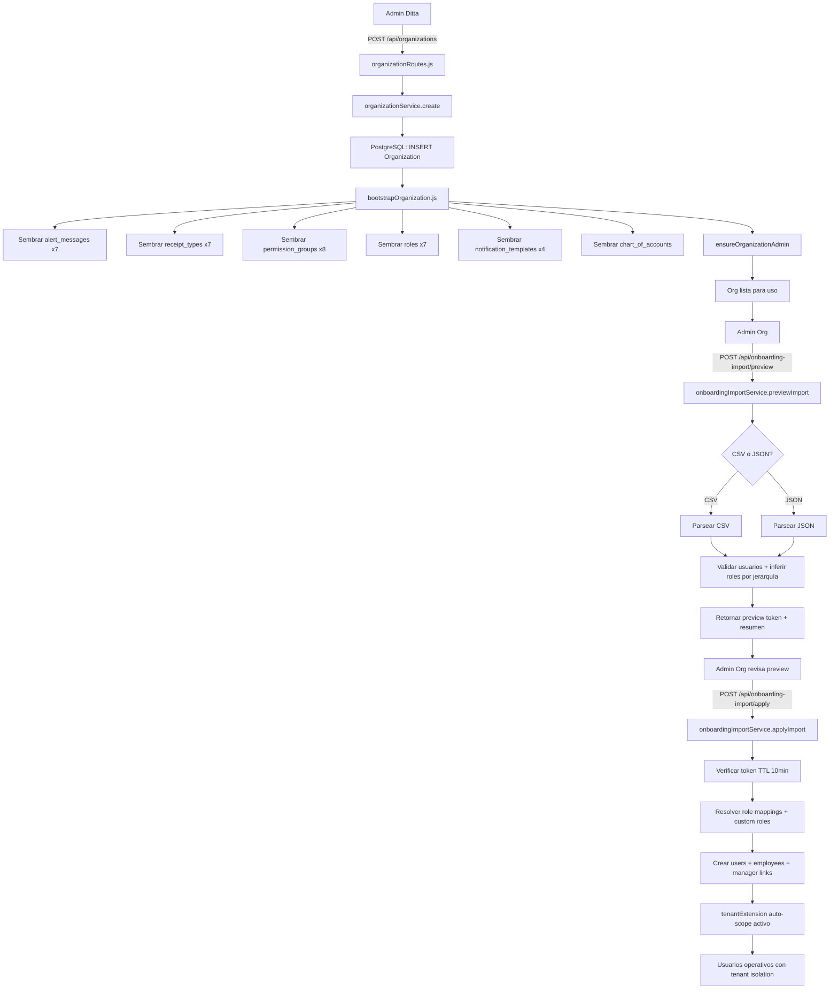
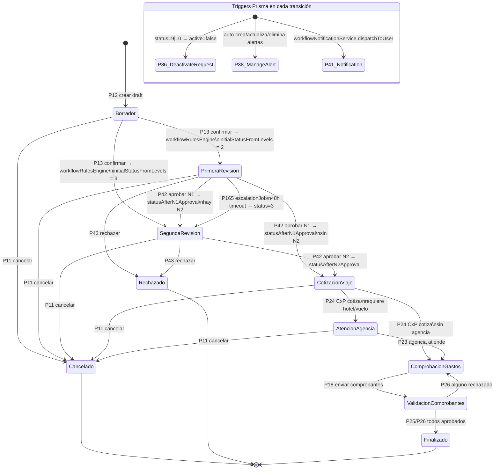
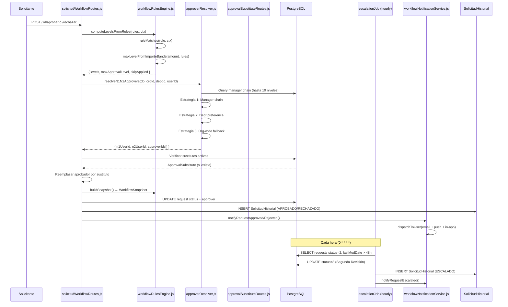
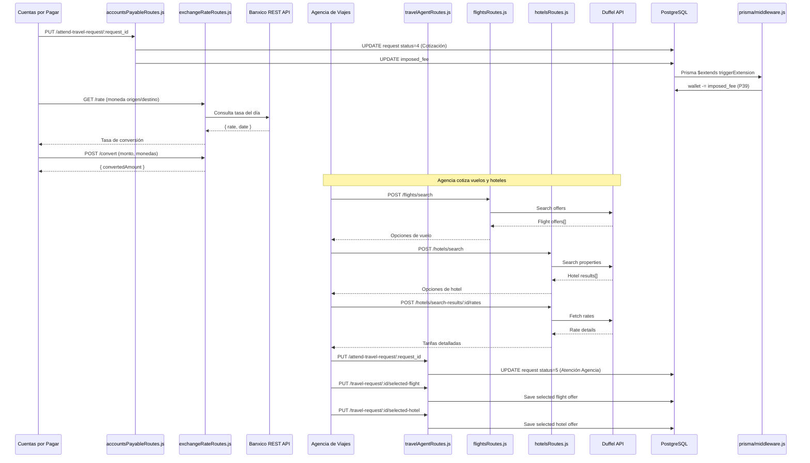
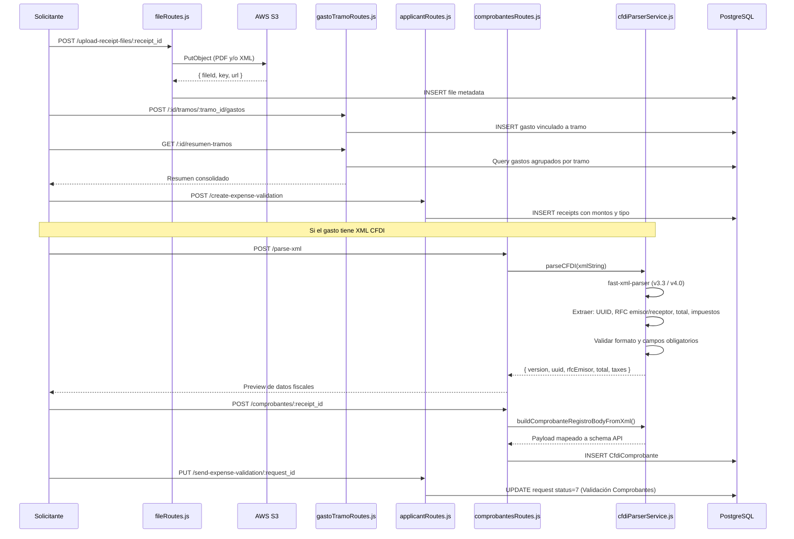
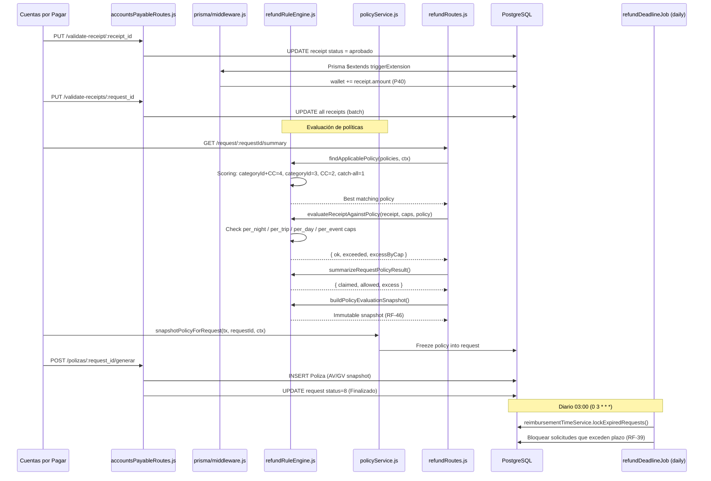
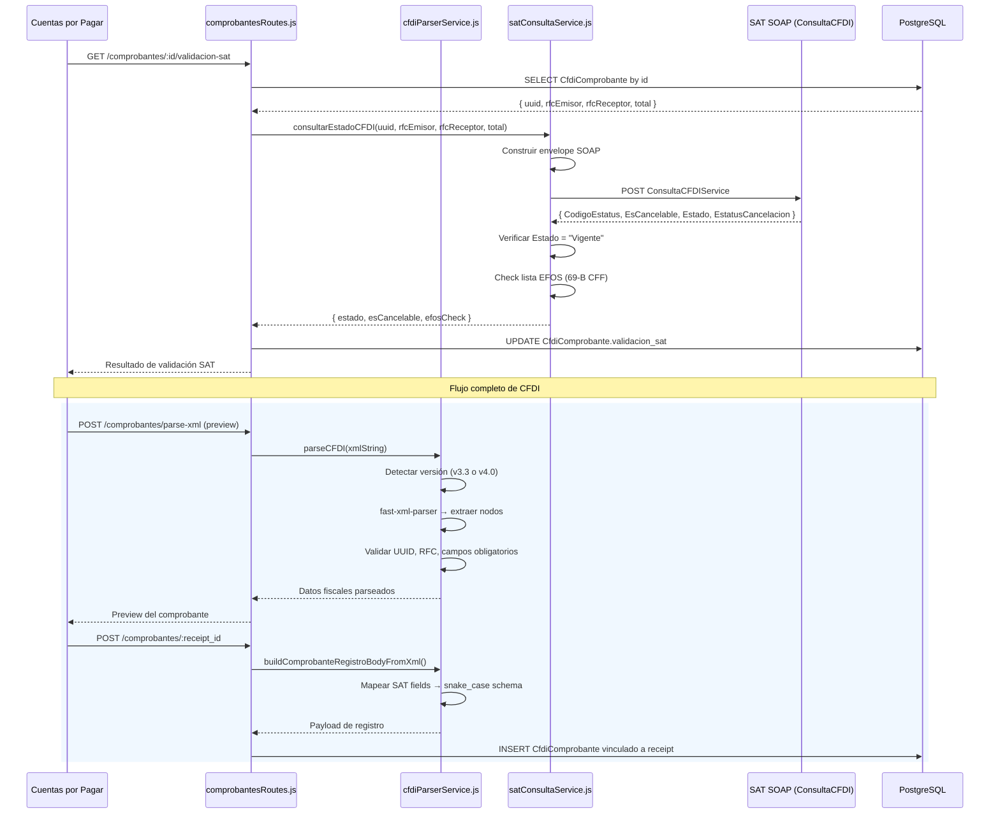
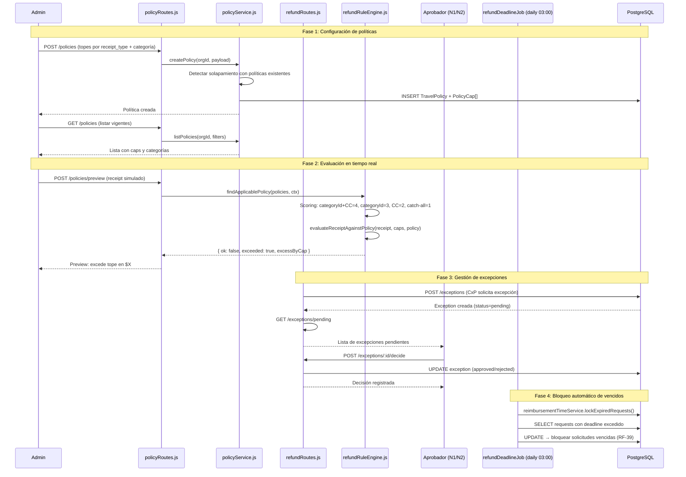
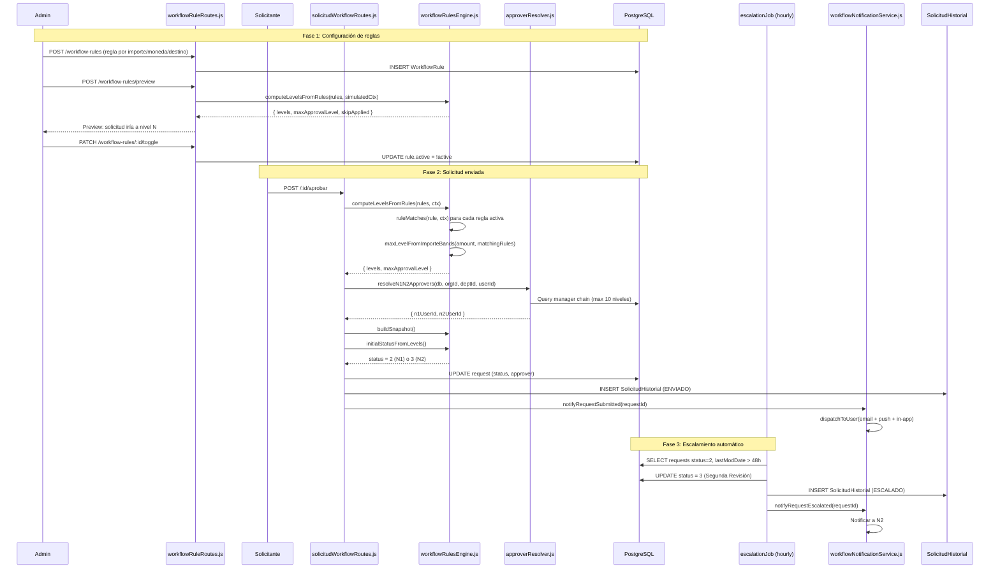
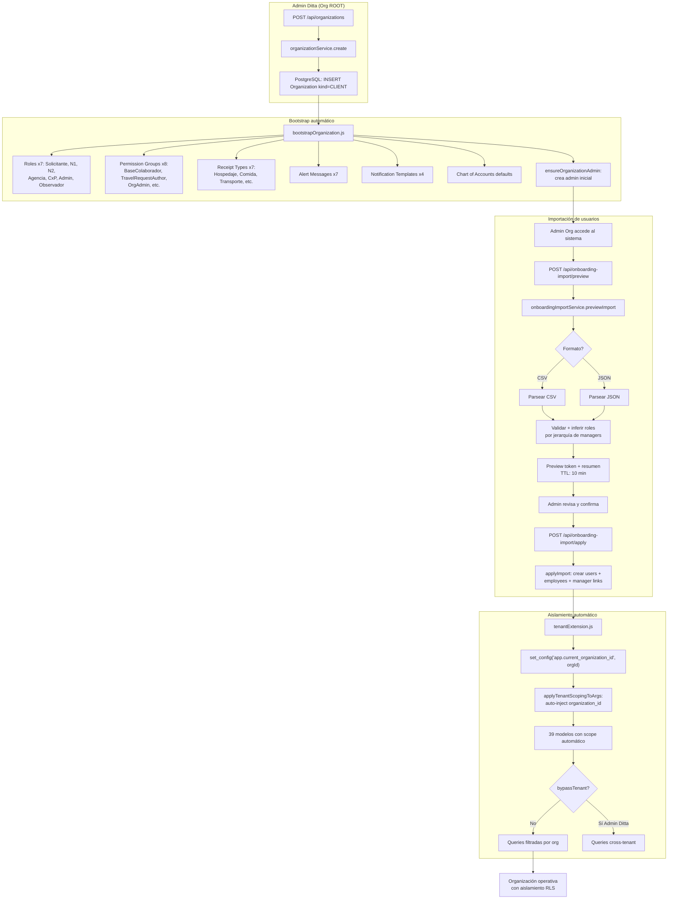

# Diagramas de Procesos

> **Versión:** 1.0
> **Fecha:** 2026-06-10
> **Responsables:** Equipo CoCo Consulting 2
> **Stack:** PostgreSQL / Prisma — sin triggers MariaDB

Este documento contiene 10 diagramas Mermaid que detallan los macro-procesos del sistema CocoAPI.
Cada diagrama usa nombres reales de servicios y archivos del código fuente.

---

## Índice

1. [Onboarding completo](#1-onboarding-completo)
2. [Solicitud de viaje — máquina de estados](#2-solicitud-de-viaje--máquina-de-estados)
3. [Aprobación configurable](#3-aprobación-configurable)
4. [Logística del viaje](#4-logística-del-viaje)
5. [Comprobación de gastos](#5-comprobación-de-gastos)
6. [Cierre y reembolso](#6-cierre-y-reembolso)
7. [Validación CFDI ante SAT](#7-validación-cfdi-ante-sat)
8. [Políticas y excepciones de reembolso](#8-políticas-y-excepciones-de-reembolso)
9. [Workflow dinámico con escalamiento](#9-workflow-dinámico-con-escalamiento)
10. [Multi-tenant onboarding](#10-multi-tenant-onboarding)

---

## 1. Onboarding completo

Admin Ditta crea la organización, `bootstrapOrganization` siembra catálogos y roles por defecto,
el admin de la organización importa usuarios vía CSV/JSON con `onboardingImportService` (preview + apply),
y el tenant extension queda activo para aislar datos.

---

## 2. Solicitud de viaje — máquina de estados

Máquina de 10 estados con transiciones controladas. El motor de reglas (`workflowRulesEngine`) puede
saltar niveles de aprobación. Cada transición dispara triggers Prisma (`prisma/middleware.js`).

> Referencia: [Service Blueprint — Máquina de estados](service-blueprint.md#7-máquina-de-estados-de-la-solicitud)

---

## 3. Aprobación configurable

El motor de reglas de workflow evalúa las reglas configuradas por el admin, el resolver
determina N1/N2, los sustitutos temporales se aplican, y el cron de escalamiento actúa en caso de timeout.

---

## 4. Logística del viaje

CxP cotiza el costo impuesto, se consulta tipo de cambio a Banxico, se buscan vuelos/hoteles
via Duffel, la agencia atiende y selecciona ofertas.

---

## 5. Comprobación de gastos

El solicitante sube PDF/XML a S3, crea gastos por tramo, vincula recibos y parsea CFDI.

---

## 6. Cierre y reembolso

CxP valida recibos, los triggers Prisma actualizan wallets, el motor de reembolso evalúa
políticas, se genera la póliza contable y se finaliza la solicitud.

---

## 7. Validación CFDI ante SAT

Upload del XML, parseo con `cfdiParserService` (fast-xml-parser para v3.3 y v4.0),
consulta SOAP al SAT, verificación EFOS y almacenamiento en PostgreSQL.

---

## 8. Políticas y excepciones de reembolso

Admin configura `TravelPolicy` con topes por categoría de empleado, `policyService.previewReceipt()`
evalúa en tiempo real, se crean excepciones cuando se excede, el aprobador decide, y el cron
`refundDeadlineJob` bloquea vencidos.

---

## 9. Workflow dinámico con escalamiento

Admin crea reglas de workflow, el motor evalúa al enviar la solicitud, el resolver determina
los aprobadores N1/N2, si hay timeout el cron escala automáticamente, y todo queda en `SolicitudHistorial`.

---

## 10. Multi-tenant onboarding

Admin Ditta crea la organización cliente via API, bootstrap siembra catálogos, el admin de la
organización importa usuarios, y el tenant extension auto-scopes todas las queries.

---

## Referencias cruzadas

- [Lista de Procesos](lista-procesos.md) — inventario de 167 procesos por dominio, endpoint y trigger
- [Service Blueprint](service-blueprint.md) — macro-procesos y swimlanes operativos
- [Flujos](flujos.md) — estados de solicitud y diagramas de secuencia API
- [Multi-tenancy](multi-tenancy.md) — detalle de aislamiento por organización
