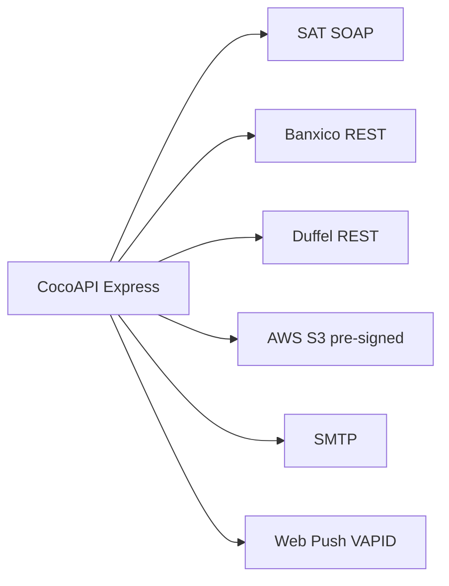
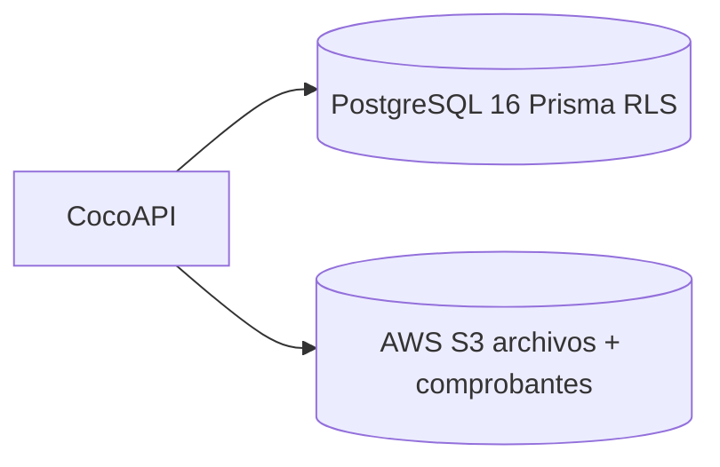
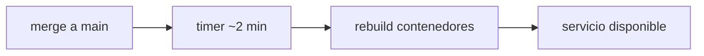

# Documento de Arquitectura — CocoAPI

> Proyecto: TC3005B.501 · Equipo: COCONSULTING2 · Cliente: Ditta Consulting
> Última actualización: 2026-06-10
> Estado: Secciones 1–6 completas; ver [arquitectura-condensada.md](arquitectura-condensada.md) para entrega única.

---

## Control del documento

Este archivo es el documento de arquitectura unificado de CocoAPI / CocoScheme y se organiza en seis secciones. Cada sección presenta una introducción contextual y, cuando el contenido técnico aún debe incorporarse, incluye marcadores que señalan el bloque pendiente. La redacción sigue un registro técnico impersonal (tercera persona, presente atemporal, sin atribuciones personales en el cuerpo del texto); la asignación de quién integra cada sección se concentra en la tabla siguiente, que constituye metadato de coordinación del borrador.

**Formato de los marcadores de contenido pendiente:**

```text
<!-- TODO (Responsable): contenido a integrar -->
```

### Asignación de integración por sección

| Sección | Integración a cargo de | Estado | Fuentes |
|---|---|---|---|
| 1. Arquitectura de Negocio | Leonardo Rodríguez · Héctor Lugo | Completa — contexto Ditta, stakeholders y roles RBAC integrados | [arquitectura-negocio.md](arquitectura-negocio.md), [service-blueprint.md](service-blueprint.md), [permisos.md](permisos.md), [Historias-de-usuario](../proyecto/Historias-de-usuario_cocoAPI.md) |
| 2. Arquitectura de Aplicación | Kevin Esquivel · Santino Im · Héctor Lugo | C4 L3 + integraciones | [diagramas-c4.md](diagramas-c4.md), [arquitectura-aplicacion.md](arquitectura-aplicacion.md) |
| 3. Arquitectura de Datos | Santino Im · Héctor Lugo | Storage + ER enlazados | [diagramas-c4.md](diagramas-c4.md), [modelo-er.md](modelo-er.md) |
| 4. Arquitectura de Infraestructura | Mariano Carretero · Héctor Lugo | Completa — specs EC2 demo documentadas | [arquitectura-nube.md](arquitectura-nube.md), [deploy-aws.md](../getting-started/deploy-aws.md) |
| 5. Requerimientos No Funcionales | — (desarrollada) | Completa | Código backend; catálogo ampliado en [RNF_CocoAPI.md](../proyecto/RNF_CocoAPI.md) |
| 6. Continuidad (RTO/RPO/SLA) | Mariano Carretero | Completa — valores demo + runbook backup | [arquitectura-nube.md](arquitectura-nube.md) |

> Nota: esta tabla es metadato de coordinación del borrador colaborativo y puede condensarse o retirarse en la versión final publicada. Los datos técnicos de las introducciones y de las secciones 5 y 6 se verificaron contra el estado de los repositorios el **2026-06-02** (`backend` y `frontend` en `main`; `cocowiki` en la rama `docs/reorg-estructura-wiki`). Las diferencias detectadas frente a documentación previa se listan en el [Anexo A](#anexo-a--notas-de-verificación).

---

## Índice

1. [Arquitectura de Negocio](#1-arquitectura-de-negocio) — incluye [Service Blueprint](service-blueprint.md)
2. [Arquitectura de Aplicación](#2-arquitectura-de-aplicación) — incluye [C4 Level 3](diagramas-c4.md#c4-level-3--component-backend-api)
3. [Arquitectura de Datos](#3-arquitectura-de-datos) — incluye [C4 Level 2 storage](diagramas-c4.md#c4-level-2--container)
4. [Arquitectura de Infraestructura](#4-arquitectura-de-infraestructura) — incluye [C4 Level 2 despliegue](diagramas-c4.md#despliegue--desarrollo-vs-producción)
5. [Requerimientos No Funcionales](#5-requerimientos-no-funcionales)
6. [Indicadores de Continuidad de Negocio (RTO / RPO / SLA)](#6-indicadores-de-continuidad-de-negocio-rto--rpo--sla)

---

## 1. Arquitectura de Negocio

> _Contenido base redactado; Arquitectura de Negocio y Service Blueprint integrados — ver [arquitectura-negocio.md](arquitectura-negocio.md) y [service-blueprint.md](service-blueprint.md)._

CocoAPI es el sistema de gestión de gastos de viaje de negocio desarrollado para el cliente Ditta Consulting. Su propósito es digitalizar y dar trazabilidad de extremo a extremo al ciclo de vida de una solicitud de viaje: desde su captura por parte de un colaborador, pasando por la cadena de autorizaciones, la cotización y reserva con la agencia, hasta la comprobación de gastos (CFDI) y su contabilización. El sistema sustituye procesos manuales y hojas de cálculo por un flujo controlado, auditable y con reglas de negocio (políticas de viático, topes de gasto, límites de reembolso) configurables por organización.

A partir del refactor multi-tenant (Q2 2026), la plataforma opera como solución multiempresa: cada entidad de negocio (usuarios, solicitudes, roles, grupos de permisos, catálogos) queda aislada por `organization_id`. La organización ROOT es Ditta (id=1), desde la cual se dan de alta las organizaciones cliente (`kind=CLIENT`). Este modelo permite administrar múltiples clientes sobre una sola instancia y garantiza que ninguna organización pueda consultar ni modificar datos de otra (detalle de aislamiento en [Sección 3](#3-arquitectura-de-datos) y [Sección 5](#5-requerimientos-no-funcionales)).

El modelo de negocio se sustenta en una jerarquía de aprobación y en un esquema de roles como contenedores de permisos. Los actores del sistema son: Solicitante (captura la solicitud), Autorizador N1 y Autorizador N2 (aprueban en dos niveles), Agencia de viajes (cotiza y reserva vuelos y hospedaje), Cuentas por pagar / CPP (valida comprobantes y procesa el pago), Administrador (gestiona usuarios, roles y catálogos de su organización) y Admin Ditta (superadministrador cross-tenant, exclusivo de la organización ROOT). El flujo de aprobación canónico es N1 → N2 → Cuentas por pagar → Agencia → Comprobación, y la solicitud transita por una máquina de estados (Borrador → revisiones → cotización → atención de agencia → comprobación → validación → finalizado, con ramas de cancelación y rechazo).

### Roles como contenedores de permisos y mapa de actores

Los roles del sistema no otorgan acceso por su nombre: son **contenedores de grupos de permisos atómicos** (`resource:action`) que se resuelven en runtime como unión aditiva (permisos y grupos del rol + grants directos del usuario), sin `deny` explícito. N1 y N2 comparten el mismo grupo aprobador y se distinguen únicamente por su tope de autorización (`maxApprovalAmount`: 50 000 vs 500 000); el rol `Admin Ditta` (grupo `DittaSuperAdmin`) existe únicamente en la organización ROOT. El diagrama de procesos de negocio, el **mapa de stakeholders/actores del sistema** (plataforma → organizaciones cliente → externos) y la síntesis del modelo de roles se documentan en [arquitectura-negocio.md](arquitectura-negocio.md); el catálogo completo de permisos y su operación, en [permisos.md](permisos.md).

### Mapa Global de Operaciones (Service Blueprint)

El [Service Blueprint](service-blueprint.md) documenta la operación end-to-end con **roles configurables por organización** (no hardcoded), **9 macro-procesos** (incluye validación fiscal CFDI/SAT, políticas/reembolso y exportación contable ERP) e integraciones externas (SAT SOAP, Banxico REST, S3 pre-signed, Web Push, API keys ERP).

Resumen de actores dinámicos:

| Rol | Ámbito | Notas |
|-----|--------|-------|
| Solicitante, N1, N2, CxP, Agencia, Admin | Por `organization_id` | Sembrados en onboarding; permisos vía control de acceso basado en roles (RBAC) |
| Observador | Por org | Solo lectura (`TravelNotifyOnly`) |
| Admin Ditta | Org ROOT | Cross-tenant; gestión de organizaciones cliente |

Los aprobadores efectivos se resuelven por reglas de workflow (`workflowRulesEngine`), no solo por nombre de rol. Diagramas de swimlanes y macro-procesos: [service-blueprint.md](service-blueprint.md) (secciones 3 y 6).

### Contexto del cliente Ditta Consulting

**Ditta Consulting** es partner de SAP que opera servicios de consultoría y back-office para clientes corporativos. El proyecto CocoAPI (curso TC3005B, equipo COCONSULTING2) nace para sustituir procesos manuales de viáticos y reembolsos por un **portal web no SAP**, ERP-agnóstico, que cualquier sistema contable pueda consumir vía API.

Objetivos de negocio acordados con el cliente:

- Digitalizar el ciclo **solicitud → aprobación (N1/N2 dinámicos) → comprobación → exportación contable**.
- Validar gastos nacionales con **CFDI/SAT** y soportar **gastos internacionales** sin XML fiscal mexicano.
- Evitar duplicar catálogos de RH/contabilidad: sincronizar empleados/proveedores desde fuente externa y exponer **API contable** (no replicar el plan de cuentas del ERP en CocoAPI).
- Operar **multi-empresa** (Ditta como ROOT, clientes como tenants) con políticas de viaje, topes y workflows configurables por organización.

### Stakeholders externos al ciclo de viaje

| Stakeholder | Rol en el ecosistema | Interacción con CocoAPI |
|-------------|----------------------|-------------------------|
| **Contabilidad del cliente** | Registra pólizas en ERP (SAP u otro) | Consume API de exportación contable (US-11) vía API Key; recibe JSON/XML estructurado |
| **Auditoría interna / compliance** | Revisa trazabilidad de aprobaciones y comprobantes | Consulta historial inmutable (US-19), logs de API keys (RNF-24) y comentarios auditables |
| **SAT / Banxico** | Autoridades y fuentes oficiales | Integraciones SOAP/REST para validación CFDI y tipo de cambio |
| **Agencia de viajes / Duffel** | Proveedor de inventario vuelo/hotel | Integración digital (US-09); costos cargados a la solicitud |
| **Administrador Ditta** | Operador de la plataforma multi-tenant | Onboarding de organizaciones, sync de empleados, catálogo contable maestro |

Referencias de requisitos funcionales: [Historias de usuario](../proyecto/Historias-de-usuario_cocoAPI.md) · RNF y trazabilidad: [RNF_CocoAPI.md](../proyecto/RNF_CocoAPI.md).

---

## 2. Arquitectura de Aplicación

> _Stack, middleware C4 L3 e integraciones integrados — ver [diagramas-c4.md](diagramas-c4.md)._

La aplicación sigue una arquitectura cliente-servidor desacoplada sobre HTTPS. El frontend está construido con Astro 5.7 (renderizado del lado del servidor con el adaptador de Node) e islas interactivas de React 19, estilizado con Tailwind CSS 4.1; la validación de formularios emplea react-hook-form y Zod, y todas las llamadas al backend pasan por un cliente HTTP centralizado (`src/utils/apiClient.ts`) que gestiona el token Bearer, el token CSRF y el header de impersonación `X-Organization-Id`. El backend expone una API REST en Express 4.18 sobre Node.js 22 (módulos ES), con acceso a datos mediante Prisma 6.16 contra PostgreSQL 16.

El backend se organiza por capas: rutas (`routes/*Routes.js`, **30 módulos**) → controladores → servicios (**71 archivos**) → Prisma (**49 modelos**). Cada petición a una ruta protegida atraviesa un pipeline de middleware documentado en [diagramas-c4.md — C4 Level 3](diagramas-c4.md#c4-level-3--component-backend-api).

**Pipeline global** (`app.js`): CORS → `express.json` → `cookieParser` → httpLogger → CSRF → montaje de rutas → manejadores de error.

**Pipeline por ruta protegida**: `authenticateToken` → `tenantContextMiddleware` → `applyRlsForRequest` → `loadPermissions` → `authorizePermission`. El rate-limiting se aplica **por ruta**, no globalmente.

### Diagrama C4 — Contexto de integraciones



Diagrama completo Level 1 (actores + sistemas externos): [diagramas-c4.md — C4 Level 1](diagramas-c4.md#c4-level-1--system-context). Capas y servicios: [arquitectura-aplicacion.md](arquitectura-aplicacion.md).

El sistema se integra con servicios externos para cubrir capacidades de negocio: el SAT (validación de CFDI vía SOAP y parseo de XML), Banxico (tipo de cambio USD→MXN por REST, con respaldo a DOF), Duffel (búsqueda y reserva de vuelos y hospedaje), SMTP / Nodemailer (notificaciones por correo), Web Push con VAPID (notificaciones en navegador) y Amazon S3 (almacenamiento de archivos con URLs prefirmadas). El detalle de cada integración se resume en la tabla siguiente.

**Tabla de referencia — integraciones externas (verificada 2026-06-02):**

| Integración | Archivo principal | Librería / Protocolo | Función |
|---|---|---|---|
| SAT (parseo de CFDI XML) | `services/cfdiParserService.js` | `fast-xml-parser` (XML) | Parseo de CFDI 3.3/4.0; extracción de RFC, UUID, total, impuestos y sello |
| SAT (consulta de estado CFDI) | `services/satConsultaService.js` | `soap` (SOAP/HTTPS) | Consulta de estado de CFDI al web service del SAT; reintentos con backoff |
| Banxico (tipo de cambio) | `services/banxicoService.js` | REST (`fetch`) | Tipo de cambio USD→MXN (serie SF43718); respaldo a DOF |
| Duffel (vuelos/hospedaje) | `services/duffel.js`, `duffelFlightProvider.js`, `duffelStaysProvider.js` | `@duffel/api` (REST) | Búsqueda y reserva de vuelos y estancias (hoteles) |
| SMTP / Correo | `services/email/mail.cjs` | `nodemailer` (SMTP) | Notificaciones por correo de cambios de estado |
| Web Push | `services/webPushService.js` | `web-push` (VAPID) | Notificaciones push en navegador |
| Amazon S3 | `services/storageService.js` | `@aws-sdk/client-s3` | Archivos de viaje con SSE-S3 y URLs prefirmadas (TTL 15 min) |

---

## 3. Arquitectura de Datos

> _Contenido base redactado; diagramas C4 y enlaces integrados — ver [diagramas-c4.md](diagramas-c4.md)._

La arquitectura de datos combina tres backends de almacenamiento especializados según el tipo de dato. El núcleo relacional es PostgreSQL 16, gestionado mediante Prisma 6.16, que modela todo el dominio de negocio (organizaciones, usuarios, roles, permisos, solicitudes, rutas, recibos, políticas y catálogos contables, entre otros). El esquema actual define 49 modelos Prisma y 5 enums (`OrganizationKind`, `OrganizationStatus`, `SolicitudHistorialAccion`, `ValidationStatus`, `PolicyExceptionStatus`).

El esquema es multi-tenant: las entidades operativas y de configuración están acotadas por `organization_id`, y el aislamiento se refuerza con Row-Level Security (RLS) de PostgreSQL sobre 38 tablas. El puente entre la aplicación y la RLS opera así: el middleware de contexto de tenant coloca la organización activa en `AsyncLocalStorage`; una extensión de Prisma Client (`prisma/tenantExtension.js`) inyecta automáticamente el filtro `organization_id` en lecturas y el valor correspondiente en escrituras para los modelos con scope; y en la conexión se ejecuta `set_config('app.current_organization_id', ...)`, GUC que evalúan las políticas RLS (`tenant_isolation`). Los superadministradores de Ditta (ROOT) pueden operar cross-tenant activando `app.bypass_tenant`, únicamente con el permiso correspondiente.

La separación de almacenamiento distribuye los datos así: PostgreSQL guarda toda la información relacional y la *metadata* de archivos; y Amazon S3 (con LocalStack como mock en desarrollo) almacena todos los binarios —tanto los comprobantes fiscales XML y PDF de los CFDI como los archivos generales de viaje—, cifrados con SSE-S3 y servidos mediante URLs prefirmadas, referenciados desde la tabla `Receipt` mediante `pdf_file_id` y `xml_file_id` (identificador del objeto en S3). La evolución del esquema se gestiona con migraciones Prisma versionadas (13 migraciones a la fecha), siendo la más relevante `20260512000000_multi_tenant_baseline`, que introdujo el modelo multi-tenant y la RLS.

### Diagrama C4 — Contenedores de datos



Diagrama completo Level 2: [diagramas-c4.md — C4 Level 2](diagramas-c4.md#c4-level-2--container). Modelos ER por subdominio (49 modelos, 5 enums): [modelo-er.md](modelo-er.md). Detalle RLS: [multi-tenancy.md](multi-tenancy.md).

---

## 4. Arquitectura de Infraestructura

> _Docker dev/prod, C4 L2 y despliegue AWS demo documentados — ver [arquitectura-nube.md](arquitectura-nube.md)._

La solución se despliega en **AWS** (región `us-east-1`, AZ `us-east-1a` en el auto-setup demo) y se empaqueta con **Docker Compose**. En desarrollo, el stack backend levanta PostgreSQL 16, LocalStack (mock S3), backend con hot-reload y contenedores de init (`s3-init`, `migrate`). En producción demo, una **EC2 t4g.small (ARM)** co-loca Caddy (TLS), frontend Astro SSR, backend Express y Postgres 16 (perfil `localdb`); los binarios van a **S3 privado** (SSE-S3) con acceso vía IAM instance role.

La entrega continua se apoya en GitHub Actions para la **integración** (en cada *push* a `main`: lint, validación de esquema Prisma y pruebas) y en un **CD server-side por git-poll** para el **despliegue**. En la instancia EC2 corre un timer systemd (`coco-redeploy.timer`, cada `REDEPLOY_INTERVAL` ≈ 2 min) que hace `git fetch` de `main` de los repos públicos y, **solo si avanzó**, `git reset --hard` + `docker compose up -d --build` (build **nativo arm64** en la caja). Detalle operativo en [deploy-aws.md sección 7](../getting-started/deploy-aws.md).

Toda la comunicación es HTTPS (Caddy: certificado auto-firmado por defecto en demo; ACME si hay dominio). La configuración se inyecta vía `deploy/.env` (chmod 600) y variables de entorno de integraciones.

### Especificaciones del despliegue demo (auto-setup)

| Recurso | Valor |
|---------|--------|
| **Instancia** | EC2 `t4g.small` (2 vCPU, 2 GiB RAM, Graviton ARM) |
| **Disco** | 30 GB gp3 EBS + swapfile 4 GB |
| **Red** | Elastic IP; subnet pública; Security Group: **22** (IP admin), **80/443** (público) |
| **IAM** | `coco-ec2-role` — permisos S3 mínimos; IMDSv2 hop-limit 2 |
| **Contenedores** | Caddy `:443` · frontend `:4321` · backend `:3000` · Postgres 16 |
| **S3** | Bucket privado, block public access, SSE-S3 |
| **Costo aprox.** | **12–15 USD/mes** en ejecución (instancia + EBS + EIP) |

### Monitoreo y observabilidad (demo)

| Capa | Estado actual | Limitación |
|------|---------------|------------|
| **Salud de contenedores** | Healthcheck HTTPS backend → reinicio Docker | No alertas externas |
| **Logs aplicación** | Pino → stdout; `docker compose logs` en EC2 | Sin CloudWatch centralizado |
| **Métricas infra** | Consola AWS / SSH manual | Sin alarmas CPU/disco configuradas |
| **CI** | GitHub Actions en cada push/PR | No sustituye APM en producción |

Para producción real se recomienda CloudWatch (logs, métricas, alarmas), Route 53 health checks y stack multi-AZ — ver [arquitectura-nube.md sección 2](arquitectura-nube.md#2-arquitectura-recomendada-producción) (~120–300+ USD/mes).

### Diagrama C4 — Contenedores y despliegue

| Entorno | Contenedores | Fuente |
|---------|--------------|--------|
| **Dev backend** | postgres, localstack, s3-init, migrate, backend (hot-reload) | `docker-compose.dev.yml` |
| **Dev frontend** | frontend (astro dev) | `docker-compose.dev.yml` (repo frontend) |
| **Prod** | postgres, backend (GHCR); frontend en host de producción | [`docker-compose.yml`](../../../TC3005B.501-Backend/docker-compose.yml) |

Pipeline CI/CD: GitHub Actions corre la CI (lint/tests). El **despliegue** a producción es **git-poll server-side**: un timer systemd (`coco-redeploy.timer`) en la EC2 hace `git fetch` de `main` y, si avanzó, reconstruye con `docker compose up -d --build` (build nativo arm64 en la caja, sin registry). Ver [deploy-aws.md sección 7](../getting-started/deploy-aws.md).

Diagramas detallados: [diagramas-c4.md — C4 Level 2](diagramas-c4.md#c4-level-2--container) y [Despliegue dev vs prod](diagramas-c4.md#despliegue--desarrollo-vs-producción). Guía operativa: [setup-docker.md](../getting-started/setup-docker.md), [arquitectura-nube.md](arquitectura-nube.md).

---

## 5. Requerimientos No Funcionales

> _Sección completa._

Esta sección consolida los requerimientos no funcionales (RNF) de CocoAPI. Dado que no existía una tabla de RNF formalizada en la documentación previa del proyecto, la tabla se construye a partir de la inspección del código (backend en `main`, verificado el 2026-06-02) y refleja tanto los requerimientos diseñados explícitamente como aquellos que el sistema ya cumple de facto. Cada RNF incluye un criterio de medición objetivo y su estado actual.

**Leyenda de Estado:** **Cumplido** (implementado y verificable) · **Parcial** (implementado sin prueba dedicada, o medición pendiente) · **Pendiente** (no implementado o no medido).

### 5.1 Tabla de RNF actualizados

| ID | Categoría | Requerimiento | US / Área | Criterio de Medición | Estado |
|---|---|---|---|---|---|
| RNF-01 | Seguridad | JWT con verificación de firma (HMAC) y expiración (1 h) | Todas | 0 requests sin auth válida acceden a rutas protegidas | Cumplido |
| RNF-02 | Seguridad | IP binding del JWT: el token queda atado a la IP de emisión | Todas | Token reutilizado desde otra IP → rechazado (`TokenMismatchError`) | Cumplido |
| RNF-03 | Seguridad | Contraseñas hasheadas con bcrypt (cost 10) | US-auth | 0 contraseñas en texto plano en BD | Cumplido |
| RNF-04 | Seguridad | Protección CSRF (`csurf`, token por sesión) en mutaciones por cookie | Todas | Mutación sin token CSRF válido → 403 (excepto login y M2M `/api/external`) | Cumplido |
| RNF-05 | Seguridad | Rate limiting: 100 req/15 min global; 5 req/min en login | Todas / login | Exceso de peticiones → HTTP 429 | Cumplido |
| RNF-06 | Seguridad | CORS restringido por allowlist (`CORS_ORIGIN`) con `credentials` | Todas | Origen no permitido → bloqueado por CORS | Cumplido |
| RNF-07 | Seguridad | HTTPS/TLS extremo a extremo | Todas | 0 tráfico en claro (autofirmado en dev, cert válido en prod) | Cumplido |
| RNF-08 | Seguridad / Aislamiento | **Multi-tenant:** aislamiento por organización vía RLS PostgreSQL (38 tablas) + extensión Prisma + `AsyncLocalStorage` | Todas las entidades con scope | **0 fugas de datos entre organizaciones** (cross-tenant) | Cumplido |
| RNF-09 | Seguridad | Validación/saneamiento de entrada (`middleware/validation.js`) y **queries parametrizadas por Prisma** → sin inyección SQL | Todas | Entrada inválida → HTTP 400; Prisma parametriza (sin SQL crudo) | Cumplido |
| RNF-10 | Privacidad / Seguridad | Cifrado en reposo **AES-256-CBC** de PII (email, teléfono de usuario) | US-user | Campos PII ilegibles en un dump de BD | Cumplido |
| RNF-11 | Rendimiento | Tiempo de respuesta de API < 500 ms (p95) en endpoints de lectura | Todas | Medición con prueba de carga | Pendiente |
| RNF-12 | Escalabilidad | Soportar 100 usuarios concurrentes sin degradación | Todas | Prueba de carga (K6 / Artillery) | Pendiente |
| RNF-13 | Escalabilidad | Backend *stateless* (JWT, sin sesión en memoria) apto para escalado horizontal | Todas | N instancias tras un balanceador sin afinidad de sesión | Parcial |
| RNF-14 | Seguridad / Autorización | RBAC granular: permisos atómicos `resource:action`, unión de 4 conjuntos, *additive-only* (sin deny explícito) | Todas | Acceso sin permiso → HTTP 403 | Cumplido |
| RNF-15 | Rendimiento | Caché de tipo de cambio (BER): 1 sola llamada externa por par/día | US-cotización | 2ª llamada del mismo día → `fromCache=true` | Cumplido |
| RNF-16 | Confiabilidad | Fallback de tipo de cambio (Banxico → DOF) ante fallo de la fuente primaria | US-cotización | El sistema sigue cotizando ante caída de Banxico | Cumplido |
| RNF-17 | Rendimiento | Descargas de archivos vía URL prefirmada S3 (TTL 15 min), sin proxy por el backend | US-archivos | La descarga no atraviesa el proceso del backend | Cumplido |
| RNF-18 | Disponibilidad | SLA de disponibilidad del servicio | Todas | Ver Sección 6 | Parcial (SLA demo 99% best-effort) |
| RNF-19 | Disponibilidad | Healthcheck HTTPS del contenedor backend para reinicio automático | Infra | Contenedor *unhealthy* → reiniciado por el orquestador | Cumplido |
| RNF-20 | Recuperación | RTO / RPO según infraestructura AWS | Todas | Ver Sección 6 | Parcial (runbook manual; ver 6.2) |
| RNF-21 | Mantenibilidad | Lint estricto (ESLint) + validación de esquema Prisma en CI | Todas | El build de CI falla ante errores de lint/esquema | Cumplido |
| RNF-22 | Mantenibilidad | Cobertura de pruebas automatizadas (≈88 tests: backend + frontend) ejecutadas en CI | Todas | CI corre la suite en cada push/PR a `main` | Parcial |
| RNF-23 | Mantenibilidad | JSDoc obligatorio + Conventional Commits | Todas | Enforcement por guía de estilo / ESLint | Cumplido |
| RNF-24 | Trazabilidad / Auditoría | Logs cifrados (AES) y bitácora de uso de API keys (`api_key_logs`) | Todas | Eventos sensibles quedan auditables | Cumplido |
| RNF-25 | Confiabilidad | **Integridad de almacenamiento:** *metadata* en **PostgreSQL** + binarios en S3; sin archivos huérfanos | US-01, US-02 | 0 archivos en S3 sin registro en BD | Cumplido |
| RNF-26 | Seguridad | **API keys** M2M con hash **scrypt** (N=16384, r=8, p=1) + *pepper*, prefijo `cck_`; la clave en claro nunca se persiste | US-external | Solo se almacena el hash (64 hex); la clave en claro se devuelve una única vez | Cumplido |
| RNF-27 | Cumplimiento fiscal | Validación de CFDI ante el SAT (SOAP) y parseo de XML (UUID único) | US-comprobación | CFDI inválido o duplicado → rechazado | Cumplido |

> **Nota sobre la columna "US / Área":** las referencias corresponden a áreas funcionales. Conviene reconciliarlas con los identificadores de historias de usuario (US) del backlog del proyecto antes de la entrega final.

#### Notas de actualización de la tabla

- **RNF-25 (base relacional: PostgreSQL):** el requerimiento de integridad de almacenamiento se redacta con PostgreSQL como base relacional, conforme a la migración desde MariaDB (PR #18). La referencia previa a MariaDB queda obsoleta.
- **RNF-08 (aislamiento multi-tenant):** se incorpora el requerimiento de cero fugas de datos entre organizaciones, sustentado en RLS PostgreSQL sobre 38 tablas, la extensión de Prisma Client y `AsyncLocalStorage`.
- **RNF-26 (API keys):** documentación previa describía las API keys con hash SHA-256. La implementación actual (`services/apiKeyService.js`) utiliza scrypt con *pepper*. Se documenta el algoritmo real, más robusto para este propósito por su costo de cómputo y memoria (resistente a ataques de fuerza bruta).

### 5.2 Pruebas no funcionales

Mapeo de los RNF contra las pruebas existentes en el repositorio (`cocowiki/docs/qa/testing.md` y suites E2E). El estado refleja la situación al 2026-06-02.

| RNF | Prueba(s) existente(s) | Resultado |
|---|---|---|
| RNF-08 — aislamiento multi-tenant | `tenantContext.test.js`, `tenantExtension.test.js`, `organizationService.test.js`, `permissions.cy.ts` (criterios de salida XC-07 / XF-07) | Completado |
| RNF-14 — autorización RBAC | `permissionMiddleware.test.js`, `permissions.cy.ts` | Completado |
| RNF-15 / RNF-16 — caché y fallback de tipo de cambio | `exchangeRate.e2e.test.js` + plan BER (`ber-bmx.e2e.test.md`): `TC-008/009/010-CACHE`, `TC-006/007-ERR`, `TC-005-NF-01` | Completado |
| RNF-27 — validación CFDI / SAT | `tests/services/CDFI/satConsultaService.e2e.test.js`, `tests/services/CDFI/verification-cfdi.e2e.test.js` | Completado |
| RNF-18 / RNF-19 — disponibilidad / SLA / escalamiento | `escalationJob.test.js` (SLA operativo de aprobación) | Parcial (cubre el escalamiento de aprobación, no la disponibilidad de infraestructura) |
| RNF-11 — respuesta < 500 ms | Pendiente: ejecutar prueba de carga | Pendiente |
| RNF-12 — 100 usuarios concurrentes | Pendiente: K6 o Artillery | Pendiente |
| RNF-20 — RTO / RPO | Runbook sección 6.2; simulacro de restore pendiente en staging | Parcial |

> **Hallazgo importante:** a la fecha no existen pruebas de rendimiento, latencia ni carga/concurrencia en el repositorio. Las pruebas no funcionales presentes cubren aislamiento multi-tenant, RBAC, confiabilidad de integraciones (BER) y validación fiscal (CFDI). El cierre de RNF-11, RNF-12 y RNF-20 requiere instrumentar una prueba de carga (K6/Artillery) y una prueba de recuperación; estas pruebas no funcionales de carga y disponibilidad quedan pendientes.

### 5.3 RNF que el sistema ya cumple *de facto*

Los siguientes mecanismos están implementados y operativos aunque no estuvieran formalizados como RNF. Se documentan con su evidencia en código (verificada el 2026-06-02) y ya están incorporados a la tabla 5.1.

- **Rate limiting** — `middleware/rateLimiters.js`. General: 100 req / 15 min por IP (10 000 en entorno no productivo). Login: 5 req / min por IP (1 000 en no productivo). El exceso responde `429`. → *RNF-05*
- **HTTPS / TLS** — certificados autofirmados en desarrollo (generados con OpenSSL al arranque); certificado válido en producción. → *RNF-07*
- **RLS multi-tenant** — 38 tablas de PostgreSQL con Row-Level Security (32 con columna de organización directa + 6 por *join* al padre). GUC `app.current_organization_id` (`set_config`) y bypass `app.bypass_tenant='on'` para ROOT. Migración `20260512000000_multi_tenant_baseline`. → *RNF-08*
- **JWT con IP binding** — `middleware/authMiddleware.js`. Verificación de firma y expiración (1 h); token desde Bearer y/o cookie httpOnly `token`; IP binding desactivable en desarrollo con `NODE_ENV=development` o `JWT_SKIP_IP_CHECK=true`. → *RNF-01, RNF-02*
- **CORS restringido** — `app.js`, allowlist por variable de entorno `CORS_ORIGIN` (lista separada por comas), `credentials: true`. → *RNF-06*
- **CSRF** — `app.js` con `csurf`; token emitido en `GET /api/user/csrf-token` (cookie con vigencia de 24 h); exenciones controladas: login, emisión del token y `/api/external/*` (M2M con `X-API-Key`). → *RNF-04*
- **Cifrado de PII con AES-256-CBC** — `middleware/decryption.js` (clave `AES_SECRET_KEY`). Cifra email y teléfono del usuario; conforme a la configuración del sistema, también las bitácoras de auditoría. → *RNF-10, RNF-24*
- **Hash de contraseñas con bcrypt** — cost 10, en el servicio de usuarios y en el de onboarding. → *RNF-03*
- **API keys con scrypt** — `services/apiKeyService.js`: hash scrypt (N=16384, r=8, p=1) + *pepper* (`API_KEY_HASH_PEPPER`, con fallback a `JWT_SECRET`), prefijo `cck_`, 256 bits de aleatoriedad; solo se persiste el hash. → *RNF-26*

---

## 6. Indicadores de Continuidad de Negocio (RTO / RPO / SLA)

> _Valores objetivo y demo documentados para el auto-setup EC2; producción multi-AZ mejora todos los indicadores._

Esta sección define RTO (tiempo máximo de recuperación), RPO (pérdida máxima de datos tolerable) y SLA (disponibilidad comprometida). La arquitectura contenizada favorece la continuidad: backend *stateless*, reconstrucción desde `main` con `docker compose up -d --build`, healthchecks HTTPS y separación de estado (PostgreSQL + S3).

**Compromiso del despliegue demo:** instancia única en una AZ — punto único de falla consciente por presupuesto escolar (~56 USD total). S3 aporta durabilidad multi-AZ para binarios; PostgreSQL co-locado en EBS **no** tiene réplica automática.

### 6.1 RTO (Recovery Time Objective)

**Qué mide.** Cuánto tarda el servicio en volver a estar disponible tras una caída o un despliegue.

En el **demo** (una EC2, sin staging) no hay un solo RTO: depende de qué falló.

| Escenario | Qué pasó | RTO esperado |
|-----------|----------|--------------|
| **A — Caída del backend** | La EC2 sigue viva; el contenedor se detuvo | Segundos a ~3 min (reinicio automático + healthcheck) |
| **B — Nuevo release** | Merge a `main`; la EC2 detecta cambios y reconstruye | Hasta ~2 min de espera + rebuild (varios minutos; no medido en repo) |
| **C — EC2 perdida** | Hay que levantar infra de cero y restaurar datos | Horas (provision + install + restore — ver 6.2) |

**Cómo se recupera (resumen).**

- **Datos:** PostgreSQL en disco (EBS) y archivos en S3. Los contenedores no guardan estado (JWT en cliente).
- **Despliegue:** GitHub Actions solo prueba el código. La EC2 revisa `main` cada ~2 min (*git-poll*); si hubo cambios, ejecuta `docker compose up -d --build`. Durante el rebuild el sitio puede quedar fuera de línea.
- **Caída del proceso:** Docker reinicia el contenedor si el proceso termina. El healthcheck tarda ~20 s en marcar el servicio listo.
- **Límite demo:** una sola máquina, una AZ, sin alta disponibilidad ni despliegue sin caída.



**Indicadores (demo)**

| Indicador | Objetivo | Notas |
|-----------|----------|-------|
| **RTO** | A: ≤3 min · B: poll + rebuild · C: horas | Ver escenarios arriba |
| **RPO** | ≤24 h | Solo si hay backup diario de PostgreSQL (6.2) |
| **SLA** | 99,0 % best-effort | Acotado por 1 EC2; mejorable con multi-AZ + RDS |

Detalle operativo: [deploy-aws.md sección 7](../getting-started/deploy-aws.md).

### 6.2 Estrategia de respaldo y runbook (PostgreSQL + S3)

**PostgreSQL (demo):**

1. **Backup lógico diario** (objetivo RPO 24 h): en la EC2, `docker compose exec postgres pg_dump -U "$POSTGRES_USER" -d "$POSTGRES_DB" -Fc -f /backup/coco-$(date +%Y%m%d).dump`.
2. Copiar el dump fuera de la instancia (S3 bucket de backups o estación local del operador).
3. **Restauración:** detener backend → `pg_restore --clean -d "$POSTGRES_DB"` sobre el dump → `docker compose up -d`.

**S3:** versioning recomendado en bucket de producción; los objetos de comprobantes no requieren backup adicional en demo gracias a durabilidad gestionada de S3.

**Recuperación ante caída de EC2:**

1. Ejecutar `aws-provision.sh` (o levantar instancia equivalente).
2. Restaurar `deploy/.env` y último dump PG.
3. `docker compose up -d --build` — el timer `coco-redeploy` retoma el CD.

**Pruebas pendientes:** simulacro de recuperación documentado como deuda (RNF-20); ejecutar al menos un restore en entorno de staging antes de comprometer SLA formal al cliente.

---

## Anexo A — Notas de verificación

Diferencias detectadas entre la documentación o los supuestos previos y la implementación actual (verificada el 2026-06-02 contra `backend` y `frontend` en `main`). Se registran para evitar propagar información desactualizada.

| Documentación o supuesto previo | Implementación actual verificada | Ajuste |
|---|---|---|
| Existía una tabla de RNF previa | No existe ninguna tabla de RNF en la wiki | La tabla se construye en sección 5.1 |
| Fuente para secciones 2 y 3: `CocoAPI_Documentacion_Tecnica.md` | Ese archivo no existe en el repositorio | Se redirige a `setup-backend.md`, `modelo-er.md`, `multi-tenancy.md` y al código |
| 38 modelos Prisma | 49 modelos / 5 enums | Corregido en sección 3 |
| RLS en "~35 tablas" | 38 tablas con RLS | Corregido en sección 5 |
| API keys con hash SHA-256 | Hash con scrypt + *pepper* | Documentado el algoritmo real (RNF-26) |
| Middleware de auth en `auth.js` | El archivo es `authMiddleware.js` | Corregido en sección 5.3 |
| RNF-25 menciona MariaDB | La base relacional es PostgreSQL (migración PR #18) | Corregido en RNF-25 |
| Documento de prueba previo cita "Prisma v7.6" | Versión real: Prisma 6.16 | Se usa la versión real en secciones 2 y 3 |

| Tabla de integraciones: fila SAT atribuida a `cfdiParserService.js` con librería `soap` | `cfdiParserService.js` usa solo `fast-xml-parser` (parseo XML); el cliente SOAP vive en `satConsultaService.js` | Fila SAT dividida en dos: parseo XML (`cfdiParserService.js`) y consulta SOAP (`satConsultaService.js`) |
| RNF-27 referenciaba `cfdi.e2e.test.js` | El archivo no existe; las pruebas E2E reales son `tests/services/CDFI/satConsultaService.e2e.test.js` y `tests/services/CDFI/verification-cfdi.e2e.test.js` | Corregido en sección 5.2 |
| Checklist pedía 29 routes / 56 services / 17 models | Verificado 2026-06-06: **30 routes**, **71 services**, **49 modelos Prisma** | Documentado en [diagramas-c4.md](diagramas-c4.md) y [service-blueprint.md](service-blueprint.md) |

**Confirmados sin cambios:** rate limit 100 req/15 min y 5 req/min en login; cifrado AES-256-CBC para PII; 5 enums Prisma; versiones Astro 5.7, React 19, Tailwind 4.1, Express 4.18, Node 22; Docker Compose de producción con 3 servicios.

---

## Nomenclatura

| Término | Significado |
|---------|-------------|
| **AES** | Advanced Encryption Standard — cifrado simétrico (PII y bitácoras sensibles). |
| **API** | Application Programming Interface — interfaz HTTP de CocoAPI. |
| **AWS** | Amazon Web Services — infraestructura de nube (despliegue y S3). |
| **CFDI** | Comprobante Fiscal Digital por Internet — comprobante fiscal mexicano. |
| **CI/CD** | Continuous Integration / Continuous Delivery — CI en GitHub Actions; despliegue por git-poll server-side (timer systemd `coco-redeploy` en la EC2). |
| **CSRF** | Cross-Site Request Forgery — token anti-falsificación en mutaciones por cookie. |
| **GHCR** | GitHub Container Registry — registro de imágenes Docker del proyecto. |
| **HTTPS** | HTTP con TLS — transporte cifrado extremo a extremo. |
| **JWT** | JSON Web Token — sesión firmada con expiración e IP binding opcional. |
| **PII** | Personally Identifiable Information — datos personales cifrados en reposo (email, teléfono). |
| **Prisma** | ORM y migraciones del esquema PostgreSQL. |
| **RBAC** | Role-Based Access Control — autorización por permisos `resource:action` (ver [permisos.md](permisos.md)). |
| **RLS** | Row-Level Security — aislamiento de filas PostgreSQL por organización. |
| **RNF** | Requerimiento No Funcional — tabla de la sección 5 de este documento. |
| **RPO** | Recovery Point Objective — pérdida máxima de datos tolerable ante fallo. |
| **RTO** | Recovery Time Objective — tiempo máximo para restaurar el servicio. |
| **SAT** | Servicio de Administración Tributaria — validación de CFDI. |
| **SLA** | Service Level Agreement — nivel de disponibilidad comprometido. |
| **SMTP** | Protocolo de correo para notificaciones de estado. |
| **SOAP** | Protocolo XML del web service del SAT. |
| **S3** | Amazon Simple Storage Service — archivos de viaje con URLs prefirmadas. |
| **SSR** | Server-Side Rendering — frontend Astro en Node. |
| **TLS** | Transport Layer Security — cifrado de transporte (HTTPS). |
| **VAPID** | Claves del servidor para Web Push. |
