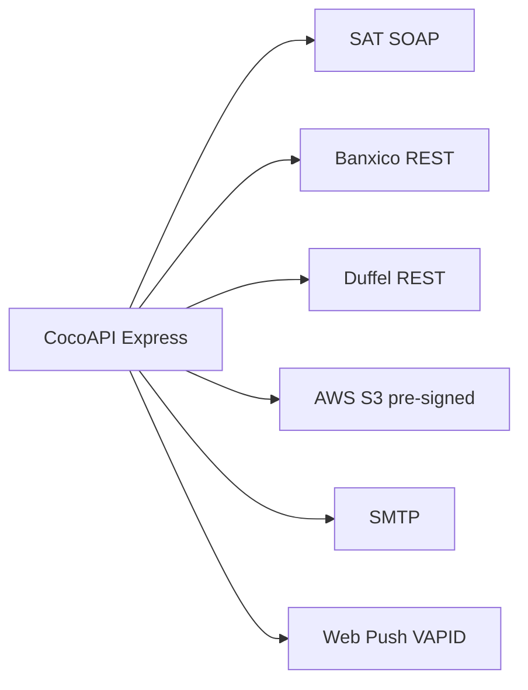
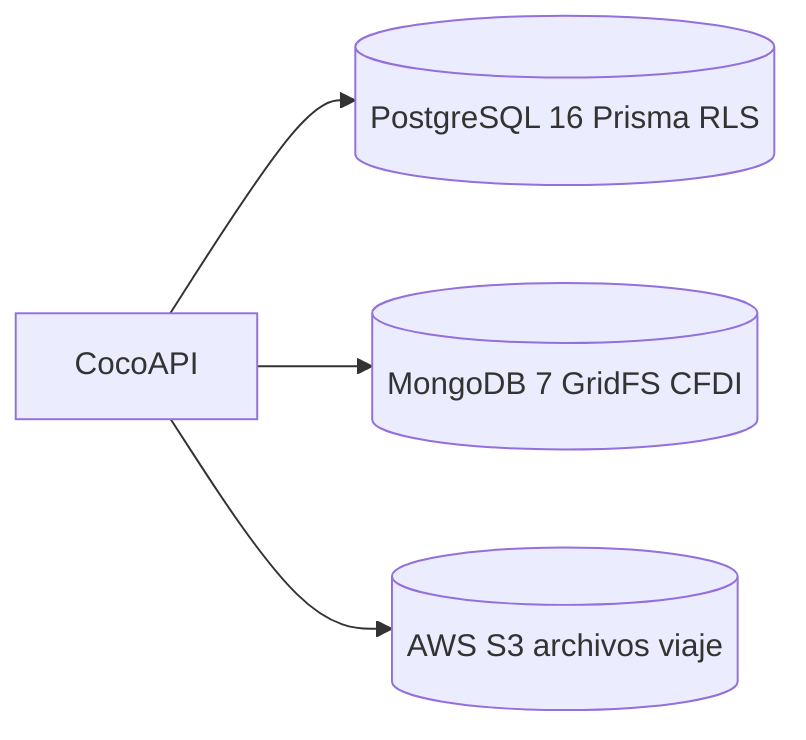

# Documento de Arquitectura — CocoAPI

> Proyecto: TC3005B.501 · Equipo: COCONSULTING2 · Cliente: Ditta Consulting
> Última actualización: 2026-06-06
> Estado: Borrador colaborativo — secciones 5 y 6 completas; secciones 1–4 con Service Blueprint y diagramas C4 integrados (2026-06-06). Pendiente: datos de infraestructura en secciones 4 y 6 (Mariano Carretero) y detalle de negocio en sección 1 (Leonardo Rodríguez).

---

## Control del documento

Este archivo es el documento de arquitectura unificado de CocoAPI / CocoScheme y se organiza en seis secciones. Cada sección presenta una introducción contextual y, cuando el contenido técnico aún debe incorporarse, incluye marcadores que señalan el bloque pendiente. La redacción sigue un registro técnico impersonal (tercera persona, presente atemporal, sin atribuciones personales en el cuerpo del texto); la asignación de quién integra cada sección se concentra en la tabla siguiente, que constituye metadato de coordinación del borrador.

**Formato de los marcadores de contenido pendiente:**

```text
<!-- TODO (Responsable): contenido a integrar -->
```

### Asignación de integración por sección

| Sección | Integración a cargo de | Estado | Fuentes |
|---|---|---|---|
| 1. Arquitectura de Negocio | Leonardo Rodríguez · Héctor Lugo | En progreso — Blueprint integrado; contexto Ditta pendiente | [service-blueprint.md](service-blueprint.md), [multi-tenancy.md](multi-tenancy.md), [permisos.md](permisos.md), [flujos.md](flujos.md) |
| 2. Arquitectura de Aplicación | Kevin Esquivel · Santino Im · Héctor Lugo | C4 L3 + integraciones | [diagramas-c4.md](diagramas-c4.md), [arquitectura-aplicacion.md](arquitectura-aplicacion.md) |
| 3. Arquitectura de Datos | Santino Im · Héctor Lugo | Storage + ER enlazados | [diagramas-c4.md](diagramas-c4.md), [modelo-er.md](modelo-er.md) |
| 4. Arquitectura de Infraestructura | Mariano Carretero · Héctor Lugo | En progreso — C4 L2 + Docker; costos pendientes | [diagramas-c4.md](diagramas-c4.md), [setup-docker.md](../getting-started/setup-docker.md) |
| 5. Requerimientos No Funcionales | — (desarrollada) | Completa | Código backend (verificado 2026-06-02) |
| 6. Continuidad (RTO/RPO/SLA) | Datos de infraestructura: Mariano Carretero | En progreso — faltan datos reales de infraestructura | Infraestructura AWS |

> Nota: esta tabla es metadato de coordinación del borrador colaborativo y puede condensarse o retirarse en la versión final publicada. Los datos técnicos de las introducciones y de las secciones 5 y 6 se verificaron contra el estado de los repositorios el **2026-06-02** (`backend` y `frontend` en `main`; `cocowiki` en la rama `docs/reorg-estructura-wiki`). Las diferencias detectadas frente a documentación previa se listan en el [Anexo A](#anexo-a--notas-de-verificación).

---

## Índice

1. [Arquitectura de Negocio](#1-arquitectura-de-negocio) — incluye [Service Blueprint](service-blueprint.md)
2. [Arquitectura de Aplicación](#2-arquitectura-de-aplicación) — incluye [C4 Level 3](diagramas-c4.md#c4-level-3--component-backend-api)
3. [Arquitectura de Datos](#3-arquitectura-de-datos) — incluye [C4 Level 2 storage](diagramas-c4.md#c4-level-2--container)
4. [Arquitectura de Infraestructura](#4-arquitectura-de-infraestructura) — incluye [C4 Level 2 despliegue](diagramas-c4.md#despliegue--desarrollo-vs-producción)
5. [Requerimientos No Funcionales](#5-requerimientos-no-funcionales)
6. [Indicadores de Continuidad de Negocio (RTO / RPO / SLA)](#6-indicadores-de-continuidad-de-negocio-rto--rpo--sla)

---

## 1. Arquitectura de Negocio

> _Contenido base redactado; Service Blueprint integrado — ver [service-blueprint.md](service-blueprint.md)._

CocoAPI es el sistema de gestión de gastos de viaje de negocio desarrollado para el cliente Ditta Consulting. Su propósito es digitalizar y dar trazabilidad de extremo a extremo al ciclo de vida de una solicitud de viaje: desde su captura por parte de un colaborador, pasando por la cadena de autorizaciones, la cotización y reserva con la agencia, hasta la comprobación de gastos (CFDI) y su contabilización. El sistema sustituye procesos manuales y hojas de cálculo por un flujo controlado, auditable y con reglas de negocio (políticas de viático, topes de gasto, límites de reembolso) configurables por organización.

A partir del refactor multi-tenant (Q2 2026), la plataforma opera como solución multiempresa: cada entidad de negocio (usuarios, solicitudes, roles, grupos de permisos, catálogos) queda aislada por `organization_id`. La organización ROOT es Ditta (id=1), desde la cual se dan de alta las organizaciones cliente (`kind=CLIENT`). Este modelo permite administrar múltiples clientes sobre una sola instancia y garantiza que ninguna organización pueda consultar ni modificar datos de otra (detalle de aislamiento en [Sección 3](#3-arquitectura-de-datos) y [Sección 5](#5-requerimientos-no-funcionales)).

El modelo de negocio se sustenta en una jerarquía de aprobación y en un esquema de roles como contenedores de permisos. Los actores del sistema son: Solicitante (captura la solicitud), Autorizador N1 y Autorizador N2 (aprueban en dos niveles), Agencia de viajes (cotiza y reserva vuelos y hospedaje), Cuentas por pagar / CPP (valida comprobantes y procesa el pago), Administrador (gestiona usuarios, roles y catálogos de su organización) y Admin Ditta (superadministrador cross-tenant, exclusivo de la organización ROOT). El flujo de aprobación canónico es N1 → N2 → Cuentas por pagar → Agencia → Comprobación, y la solicitud transita por una máquina de estados (Borrador → revisiones → cotización → atención de agencia → comprobación → validación → finalizado, con ramas de cancelación y rechazo).

### Mapa Global de Operaciones (Service Blueprint)

El [Service Blueprint](service-blueprint.md) documenta la operación end-to-end con **roles configurables por organización** (no hardcoded), **9 macro-procesos** (incluye validación fiscal CFDI/SAT, políticas/reembolso y exportación contable ERP) e integraciones externas (SAT SOAP, Banxico REST, S3 pre-signed, Web Push, API keys ERP).

Resumen de actores dinámicos:

| Rol | Ámbito | Notas |
|-----|--------|-------|
| Solicitante, N1, N2, CxP, Agencia, Admin | Por `organization_id` | Sembrados en onboarding; permisos vía control de acceso basado en roles (RBAC) |
| Observador | Por org | Solo lectura (`TravelNotifyOnly`) |
| Admin Ditta | Org ROOT | Cross-tenant; gestión de organizaciones cliente |

Los aprobadores efectivos se resuelven por reglas de workflow (`workflowRulesEngine`), no solo por nombre de rol. Diagramas de swimlanes y macro-procesos: [service-blueprint.md](service-blueprint.md) (secciones 3 y 6).

<!-- TODO (Leonardo Rodríguez): integrar el contexto de negocio del cliente Ditta (relación comercial, objetivos del proyecto). -->
<!-- TODO (Leonardo Rodríguez): ampliar stakeholders externos al ciclo de viaje (contabilidad cliente, auditoría). -->

---

## 2. Arquitectura de Aplicación

> _Stack, middleware C4 L3 e integraciones integrados — ver [diagramas-c4.md](diagramas-c4.md)._

La aplicación sigue una arquitectura cliente-servidor desacoplada sobre HTTPS. El frontend está construido con Astro 5.7 (renderizado del lado del servidor con el adaptador de Node) e islas interactivas de React 19, estilizado con Tailwind CSS 4.1; la validación de formularios emplea react-hook-form y Zod, y todas las llamadas al backend pasan por un cliente HTTP centralizado (`src/utils/apiClient.ts`) que gestiona el token Bearer, el token CSRF y el header de impersonación `X-Organization-Id`. El backend expone una API REST en Express 4.18 sobre Node.js 22 (módulos ES), con acceso a datos mediante Prisma 6.16 contra PostgreSQL 16.

El backend se organiza por capas: rutas (`routes/*Routes.js`, **30 módulos**) → controladores → servicios (**71 archivos**) → Prisma (**49 modelos**). Cada petición a una ruta protegida atraviesa un pipeline de middleware documentado en [diagramas-c4.md — C4 Level 3](diagramas-c4.md#c4-level-3--component-backend-api).

**Pipeline global** (`app.js`): CORS → `express.json` → `cookieParser` → httpLogger → CSRF → montaje de rutas → manejadores de error.

**Pipeline por ruta protegida**: `authenticateToken` → `tenantContextMiddleware` → `applyRlsForRequest` → `loadPermissions` → `authorizePermission`. La sanitización Mongo (`mongoSanitize`) y el rate-limiting se aplican **por ruta**, no globalmente.

### Diagrama C4 — Contexto de integraciones



Diagrama completo Level 1 (actores + sistemas externos): [diagramas-c4.md — C4 Level 1](diagramas-c4.md#c4-level-1--system-context). Capas y servicios: [arquitectura-aplicacion.md](arquitectura-aplicacion.md).

El sistema se integra con servicios externos para cubrir capacidades de negocio: el SAT (validación de CFDI vía SOAP y parseo de XML), Banxico (tipo de cambio USD→MXN por REST, con respaldo a DOF), Duffel (búsqueda y reserva de vuelos y hospedaje), SMTP / Nodemailer (notificaciones por correo), Web Push con VAPID (notificaciones en navegador) y Amazon S3 (almacenamiento de archivos con URLs prefirmadas). El detalle de cada integración se resume en la tabla siguiente.

**Tabla de referencia — integraciones externas (verificada 2026-06-02):**

| Integración | Archivo principal | Librería / Protocolo | Función |
|---|---|---|---|
| SAT (parseo de CFDI XML) | `services/cfdiParserService.js` | `fast-xml-parser` (XML) | Parseo de CFDI 3.3/4.0; extracción de RFC, UUID, total, impuestos y sello |
| SAT (consulta de estado CFDI) | `services/satConsultaService.js` | `soap` (SOAP/HTTPS) | Consulta de estado de CFDI al web service del SAT; reintentos con backoff |
| Banxico (tipo de cambio) | `services/banxicoService.js` | REST (`fetch`) | Tipo de cambio USD→MXN (serie SF43718); respaldo a DOF |
| Duffel (vuelos/hospedaje) | `services/duffel.js`, `duffelFlightProvider.js`, `duffelStaysProvider.js` | `@duffel/api` (REST) | Búsqueda y reserva de vuelos y estancias (hoteles) |
| SMTP / Correo | `services/email/mail.cjs` | `nodemailer` (SMTP) | Notificaciones por correo de cambios de estado |
| Web Push | `services/webPushService.js` | `web-push` (VAPID) | Notificaciones push en navegador |
| Amazon S3 | `services/storageService.js` | `@aws-sdk/client-s3` | Archivos de viaje con SSE-S3 y URLs prefirmadas (TTL 15 min) |

---

## 3. Arquitectura de Datos

> _Contenido base redactado; diagramas C4 y enlaces integrados — ver [diagramas-c4.md](diagramas-c4.md)._

La arquitectura de datos combina tres backends de almacenamiento especializados según el tipo de dato. El núcleo relacional es PostgreSQL 16, gestionado mediante Prisma 6.16, que modela todo el dominio de negocio (organizaciones, usuarios, roles, permisos, solicitudes, rutas, recibos, políticas y catálogos contables, entre otros). El esquema actual define 49 modelos Prisma y 5 enums (`OrganizationKind`, `OrganizationStatus`, `SolicitudHistorialAccion`, `ValidationStatus`, `PolicyExceptionStatus`).

El esquema es multi-tenant: las entidades operativas y de configuración están acotadas por `organization_id`, y el aislamiento se refuerza con Row-Level Security (RLS) de PostgreSQL sobre 38 tablas. El puente entre la aplicación y la RLS opera así: el middleware de contexto de tenant coloca la organización activa en `AsyncLocalStorage`; una extensión de Prisma Client (`prisma/tenantExtension.js`) inyecta automáticamente el filtro `organization_id` en lecturas y el valor correspondiente en escrituras para los modelos con scope; y en la conexión se ejecuta `set_config('app.current_organization_id', ...)`, GUC que evalúan las políticas RLS (`tenant_isolation`). Los superadministradores de Ditta (ROOT) pueden operar cross-tenant activando `app.bypass_tenant`, únicamente con el permiso correspondiente.

La separación de almacenamiento distribuye los datos así: PostgreSQL guarda toda la información relacional y la *metadata* de archivos; MongoDB 7 (GridFS) almacena los binarios de comprobantes fiscales —XML y PDF de los CFDI— referenciados desde la tabla `Receipt` mediante los identificadores de GridFS (`pdf_file_id`, `xml_file_id`); y Amazon S3 (con LocalStack como mock en desarrollo) almacena los archivos generales de viaje, cifrados con SSE-S3 y servidos mediante URLs prefirmadas. El driver Node.js de MongoDB es `mongodb@5` (`mongodb@^5.0.0`), compatible con el servidor MongoDB 7 en uso; ambas versiones son correctas y coexisten sin inconveniente. La evolución del esquema se gestiona con migraciones Prisma versionadas (13 migraciones a la fecha), siendo la más relevante `20260512000000_multi_tenant_baseline`, que introdujo el modelo multi-tenant y la RLS.

### Diagrama C4 — Contenedores de datos



Diagrama completo Level 2: [diagramas-c4.md — C4 Level 2](diagramas-c4.md#c4-level-2--container). Modelos ER por subdominio (49 modelos, 5 enums): [modelo-er.md](modelo-er.md). Detalle RLS: [multi-tenancy.md](multi-tenancy.md).

---

## 4. Arquitectura de Infraestructura

> _Docker dev/prod y C4 L2 integrados; costos AWS pendientes — ver [diagramas-c4.md](diagramas-c4.md)._

La solución se despliega en la nube de AWS y se empaqueta íntegramente con Docker Compose. En desarrollo, el stack levanta seis contenedores: cuatro de larga duración —PostgreSQL 16, MongoDB 7, LocalStack (mock de S3) y el backend con hot-reload— más dos contenedores de inicialización de un solo uso (`s3-init`, que crea el bucket en LocalStack, y `migrate`, que ejecuta `prisma generate` → `db push` → seed). En producción, el stack se reduce a tres servicios: PostgreSQL, MongoDB y el backend, este último ejecutado a partir de la imagen publicada en el registro de contenedores.

La entrega continua se apoya en GitHub Actions. En cada *push* a `main`, los flujos de integración continua ejecutan lint, validación de esquema Prisma y pruebas; y un flujo de publicación construye la imagen Docker (etapa `production`) y la envía a GHCR (GitHub Container Registry) etiquetada como `latest` y por SHA de commit (imágenes `ghcr.io/coconsulting2/tc3005b-501-backend` y `…-frontend`). El despliegue al host consiste en obtener la imagen y recrear los servicios (`docker compose pull && docker compose up -d`); este paso se realiza actualmente de forma operada sobre la instancia EC2 y no está automatizado dentro de los flujos de Actions.

Toda la comunicación es HTTPS: certificados autofirmados en desarrollo (generados con OpenSSL al primer arranque) y certificado válido en producción. Los contenedores se comunican por una red interna (`cocoscheme`) y exponen los puertos estándar del proyecto (backend `:3000`, frontend `:4321`, Postgres `:5434` en host, Mongo `:27017`, LocalStack `:4566`). La configuración se inyecta mediante variables de entorno (credenciales de base de datos, `JWT_SECRET`, `AES_SECRET_KEY`, `CORS_ORIGIN`, tokens de integraciones externas, claves VAPID y configuración de S3).

### Diagrama C4 — Contenedores y despliegue

| Entorno | Contenedores | Fuente |
|---------|--------------|--------|
| **Dev backend** | postgres, mongo, localstack, s3-init, migrate, backend (hot-reload) | `docker-compose.dev.yml` |
| **Dev frontend** | frontend (astro dev) | `docker-compose.dev.yml` (repo frontend) |
| **Prod** | postgres, mongo, backend (GHCR); frontend en host de producción | [`docker-compose.yml`](../../../TC3005B.501-Backend/docker-compose.yml) |

Pipeline CI/CD: GitHub Actions → build imagen `production` → push GHCR (`ghcr.io/coconsulting2/tc3005b-501-backend` y `…-frontend`) → despliegue con `docker compose pull && up -d` en el host de producción.

Diagramas detallados: [diagramas-c4.md — C4 Level 2](diagramas-c4.md#c4-level-2--container) y [Despliegue dev vs prod](diagramas-c4.md#despliegue--desarrollo-vs-producción). Guía operativa local: [setup-docker.md](../getting-started/setup-docker.md).

<!-- TODO (Mariano Carretero): documentar los costos estimados de la infraestructura AWS. -->
<!-- TODO (Mariano Carretero): completar Security Groups, región y monitoreo con datos reales de la instancia EC2. -->

---

## 5. Requerimientos No Funcionales

> _Sección completa._

Esta sección consolida los requerimientos no funcionales (RNF) de CocoAPI. Dado que no existía una tabla de RNF formalizada en la documentación previa del proyecto, la tabla se construye a partir de la inspección del código (backend en `main`, verificado el 2026-06-02) y refleja tanto los requerimientos diseñados explícitamente como aquellos que el sistema ya cumple de facto. Cada RNF incluye un criterio de medición objetivo y su estado actual.

**Leyenda de Estado:** **Cumplido** (implementado y verificable) · **Parcial** (implementado sin prueba dedicada, o medición pendiente) · **Pendiente** (no implementado o no medido).

### 5.1 Tabla de RNF actualizados

| ID | Categoría | Requerimiento | US / Área | Criterio de Medición | Estado |
|---|---|---|---|---|---|
| RNF-01 | Seguridad | JWT con verificación de firma (HMAC) y expiración (1 h) | Todas | 0 requests sin auth válida acceden a rutas protegidas | Cumplido |
| RNF-02 | Seguridad | IP binding del JWT: el token queda atado a la IP de emisión | Todas | Token reutilizado desde otra IP → rechazado (`TokenMismatchError`) | Cumplido |
| RNF-03 | Seguridad | Contraseñas hasheadas con bcrypt (cost 10) | US-auth | 0 contraseñas en texto plano en BD | Cumplido |
| RNF-04 | Seguridad | Protección CSRF (`csurf`, token por sesión) en mutaciones por cookie | Todas | Mutación sin token CSRF válido → 403 (excepto login y M2M `/api/external`) | Cumplido |
| RNF-05 | Seguridad | Rate limiting: 100 req/15 min global; 5 req/min en login | Todas / login | Exceso de peticiones → HTTP 429 | Cumplido |
| RNF-06 | Seguridad | CORS restringido por allowlist (`CORS_ORIGIN`) con `credentials` | Todas | Origen no permitido → bloqueado por CORS | Cumplido |
| RNF-07 | Seguridad | HTTPS/TLS extremo a extremo | Todas | 0 tráfico en claro (autofirmado en dev, cert válido en prod) | Cumplido |
| RNF-08 | Seguridad / Aislamiento | **Multi-tenant:** aislamiento por organización vía RLS PostgreSQL (38 tablas) + extensión Prisma + `AsyncLocalStorage` | Todas las entidades con scope | **0 fugas de datos entre organizaciones** (cross-tenant) | Cumplido |
| RNF-09 | Seguridad | Sanitización anti-inyección (`mongo-sanitize`) sobre `params`/`query`/`body` | Todas | 0 operadores `$`/`.` llegan a la capa de datos | Cumplido |
| RNF-10 | Privacidad / Seguridad | Cifrado en reposo **AES-256-CBC** de PII (email, teléfono de usuario) | US-user | Campos PII ilegibles en un dump de BD | Cumplido |
| RNF-11 | Rendimiento | Tiempo de respuesta de API < 500 ms (p95) en endpoints de lectura | Todas | Medición con prueba de carga | Pendiente |
| RNF-12 | Escalabilidad | Soportar 100 usuarios concurrentes sin degradación | Todas | Prueba de carga (K6 / Artillery) | Pendiente |
| RNF-13 | Escalabilidad | Backend *stateless* (JWT, sin sesión en memoria) apto para escalado horizontal | Todas | N instancias tras un balanceador sin afinidad de sesión | Parcial |
| RNF-14 | Seguridad / Autorización | RBAC granular: permisos atómicos `resource:action`, unión de 4 conjuntos, *additive-only* (sin deny explícito) | Todas | Acceso sin permiso → HTTP 403 | Cumplido |
| RNF-15 | Rendimiento | Caché de tipo de cambio (BER): 1 sola llamada externa por par/día | US-cotización | 2ª llamada del mismo día → `fromCache=true` | Cumplido |
| RNF-16 | Confiabilidad | Fallback de tipo de cambio (Banxico → DOF) ante fallo de la fuente primaria | US-cotización | El sistema sigue cotizando ante caída de Banxico | Cumplido |
| RNF-17 | Rendimiento | Descargas de archivos vía URL prefirmada S3 (TTL 15 min), sin proxy por el backend | US-archivos | La descarga no atraviesa el proceso del backend | Cumplido |
| RNF-18 | Disponibilidad | SLA de disponibilidad del servicio | Todas | Ver Sección 6 | Pendiente (datos AWS) |
| RNF-19 | Disponibilidad | Healthcheck HTTPS del contenedor backend para reinicio automático | Infra | Contenedor *unhealthy* → reiniciado por el orquestador | Cumplido |
| RNF-20 | Recuperación | RTO / RPO según infraestructura AWS | Todas | Ver Sección 6 | Pendiente (datos AWS) |
| RNF-21 | Mantenibilidad | Lint estricto (ESLint) + validación de esquema Prisma en CI | Todas | El build de CI falla ante errores de lint/esquema | Cumplido |
| RNF-22 | Mantenibilidad | Cobertura de pruebas automatizadas (≈88 tests: backend + frontend) ejecutadas en CI | Todas | CI corre la suite en cada push/PR a `main` | Parcial |
| RNF-23 | Mantenibilidad | JSDoc obligatorio + Conventional Commits | Todas | Enforcement por guía de estilo / ESLint | Cumplido |
| RNF-24 | Trazabilidad / Auditoría | Logs cifrados (AES) y bitácora de uso de API keys (`api_key_logs`) | Todas | Eventos sensibles quedan auditables | Cumplido |
| RNF-25 | Confiabilidad | **Integridad de almacenamiento:** *metadata* en **PostgreSQL** + binarios en GridFS/S3; sin archivos huérfanos | US-01, US-02 | 0 archivos en S3/GridFS sin registro en BD | Cumplido |
| RNF-26 | Seguridad | **API keys** M2M con hash **scrypt** (N=16384, r=8, p=1) + *pepper*, prefijo `cck_`; la clave en claro nunca se persiste | US-external | Solo se almacena el hash (64 hex); la clave en claro se devuelve una única vez | Cumplido |
| RNF-27 | Cumplimiento fiscal | Validación de CFDI ante el SAT (SOAP) y parseo de XML (UUID único) | US-comprobación | CFDI inválido o duplicado → rechazado | Cumplido |

> **Nota sobre la columna "US / Área":** las referencias corresponden a áreas funcionales. Conviene reconciliarlas con los identificadores de historias de usuario (US) del backlog del proyecto antes de la entrega final.

#### Notas de actualización de la tabla

- **RNF-25 (base relacional: PostgreSQL):** el requerimiento de integridad de almacenamiento se redacta con PostgreSQL como base relacional, conforme a la migración desde MariaDB (PR #18). La referencia previa a MariaDB queda obsoleta.
- **RNF-08 (aislamiento multi-tenant):** se incorpora el requerimiento de cero fugas de datos entre organizaciones, sustentado en RLS PostgreSQL sobre 38 tablas, la extensión de Prisma Client y `AsyncLocalStorage`.
- **RNF-26 (API keys):** documentación previa describía las API keys con hash SHA-256. La implementación actual (`services/apiKeyService.js`) utiliza scrypt con *pepper*. Se documenta el algoritmo real, más robusto para este propósito por su costo de cómputo y memoria (resistente a ataques de fuerza bruta).

### 5.2 Pruebas no funcionales

Mapeo de los RNF contra las pruebas existentes en el repositorio (`cocowiki/docs/qa/testing.md` y suites E2E). El estado refleja la situación al 2026-06-02.

| RNF | Prueba(s) existente(s) | Resultado |
|---|---|---|
| RNF-08 — aislamiento multi-tenant | `tenantContext.test.js`, `tenantExtension.test.js`, `organizationService.test.js`, `permissions.cy.ts` (criterios de salida XC-07 / XF-07) | Completado |
| RNF-14 — autorización RBAC | `permissionMiddleware.test.js`, `permissions.cy.ts` | Completado |
| RNF-15 / RNF-16 — caché y fallback de tipo de cambio | `exchangeRate.e2e.test.js` + plan BER (`ber-bmx.e2e.test.md`): `TC-008/009/010-CACHE`, `TC-006/007-ERR`, `TC-005-NF-01` | Completado |
| RNF-27 — validación CFDI / SAT | `tests/services/CDFI/satConsultaService.e2e.test.js`, `tests/services/CDFI/verification-cfdi.e2e.test.js` | Completado |
| RNF-18 / RNF-19 — disponibilidad / SLA / escalamiento | `escalationJob.test.js` (SLA operativo de aprobación) | Parcial (cubre el escalamiento de aprobación, no la disponibilidad de infraestructura) |
| RNF-11 — respuesta < 500 ms | Pendiente: ejecutar prueba de carga | Pendiente |
| RNF-12 — 100 usuarios concurrentes | Pendiente: K6 o Artillery | Pendiente |
| RNF-20 — RTO / RPO | Pendiente: prueba de recuperación ante desastre (datos de infraestructura AWS) | Pendiente |

> **Hallazgo importante:** a la fecha no existen pruebas de rendimiento, latencia ni carga/concurrencia en el repositorio. Las pruebas no funcionales presentes cubren aislamiento multi-tenant, RBAC, confiabilidad de integraciones (BER) y validación fiscal (CFDI). El cierre de RNF-11, RNF-12 y RNF-20 requiere instrumentar una prueba de carga (K6/Artillery) y una prueba de recuperación; estas pruebas no funcionales de carga y disponibilidad quedan pendientes.

### 5.3 RNF que el sistema ya cumple *de facto*

Los siguientes mecanismos están implementados y operativos aunque no estuvieran formalizados como RNF. Se documentan con su evidencia en código (verificada el 2026-06-02) y ya están incorporados a la tabla 5.1.

- **Rate limiting** — `middleware/rateLimiters.js`. General: 100 req / 15 min por IP (10 000 en entorno no productivo). Login: 5 req / min por IP (1 000 en no productivo). El exceso responde `429`. → *RNF-05*
- **HTTPS / TLS** — certificados autofirmados en desarrollo (generados con OpenSSL al arranque); certificado válido en producción. → *RNF-07*
- **RLS multi-tenant** — 38 tablas de PostgreSQL con Row-Level Security (32 con columna de organización directa + 6 por *join* al padre). GUC `app.current_organization_id` (`set_config`) y bypass `app.bypass_tenant='on'` para ROOT. Migración `20260512000000_multi_tenant_baseline`. → *RNF-08*
- **JWT con IP binding** — `middleware/authMiddleware.js`. Verificación de firma y expiración (1 h); token desde Bearer y/o cookie httpOnly `token`; IP binding desactivable en desarrollo con `NODE_ENV=development` o `JWT_SKIP_IP_CHECK=true`. → *RNF-01, RNF-02*
- **CORS restringido** — `app.js`, allowlist por variable de entorno `CORS_ORIGIN` (lista separada por comas), `credentials: true`. → *RNF-06*
- **Sanitización MongoDB** — `middleware/mongoSanitize.js` (`mongo-sanitize`): elimina claves con `$`/`.` de `params`, `query` y `body`. → *RNF-09*
- **CSRF** — `app.js` con `csurf`; token emitido en `GET /api/user/csrf-token` (cookie con vigencia de 24 h); exenciones controladas: login, emisión del token y `/api/external/*` (M2M con `X-API-Key`). → *RNF-04*
- **Cifrado de PII con AES-256-CBC** — `middleware/decryption.js` (clave `AES_SECRET_KEY`). Cifra email y teléfono del usuario; conforme a la configuración del sistema, también las bitácoras de auditoría. → *RNF-10, RNF-24*
- **Hash de contraseñas con bcrypt** — cost 10, en el servicio de usuarios y en el de onboarding. → *RNF-03*
- **API keys con scrypt** — `services/apiKeyService.js`: hash scrypt (N=16384, r=8, p=1) + *pepper* (`API_KEY_HASH_PEPPER`, con fallback a `JWT_SECRET`), prefijo `cck_`, 256 bits de aleatoriedad; solo se persiste el hash. → *RNF-26*

---

## 6. Indicadores de Continuidad de Negocio (RTO / RPO / SLA)

> _Estructura completa; los valores de infraestructura se completan con los datos de AWS (ver marcadores en 6.1)._

Esta sección define los indicadores de continuidad de negocio que comprometen la resiliencia del servicio: RTO (tiempo objetivo de recuperación), RPO (punto objetivo de recuperación, es decir, la pérdida máxima de datos tolerable) y SLA (nivel de disponibilidad comprometido). La sección establece la estructura de los indicadores y describe, desde la arquitectura, cómo la solución contribuye a cumplir cada uno; los valores objetivo y los valores reales medidos sobre la infraestructura AWS se completan a partir de los datos de despliegue (ver marcadores en la tabla 6.1).

La arquitectura de CocoAPI favorece la continuidad por su naturaleza contenizada e inmutable: el backend es *stateless* y se ejecuta a partir de imágenes versionadas en GHCR, de modo que recrear el servicio se reduce a `docker compose pull && up -d`; los healthchecks HTTPS permiten el reinicio automático ante fallos; y la separación de estado en PostgreSQL, MongoDB GridFS y S3 acota el dato a respaldar. Los valores numéricos (objetivo y real) dependen de decisiones de infraestructura aún por confirmar (instancia única frente a multi-AZ, cadencia de respaldos de la base de datos, monitoreo).

### 6.1 Tabla de indicadores

| Indicador | Definición | Valor objetivo | Valor real AWS (demo) | Cómo la arquitectura lo cumple |
|---|---|---|---|---|
| **RTO** — Recovery Time Objective | Tiempo máximo aceptable para recuperar el servicio tras una interrupción | *Pendiente definir* | *Pendiente (datos AWS)* | Contenedores *stateless* desde imágenes inmutables en GHCR: recuperación con `docker compose pull && up -d`. El healthcheck HTTPS dispara el reinicio automático del contenedor *unhealthy*. *(Por confirmar: tiempo real de recreación medido sobre EC2.)* |
| **RPO** — Recovery Point Objective | Pérdida máxima de datos aceptable, medida en tiempo | *Pendiente definir* | *Pendiente (datos AWS)* | El estado reside en PostgreSQL, MongoDB (GridFS) y S3; el RPO queda determinado por la cadencia de respaldos/snapshots de la base de datos y la durabilidad de S3. *(Por confirmar: frecuencia real de snapshots y estrategia de backup.)* |
| **SLA** — Service Level Agreement | Nivel de disponibilidad comprometido del servicio | *Pendiente definir* | *Pendiente (datos AWS)* | La disponibilidad está acotada por el modelo de despliegue actual (instancia EC2 única / una sola AZ); es mejorable con multi-AZ y base de datos administrada. *(Por confirmar: porcentaje comprometido y esquema de monitoreo/alertas.)* |

<!-- TODO (Mariano Carretero): completar "Valor objetivo" y "Valor real AWS (demo)" de RTO, RPO y SLA con los datos reales de la infraestructura AWS. -->
<!-- TODO (Mariano Carretero): validar/ajustar la columna "Cómo la arquitectura lo cumple" con el detalle real de respaldos, AZ y monitoreo. -->
<!-- TODO: una vez disponibles los números de SLA/disponibilidad, ejecutar las pruebas no funcionales de carga (RNF-11/RNF-12) y de disponibilidad que respalden estos indicadores. -->

---

## Anexo de coordinación — Checklist y pasos a la wiki

> _Bloque de coordinación del borrador; no forma parte del cuerpo del documento y puede retirarse en la versión publicada._

### Checklist

- [x] Crear el archivo del documento con las seis secciones.
- [x] Redactar la introducción de cada sección (2–3 párrafos contextuales).
- [x] Agregar los marcadores `TODO` con responsable para las secciones 1–4.
- [x] Completar la Sección 5: tabla de RNF actualizados + mapeo de pruebas existentes + RNF *de facto*.
- [x] Completar la Sección 6: tabla de indicadores RTO/RPO/SLA con celdas para los datos reales de AWS.
- [x] Reubicar el archivo en `cocowiki/docs/arquitectura-datos/documento-arquitectura.md` y agregar el enlace en `_sidebar.md`.
- [x] Actualizar Mapa Global de Operaciones (Service Blueprint) con actores dinámicos, 9 macro-procesos e integraciones SAT/Banxico/S3/Web Push/ERP — [service-blueprint.md](service-blueprint.md).
- [x] Crear diagramas C4 Level 1 (Context), Level 2 (Container) y Level 3 (Component Backend) — [diagramas-c4.md](diagramas-c4.md).
- [x] Integrar Blueprint y C4 en secciones 1–4 del documento unificado.
- [ ] Notificar a cada responsable de integración (ver [Control del documento](#control-del-documento)) que su sección está lista para integrarse.
- [ ] (Posterior) Convertir el documento a `.docx` para la entrega.

### Pasos para integrar a la wiki

**Ubicación destino sugerida:** `cocowiki/docs/arquitectura-datos/documento-arquitectura.md` (la wiki solo publica `docs/`, y el enlace debe ser relativo).

**Línea para `cocowiki/docs/_sidebar.md`** (bajo la sección **Arquitectura**, después de la entrada *Multi-tenant*):

```markdown
  * [Documento de Arquitectura](arquitectura-datos/documento-arquitectura.md "Negocio, Aplicación, Datos, Infraestructura, RNF y Continuidad")
```

---

## Anexo A — Notas de verificación

Diferencias detectadas entre la documentación o los supuestos previos y la implementación actual (verificada el 2026-06-02 contra `backend` y `frontend` en `main`). Se registran para evitar propagar información desactualizada.

| Documentación o supuesto previo | Implementación actual verificada | Ajuste |
|---|---|---|
| Existía una tabla de RNF previa | No existe ninguna tabla de RNF en la wiki | La tabla se construye en sección 5.1 |
| Fuente para secciones 2 y 3: `CocoAPI_Documentacion_Tecnica.md` | Ese archivo no existe en el repositorio | Se redirige a `setup-backend.md`, `modelo-er.md`, `multi-tenancy.md` y al código |
| 38 modelos Prisma | 49 modelos / 5 enums | Corregido en sección 3 |
| RLS en "~35 tablas" | 38 tablas con RLS | Corregido en sección 5 |
| API keys con hash SHA-256 | Hash con scrypt + *pepper* | Documentado el algoritmo real (RNF-26) |
| Middleware de auth en `auth.js` | El archivo es `authMiddleware.js` | Corregido en sección 5.3 |
| RNF-25 menciona MariaDB | La base relacional es PostgreSQL (migración PR #18) | Corregido en RNF-25 |
| Documento de prueba previo cita "Prisma v7.6" | Versión real: Prisma 6.16 | Se usa la versión real en secciones 2 y 3 |

| Tabla de integraciones: fila SAT atribuida a `cfdiParserService.js` con librería `soap` | `cfdiParserService.js` usa solo `fast-xml-parser` (parseo XML); el cliente SOAP vive en `satConsultaService.js` | Fila SAT dividida en dos: parseo XML (`cfdiParserService.js`) y consulta SOAP (`satConsultaService.js`) |
| RNF-27 referenciaba `cfdi.e2e.test.js` | El archivo no existe; las pruebas E2E reales son `tests/services/CDFI/satConsultaService.e2e.test.js` y `tests/services/CDFI/verification-cfdi.e2e.test.js` | Corregido en sección 5.2 |
| Checklist pedía 29 routes / 56 services / 17 models | Verificado 2026-06-06: **30 routes**, **71 services**, **49 modelos Prisma** | Documentado en [diagramas-c4.md](diagramas-c4.md) y [service-blueprint.md](service-blueprint.md) |

**Confirmados sin cambios:** rate limit 100 req/15 min y 5 req/min en login; cifrado AES-256-CBC para PII; 5 enums Prisma; versiones Astro 5.7, React 19, Tailwind 4.1, Express 4.18, Node 22; Docker Compose de producción con 3 servicios.

---

## Nomenclatura

| Término | Significado |
|---------|-------------|
| **AES** | Advanced Encryption Standard — cifrado simétrico (PII y bitácoras sensibles). |
| **API** | Application Programming Interface — interfaz HTTP de CocoAPI. |
| **AWS** | Amazon Web Services — infraestructura de nube (despliegue y S3). |
| **CFDI** | Comprobante Fiscal Digital por Internet — comprobante fiscal mexicano. |
| **CI/CD** | Continuous Integration / Continuous Delivery — pipeline GitHub Actions → GHCR. |
| **CSRF** | Cross-Site Request Forgery — token anti-falsificación en mutaciones por cookie. |
| **GHCR** | GitHub Container Registry — registro de imágenes Docker del proyecto. |
| **GridFS** | Almacén MongoDB para binarios PDF/XML de comprobantes. |
| **HTTPS** | HTTP con TLS — transporte cifrado extremo a extremo. |
| **JWT** | JSON Web Token — sesión firmada con expiración e IP binding opcional. |
| **PII** | Personally Identifiable Information — datos personales cifrados en reposo (email, teléfono). |
| **Prisma** | ORM y migraciones del esquema PostgreSQL. |
| **RBAC** | Role-Based Access Control — autorización por permisos `resource:action` (ver [permisos.md](permisos.md)). |
| **RLS** | Row-Level Security — aislamiento de filas PostgreSQL por organización. |
| **RNF** | Requerimiento No Funcional — tabla de la sección 5 de este documento. |
| **RPO** | Recovery Point Objective — pérdida máxima de datos tolerable ante fallo. |
| **RTO** | Recovery Time Objective — tiempo máximo para restaurar el servicio. |
| **SAT** | Servicio de Administración Tributaria — validación de CFDI. |
| **SLA** | Service Level Agreement — nivel de disponibilidad comprometido. |
| **SMTP** | Protocolo de correo para notificaciones de estado. |
| **SOAP** | Protocolo XML del web service del SAT. |
| **S3** | Amazon Simple Storage Service — archivos de viaje con URLs prefirmadas. |
| **SSR** | Server-Side Rendering — frontend Astro en Node. |
| **TLS** | Transport Layer Security — cifrado de transporte (HTTPS). |
| **VAPID** | Claves del servidor para Web Push. |
