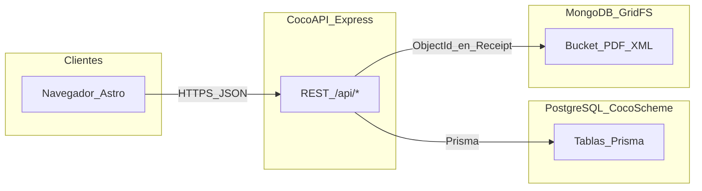
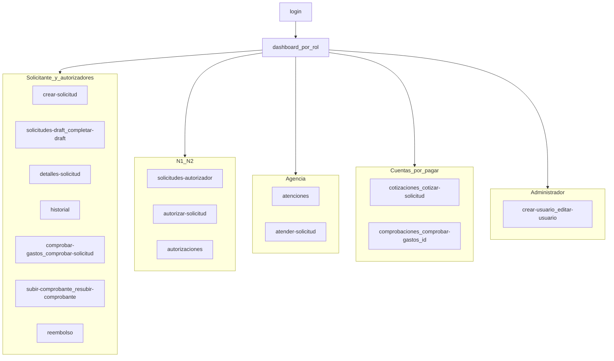
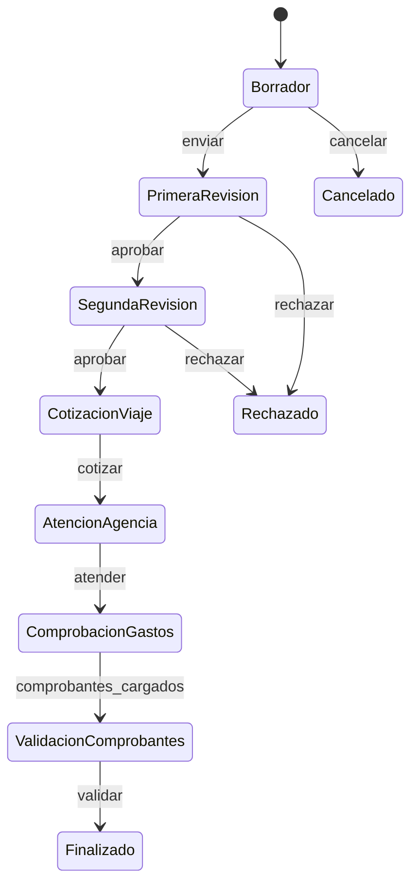
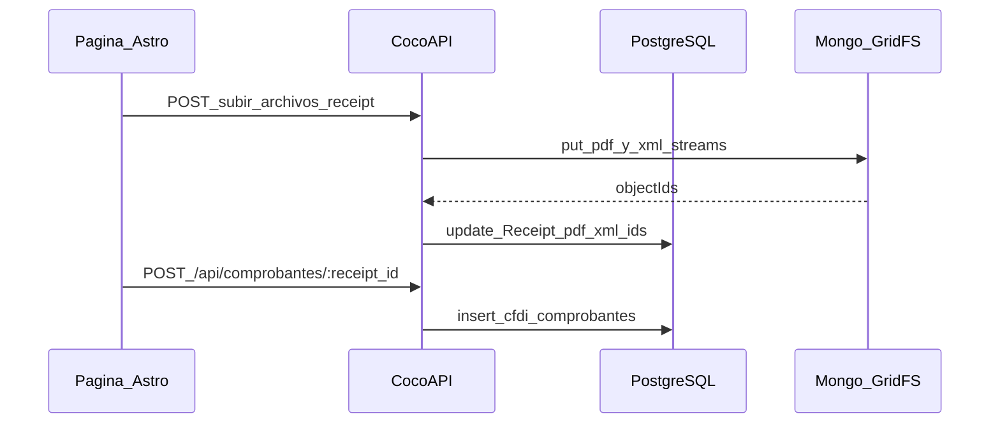

# Flujos — arquitectura de datos y navegación

| Metadato | Valor |
|----------|--------|
| **Versión del documento** | 1.0.2 |
| **Última actualización** | 2026-04-21 |
| **Referencias (monorepo)** | [routeAccess.ts](../../../TC3005B.501-Frontend/src/config/routeAccess.ts), [middleware.ts](../../../TC3005B.501-Frontend/src/middleware.ts), [app.js](../../../TC3005B.501-Backend/app.js), [seed.js](../../../TC3005B.501-Backend/prisma/seed.js) |

## 1. Capas del sistema y datos

El cliente **Astro** (SSR y navegador) consume la **CocoAPI** (Express, HTTPS). La API persiste datos estructurados en **PostgreSQL** vía **Prisma** y archivos de comprobantes (PDF/XML) en **MongoDB GridFS**; los `ObjectId` se guardan en columnas `Receipt.pdf_file_id` y `Receipt.xml_file_id`.

### Leyenda: columnas de archivo en `Receipt`

| Columna (PostgreSQL) | Uso |
|----------------------|-----|
| `pdf_file_id`, `xml_file_id` | Identificador del archivo en GridFS (típicamente 24 caracteres hex, ObjectId). |
| `pdf_file_name`, `xml_file_name` | Nombre de archivo para descarga o UI. |

## 2. Autenticación y rutas (frontend)

- **Públicas:** `/login`, `/404` (sin cookie de rol).
- **Resto:** middleware exige cookie `role`; las rutas deben coincidir con listas por rol en `roleRoutes` ([routeAccess.ts](../../../TC3005B.501-Frontend/src/config/routeAccess.ts)).
- Las llamadas API usan `PUBLIC_API_BASE_URL` y token Bearer cuando aplica ([apiClient.ts](../../../TC3005B.501-Frontend/src/utils/apiClient.ts)).

## 3. Rutas de pantalla por rol

Origen: `roleRoutes` en el frontend. Patrón `/*` indica prefijo (p. ej. `/detalles-solicitud/123`).

| Rol | Rutas permitidas |
|-----|------------------|
| **Solicitante** | `/dashboard`, `/perfil-usuario`, `/crear-solicitud`, `/historial`, `/reembolso`, `/solicitudes-draft`, `/comprobar-gastos`, `/completar-draft/*`, `/editar-solicitud/*`, `/comprobar-solicitud/*`, `/detalles-solicitud/*`, `/subir-comprobante/*`, `/resubir-comprobante/*` |
| **N1**, **N2** | Igual que Solicitante más: `/solicitudes-autorizador`, `/autorizaciones`, `/autorizar-solicitud/*`, `/subir-comprobante/*` (sin `/resubir-comprobante/*` en la lista actual) |
| **Agencia de viajes** | `/dashboard`, `/perfil-usuario`, `/atenciones`, `/atender-solicitud/*` |
| **Cuentas por pagar** | `/dashboard`, `/perfil-usuario`, `/cotizaciones`, `/comprobaciones`, `/cotizar-solicitud/*`, `/comprobar-gastos/*` |
| **Administrador** | `/dashboard`, `/perfil-usuario`, `/crear-usuario`, `/editar-usuario/*` |

Para diagramas de navegación **pantalla a pantalla** por rol (diagramas en `docs/images/diagrams/pantallas/`, alcance Módulos 1–3), ver **[Flujos de pantallas por rol](flujos-pantallas-por-rol.md)**.

El **dashboard** monta una vista distinta por rol ([role-views.ts](../../../TC3005B.501-Frontend/src/views/role-views.ts)): `ApplicantView`, `AuthorizerView`, `AdminView`, `AccountsPayableView`, `TravelAgencyView`.

## 4. Flujo de navegación por actor (resumen)

## 5. Estados de solicitud (`Request_status`)

Valores sembrados en referencia ([seed.js](../../../TC3005B.501-Backend/prisma/seed.js)):

1. Borrador  
2. Primera Revisión  
3. Segunda Revisión  
4. Cotización del Viaje  
5. Atención Agencia de Viajes  
6. Comprobación gastos del viaje  
7. Validación de comprobantes  
8. Finalizado  
9. Cancelado  
10. Rechazado  

Flujo nominal de avance (el código de negocio puede saltar o retroceder según reglas de la API):

En UI, el dashboard del solicitante agrupa estados en buckets (ej. revisión, pendiente de cotización/agencia, comprobación/validación) — ver [ApplicantView.astro](../../../TC3005B.501-Frontend/src/views/ApplicantView.astro).

## 6. API REST → entidades principales

Prefijos definidos en [app.js](../../../TC3005B.501-Backend/app.js).

| Prefijo | Entidades / almacén típico |
|---------|----------------------------|
| `/api/applicant` | `User`, `Request`, `Request_status`, `Route`, `Route_Request`, `Country`, `City`, `Department` |
| `/api/authorizer` | `Request`, `Request_status`, `Alert`, `AlertMessage` |
| `/api/user` | `User`, sesión / perfil |
| `/api/travel-agent` | `Request`, `Request_status`, `Route`, … |
| `/api/accounts-payable` | `Request`, `Request_status`, `Receipt`, … |
| `/api/admin` | `User`, `Role`, `Department` |
| `/api/files` | **GridFS** + actualización `Receipt` (`pdf_*`, `xml_*`) |
| `/api/comprobantes` | `cfdi_comprobantes` ligado a `Receipt` (`POST /api/comprobantes/:receipt_id`) |

## 7. Secuencia: comprobante con archivos y CFDI (lógico)

## 8. Documentación obsoleta

No usar como fuente del despliegue actual (en el monorepo padre, si está clonado junto a este repo):

- [BLUEPRINT_SISTEMA.md](../../../BLUEPRINT_SISTEMA.md) — describe stack con MariaDB.
- [DIAGRAMA_SISTEMA_DETALLADO.md](../../../DIAGRAMA_SISTEMA_DETALLADO.md) — mismo desfase respecto a PostgreSQL + Prisma + GridFS.
- [20260409000000_create_cfdi_comprobantes.up.sql](../../../TC3005B.501-Backend/database/migrations/20260409000000_create_cfdi_comprobantes.up.sql) — esquema alternativo (`organizaciones`, `viajes`) no alineado con el modelo Prisma `CfdiComprobante` ↔ `Receipt`.

**Operativo:** [docker-compose.dev.yml](../../../TC3005B.501-Backend/docker-compose.dev.yml), `prisma db push`, [schema.prisma](../../../TC3005B.501-Backend/prisma/schema.prisma) y el ER en [modelo-er.md](modelo-er.md).

> **GitHub Pages:** este sitio publica solo `cocowiki/docs`. Los enlaces `../../../TC3005B...` sirven cuando el wiki y el backend/frontend están en el mismo clon (monorepo). En la web publicada pueden no resolverse; usa el repositorio del producto para abrir el código.
