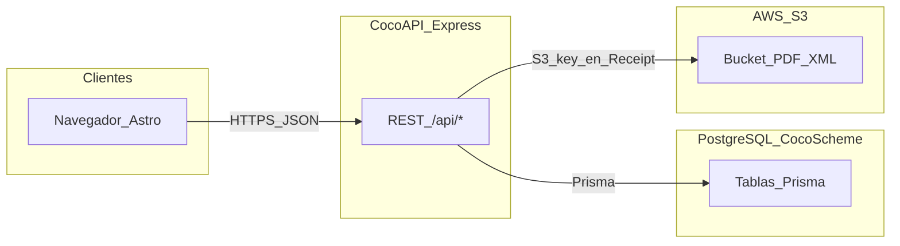
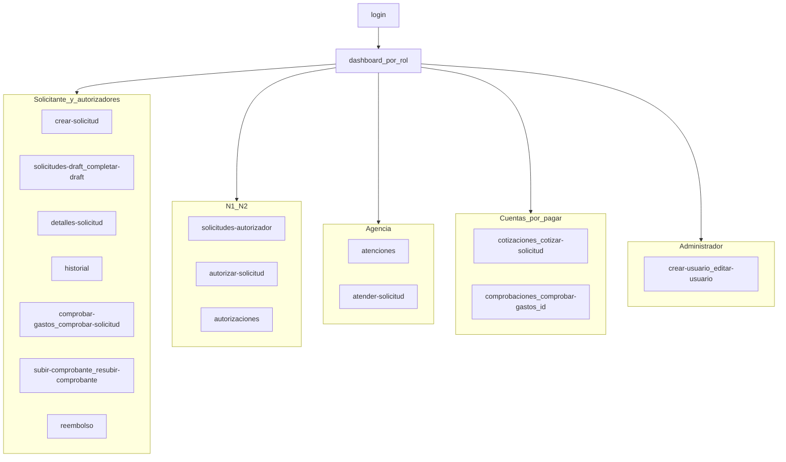
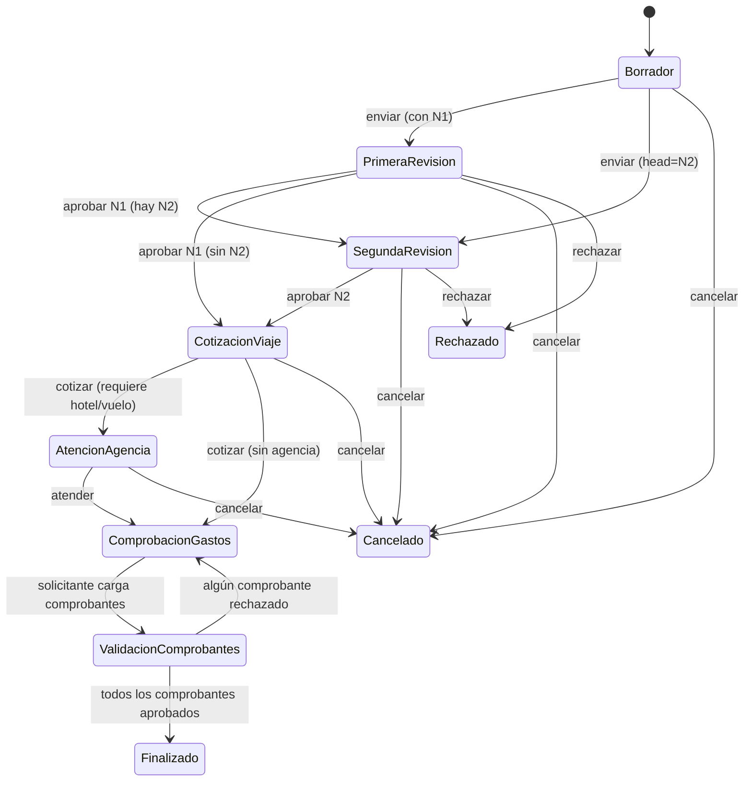
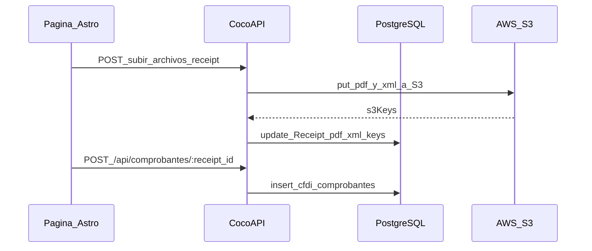

# Flujos — arquitectura de datos y navegación

| Metadato | Valor |
|----------|--------|
| **Versión del documento** | 1.1.0 |
| **Última actualización** | 2026-06-02 |
| **Referencias (monorepo)** | [routeAccess.ts](../../../TC3005B.501-Frontend/src/config/routeAccess.ts), [middleware.ts](../../../TC3005B.501-Frontend/src/middleware.ts), [app.js](../../../TC3005B.501-Backend/app.js), [seed.js](../../../TC3005B.501-Backend/prisma/seed.js), [bootstrapOrganization.js](../../../TC3005B.501-Backend/prisma/seedHelpers/bootstrapOrganization.js) |

## 1. Capas del sistema y datos

El cliente **Astro** (SSR y navegador) consume la **CocoAPI** (Express, HTTPS). La API persiste datos estructurados en **PostgreSQL** vía **Prisma** y archivos de comprobantes (PDF/XML) en **AWS S3** (LocalStack como mock en dev), con URLs prefirmadas; la **S3 object key** se guarda en columnas `Receipt.pdf_file_key` y `Receipt.xml_file_key`.

### Leyenda: columnas de archivo en `Receipt`

| Columna (PostgreSQL) | Uso |
|----------------------|-----|
| `pdf_file_key`, `xml_file_key` | S3 object key del archivo (ruta dentro del bucket). |
| `pdf_file_name`, `xml_file_name` | Nombre de archivo para descarga o UI. |

### Capas internas del backend

La CocoAPI sigue una arquitectura en capas. Cada petición REST atraviesa, de fuera hacia dentro:

| Capa | Ruta | Responsabilidad |
|------|------|-----------------|
| **Routes** | `routes/*Routes.js` | Definición de rutas Express y encadenado de middleware (auth, CSRF, permisos por código, contexto de tenant). |
| **Controllers** | `controllers/*Controller.js` | Manejo HTTP: validación de entrada, formateo de respuesta y códigos de estado. |
| **Services** | `services/*Service.js` | Lógica de negocio y flujos transaccionales (máquina de estados, reglas de workflow, validación de comprobantes). |
| **Models** | `models/*Model.js` | Acceso a datos vía Prisma (la mayor parte del acceso directo a BD vive hoy en los servicios). |
| **Prisma** | `prisma/` | Esquema (`schema.prisma`), contexto de tenant y puente RLS (`middleware.js`, `tenantExtension.js`). |

El punto de entrada es `index.js` (arranque HTTPS) → `app.js` (configuración de Express y montaje de rutas).

## 2. Autenticación y rutas (frontend)

- **Públicas:** `/login`, `/404` (sin cookie de rol).
- **Resto:** middleware exige cookie `role`; las rutas deben coincidir con listas por rol en `roleRoutes` ([routeAccess.ts](../../../TC3005B.501-Frontend/src/config/routeAccess.ts)).
- Las llamadas API usan `PUBLIC_API_BASE_URL` y token Bearer cuando aplica ([apiClient.ts](../../../TC3005B.501-Frontend/src/utils/apiClient.ts)).

## 3. Rutas de pantalla por rol

Origen: `roleRoutes` en el frontend. Patrón `/*` indica prefijo (p. ej. `/detalles-solicitud/123`).

| Rol | Rutas permitidas |
|-----|------------------|
| **Solicitante** | `/dashboard`, `/perfil-usuario`, `/crear-solicitud`, `/historial`, `/reembolso`, `/solicitudes-draft`, `/comprobar-gastos`, `/completar-draft/*`, `/editar-solicitud/*`, `/comprobar-solicitud/*`, `/detalles-solicitud/*`, `/subir-comprobante/*`, `/resubir-comprobante/*` |
| **N1**, **N2** | Igual que Solicitante más: `/solicitudes-autorizador`, `/autorizaciones`, `/autorizar-solicitud/*`, `/subir-comprobante/*` (sin `/resubir-comprobante/*` en la lista actual) |
| **Agencia de viajes** | `/dashboard`, `/perfil-usuario`, `/atenciones`, `/atender-solicitud/*` |
| **Cuentas por pagar** | `/dashboard`, `/perfil-usuario`, `/cotizaciones`, `/comprobaciones`, `/cotizar-solicitud/*`, `/comprobar-gastos/*` |
| **Administrador** | `/dashboard`, `/perfil-usuario`, `/crear-usuario`, `/editar-usuario/*` |

Para diagramas de navegación **pantalla a pantalla** por rol (diagramas en `docs/images/diagrams/pantallas/`, alcance Módulos 1–3), ver **[Flujos de pantallas por rol](../guias-usuario/flujos-pantallas-por-rol.md)**.

El **dashboard** monta una vista distinta por rol ([role-views.ts](../../../TC3005B.501-Frontend/src/views/role-views.ts)): `ApplicantView`, `AuthorizerView`, `AdminView`, `AccountsPayableView`, `TravelAgencyView`.

### 3.1 Catálogo de roles (backend, por organización)

La tabla anterior cubre las pantallas del frontend. En el backend, cada organización recibe un conjunto de roles base al sembrarse (`DEFAULT_ROLES` en [bootstrapOrganization.js](../../../TC3005B.501-Backend/prisma/seedHelpers/bootstrapOrganization.js)). El sistema es **multi-tenant**: salvo Admin Ditta, todos los roles están acotados por `organization_id`.

| Rol | Ámbito | Notas |
|-----|--------|-------|
| **Solicitante** | Por organización | Crea y da seguimiento a sus solicitudes. |
| **N1** | Por organización | Autorizador de primer nivel (tope de aprobación por defecto 50 000). |
| **N2** | Por organización | Autorizador de segundo nivel (tope de aprobación por defecto 500 000). |
| **Agencia de viajes** | Por organización | Atiende los servicios del viaje (hotel/vuelo). |
| **Cuentas por pagar** | Por organización | Cotiza y valida comprobantes. |
| **Administrador** | Por organización | Administra usuarios, roles y catálogos de su org. |
| **Observador** | Por organización (rol de sistema) | Solo lectura y notificaciones, **sin** capacidad de autorizar. Grupo de permisos `TravelNotifyOnly`. |
| **Admin Ditta** | Solo organización ROOT (Ditta) | Superadmin cross-tenant. Solo se siembra cuando la org es `ROOT`; grupo de permisos `DittaSuperAdmin`. |

Todos los roles base incluyen además los grupos `BaseColaborador` y `TravelRequestAuthor` (capacidad de solicitante) sobre su paquete específico.

## 4. Flujo de navegación por actor (resumen)

## 5. Estados de solicitud (`Request_status`)

Valores sembrados en referencia ([seed.js](../../../TC3005B.501-Backend/prisma/seed.js)):

1. Borrador  
2. Primera Revisión  
3. Segunda Revisión  
4. Cotización del Viaje  
5. Atención Agencia de Viajes  
6. Comprobación gastos del viaje  
7. Validación de comprobantes  
8. Finalizado  
9. Cancelado  
10. Rechazado  

Flujo real de la máquina de estados. El motor de reglas de workflow puede **saltar** pasos (N2 y/o Agencia) y la validación de comprobantes puede **retroceder**:

Reglas que rigen las transiciones (verificadas en el backend):

- **Cancelación (→ Cancelado, estado 9):** permitida mientras la solicitud esté en estados **1–5** (Borrador, Primera Revisión, Segunda Revisión, Cotización del Viaje, Atención Agencia de Viajes). Una vez atendida por la agencia ya no puede cancelarse. Ver `cancelTravelRequestValidation` en [applicantService.js](../../../TC3005B.501-Backend/services/applicantService.js) (lista permitida `[1, 2, 3, 4, 5]`).
- **N1 puede saltar N2:** si para la solicitud no hay un aprobador N2 configurado, al aprobar Primera Revisión la solicitud pasa **directo a Cotización del Viaje** (estado 4) en lugar de Segunda Revisión. Ver `statusAfterN1Approval` en [workflowRulesEngine.js](../../../TC3005B.501-Backend/services/workflowRulesEngine.js). Por las mismas reglas, una solicitud puede iniciar directamente en Segunda Revisión cuando el nivel inicial es N2 (`initialStatusFromLevels`).
- **Paso de Agencia opcional:** Cuentas por pagar enruta a **Atención Agencia de Viajes** (estado 5) solo si la ruta necesita hotel o vuelo; en caso contrario salta directo a **Comprobación gastos del viaje** (estado 6). Ver `routeNeedsAgency` en [solicitudJourneyService.js](../../../TC3005B.501-Backend/services/solicitudJourneyService.js) y la decisión `... ? 5 : 6` en [accountsPayableController.js](../../../TC3005B.501-Backend/controllers/accountsPayableController.js).
- **Carga de comprobantes (→ estado 7):** cuando el solicitante sube sus comprobantes, la solicitud avanza a **Validación de comprobantes**. Ver `updateRequestStatusToValidationStage` en [applicantModel.js](../../../TC3005B.501-Backend/models/applicantModel.js).
- **Retroceso en validación:** al validar comprobantes, si **alguno se rechaza** la solicitud regresa a **Comprobación gastos del viaje** (estado 6); si **todos se aprueban** pasa a **Finalizado** (estado 8). Ver `validateReceiptsAndUpdateStatus` en [accountsPayableService.js](../../../TC3005B.501-Backend/services/accountsPayableService.js).

En UI, el dashboard del solicitante agrupa estados en buckets (ej. revisión, pendiente de cotización/agencia, comprobación/validación) — ver [ApplicantView.astro](../../../TC3005B.501-Frontend/src/views/ApplicantView.astro).

## 6. API REST → módulos y entidades principales

Todos los prefijos están montados en [app.js](../../../TC3005B.501-Backend/app.js). Cada prefijo `/api/{módulo}` cuelga de su archivo `routes/*Routes.js`.

| Prefijo | Propósito / almacén típico |
|---------|----------------------------|
| `/api/applicant` | Solicitudes del solicitante: alta, borradores, cancelación, carga de comprobantes (`User`, `Request`, `Request_status`, `Route`, `Route_Request`, `Country`, `City`, `Department`). |
| `/api/authorizer` | Bandeja y alertas del autorizador N1/N2 (`Request`, `Request_status`, `Alert`, `AlertMessage`). |
| `/api/solicitudes` (inbox) | Bandeja unificada de solicitudes; se monta **antes** del workflow para que `/inbox` no colisione con `/:id/...`. |
| `/api/solicitudes` (workflow) | Acciones del flujo: aprobar, rechazar, reasignar (`solicitudWorkflowRoutes`). |
| `/api/solicitudes` (comentarios) | Comentarios/hilos por solicitud (`requestCommentRoutes`). |
| `/api/approval-substitutes` | Sustitutos de aprobación (delegación temporal de autorizadores). |
| `/api/user` | Sesión, login, perfil, token CSRF (`User`). |
| `/api/travel-agent` | Atención de la agencia de viajes a la solicitud (`Request`, `Request_status`, `Route`, …). |
| `/api/admin` (usuarios) | Administración de usuarios, roles y departamentos por organización. |
| `/api/admin` (permisos) | Catálogo de permisos y grupos; asignación a roles/usuarios (`permissionRoutes`). |
| `/api/accounts-payable` | Cuentas por pagar: cotización, validación de comprobantes, transiciones de estado (`Request`, `Receipt`). |
| `/api/files` | **AWS S3** + actualización de `Receipt` (`pdf_file_key`/`xml_file_key`, `pdf_file_name`/`xml_file_name`); URLs prefirmadas. |
| `/api/comprobantes` | CFDI ligado a `Receipt` (`POST /api/comprobantes/:receipt_id`). |
| `/api/viajes` | Gasto por tramo del viaje (`gastoTramoRoutes`). |
| `/api/exchange-rate` | Tipo de cambio (registro/consulta). |
| `/api/fx` | Conversión de divisas para importes de la solicitud. |
| `/api/flights` | Catálogo/consulta de vuelos para la cotización. |
| `/api/hotels` | Catálogo/consulta de hoteles para la cotización. |
| `/api/notifications` | Notificaciones in-app / email al usuario. |
| `/api/policies` | Reglas de política de reembolso (motor de reglas, `policyRoutes`). |
| `/api/employee-categories` | Categorías de empleado que parametrizan las políticas. |
| `/api/refunds` | Reembolsos evaluados contra el motor de políticas. |
| `/api/keys` | API keys por organización (panel admin). |
| `/api/external` | Endpoints externos para integraciones ERP (autenticación por `X-API-Key`, exento de CSRF). Ver [API integración ERP](../desarrollo/api-integracion-erp.md). |
| `/api/organizations` | Multi-tenant: gestión de organizaciones (crear/listar solo Ditta; cada admin lee/edita la propia). |
| `/api/onboarding/import` | Importación masiva de usuarios en el onboarding (JSON/CSV, patrón strategy). |
| `/api/export` | Exportación contable al ERP (pólizas AV/GV). |
| `/api/reports` | Reportes operativos. |
| `/api/viaticos-policy` | Política de viáticos: topes de hotel y comida por organización. |
| `/api/workflow-rules` | CRUD de reglas de workflow (solo Administrador de org, `workflow:manage`). |

> Rutas auxiliares no `/api/*`: `/openapi` (estáticos para Swagger), `/api-docs` (Swagger UI), `/` y `/health` (estado del servicio).

## 7. Secuencia: comprobante con archivos y CFDI (lógico)

## 8. Documentación relacionada

| Documento | Contenido |
|-----------|-----------|
| [Service Blueprint](service-blueprint.md) | Actores, macro-procesos, swimlanes, integraciones |
| [Diagramas C4](diagramas-c4.md) | Context, Container, Component |
| [Documento de Arquitectura](documento-arquitectura.md) | Visión unificada y requerimientos no funcionales |
| [Modelo ER](modelo-er.md) | Esquema PostgreSQL / Prisma |
| [Multi-tenant](multi-tenancy.md) | Aislamiento por organización |
| [Setup Docker](../getting-started/setup-docker.md) | Arranque local del stack |

Fuentes operativas de código: [docker-compose.dev.yml](../../../TC3005B.501-Backend/docker-compose.dev.yml), [schema.prisma](../../../TC3005B.501-Backend/prisma/schema.prisma).

> **GitHub Pages:** este sitio publica solo `cocowiki/docs`. Los enlaces `../../../TC3005B...` sirven cuando el wiki y el backend/frontend están en el mismo clon (monorepo). En la web publicada pueden no resolverse; usa el repositorio del producto para abrir el código.

---

## Nomenclatura

| Término | Significado |
|---------|-------------|
| **API** | Application Programming Interface — endpoints REST `/api/*` montados en [app.js](../../../TC3005B.501-Backend/app.js). |
| **CFDI** | Comprobante Fiscal Digital por Internet — XML/PDF fiscal almacenado en AWS S3 y metadata en PostgreSQL. |
| **CSRF** | Cross-Site Request Forgery — token requerido en mutaciones autenticadas por cookie. |
| **HTTPS** | HTTP con TLS — protocolo entre navegador Astro y CocoAPI. |
| **JWT** | JSON Web Token — autenticación en cookie `token` o header Bearer. |
| **N1 / N2** | Autorizador de primer y segundo nivel. |
| **ORM** | Object-Relational Mapping — acceso a datos vía Prisma. |
| **REST** | Estilo de API HTTP JSON documentado en la sección 6. |
| **RLS** | Row-Level Security — filtrado por organización en PostgreSQL (ver [multi-tenancy.md](multi-tenancy.md)). |
| **SAT** | Servicio de Administración Tributaria — validación de comprobantes fiscales. |
| **SSR** | Server-Side Rendering — frontend Astro con render en servidor. |
