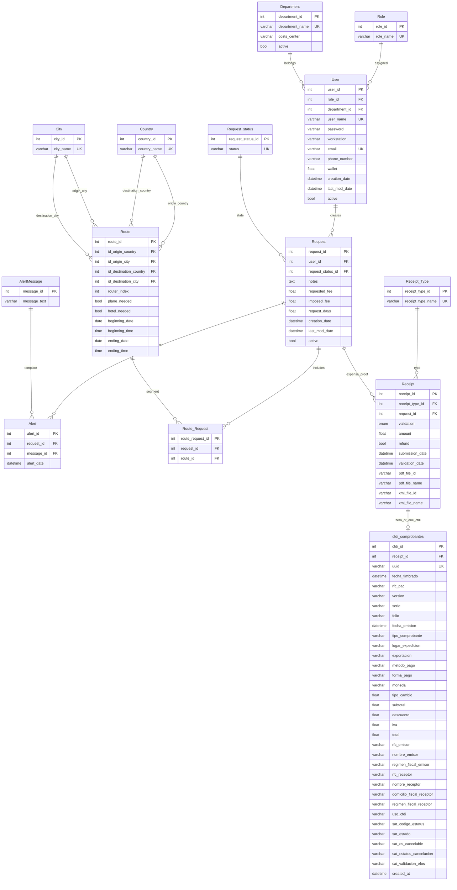

# Modelo entidad-relación (PostgreSQL / Prisma)

| Metadato | Valor |
|----------|--------|
| **Versión del documento** | 1.0.1 |
| **Última actualización** | 2026-04-15 |
| **Fuente** | [schema.prisma](../../../TC3005B.501-Backend/prisma/schema.prisma) (monorepo, ruta relativa desde este repo) |

## Alcance

Este diagrama describe las tablas creadas a partir del esquema **Prisma** en **PostgreSQL** (base `CocoScheme` en desarrollo). Los archivos PDF/XML de comprobantes **no** se guardan en PostgreSQL: los campos `pdf_file_id` y `xml_file_id` de `Receipt` almacenan identificadores **ObjectId** de **MongoDB GridFS** (ver [flujos.md](flujos.md)).

## Diagrama ER (Mermaid)

## Enum `ValidationStatus` (columna `Receipt.validation`)

Valores en base de datos (Prisma): `Pendiente`, `Aprobado`, `Rechazado`.

## Relación 1:0..1 `Receipt` ↔ `cfdi_comprobantes`

- Cada fila en `cfdi_comprobantes` exige un `receipt_id` único (una factura CFDI por comprobante).
- Un `Receipt` puede existir **sin** registro CFDI hasta que se registre vía API (ver `POST /api/comprobantes/:receipt_id`).

## Archivos binarios (fuera del ER relacional)

| Columna | Destino real |
|---------|----------------|
| `Receipt.pdf_file_id`, `Receipt.xml_file_id` | ObjectId en **MongoDB GridFS** (bucket por defecto del driver). |
| `pdf_file_name`, `xml_file_name` | Metadato en PostgreSQL para nombre legible. |

> **GitHub Pages:** el sitio publica solo `cocowiki/docs`. El enlace a `schema.prisma` usa ruta relativa al monorepo; si solo clonaste el repo de la wiki, abre el backend en el repo del producto.
