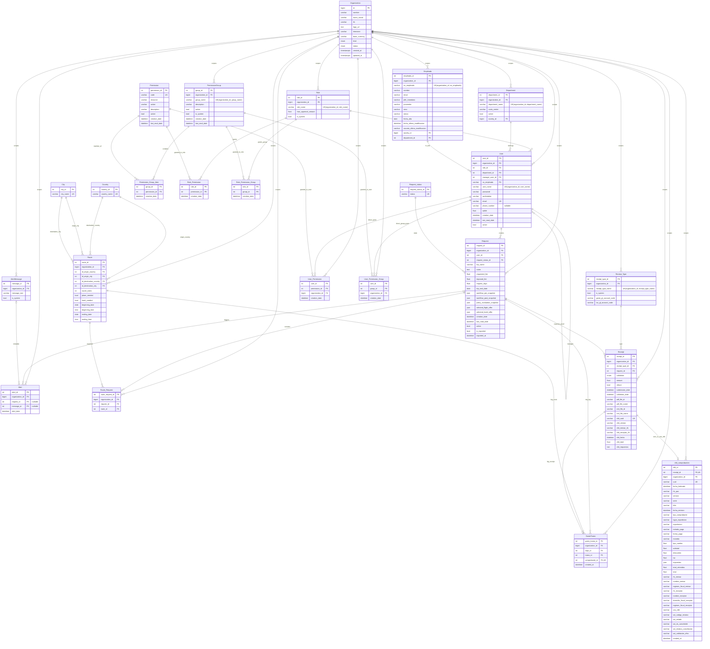
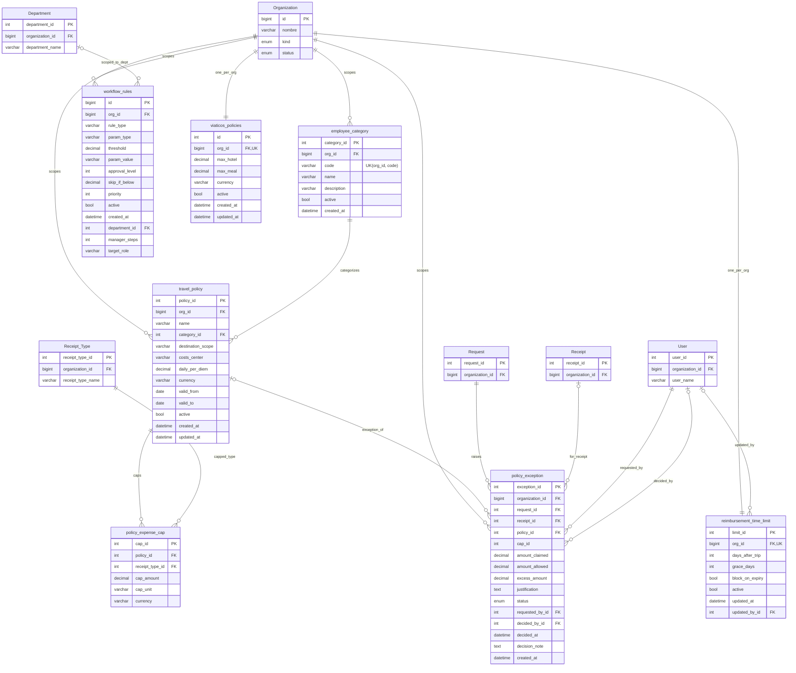
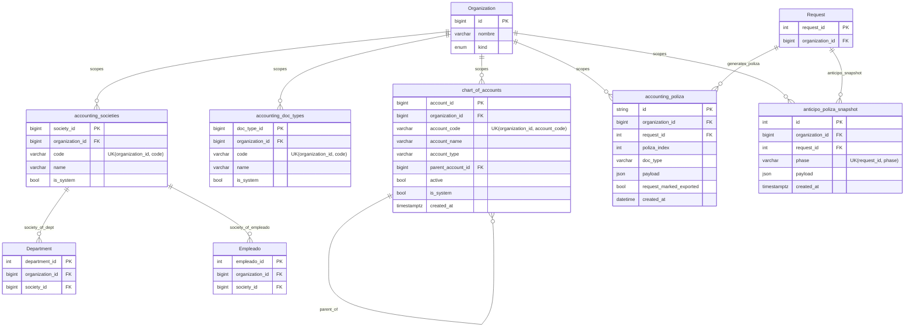
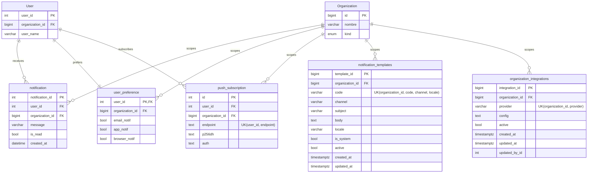
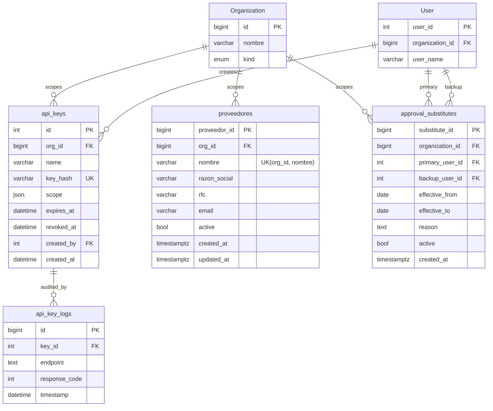
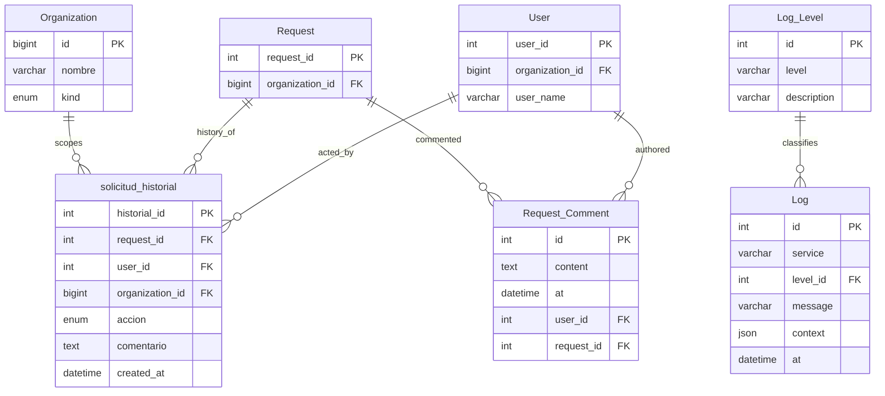
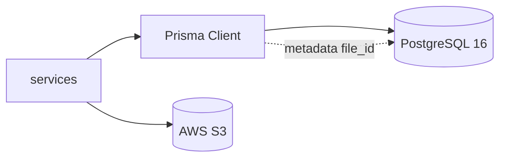

# Modelo entidad-relación (PostgreSQL / Prisma)

| Metadato | Valor |
|----------|--------|
| **Versión del documento** | 1.4.0 |
| **Última actualización** | 2026-06-09 |
| **Fuente** | [schema.prisma](../../../TC3005B.501-Backend/prisma/schema.prisma) (monorepo, ruta relativa desde este repo) |

## 4. Arquitectura de Datos

La arquitectura de datos de CocoScheme combina un **núcleo relacional** en PostgreSQL (49 modelos Prisma, 5 enums), **aislamiento multi-tenant** reforzado con Row-Level Security (RLS) y **almacenamiento de binarios** en AWS S3 referenciado desde metadatos en base de datos. Este documento es la referencia detallada del esquema ER, las entidades principales, las tecnologías de persistencia, el scope por organización, el manejo de archivos y la trazabilidad de cambios.

| Subsección | Contenido |
|------------|-----------|
| [4.1](#41-modelo-de-datos-y-entidades-principales) | Diagramas ER por dominio, enums, catálogos y notas de entidades clave |
| [4.2](#42-tecnologías-de-persistencia) | PostgreSQL, Prisma ORM y S3 |
| [4.3](#43-aislamiento-multi-tenant) | `organization_id`, RLS y catálogos globales |
| [4.4](#44-almacenamiento-de-archivos-y-documentos) | PDF/XML de comprobantes fuera del ER relacional |
| [4.5](#45-migraciones-y-trazabilidad-de-datos) | Evolución del esquema Prisma y pistas de auditoría |

Vista condensada en [documento-arquitectura.md sección 3](documento-arquitectura.md#3-arquitectura-de-datos) · Contenedores C4: [diagramas-c4.md](diagramas-c4.md#c4-level-2--container).

### 4.1 Modelo de Datos y Entidades Principales

El dominio de negocio se modela en PostgreSQL bajo el esquema **CocoScheme**. Las entidades se agrupan en un **diagrama núcleo** (organización, RBAC, solicitud, comprobantes/CFDI) y **sub-diagramas por dominio** (políticas/workflow, contabilidad, notificaciones, API keys, auditoría). Las relaciones entre sub-diagramas se resuelven por FK compartidas (`organization_id`, `request_id`, `user_id`, etc.).

## Alcance

Este documento describe las tablas creadas a partir del esquema **Prisma** en **PostgreSQL** (base `CocoScheme` en desarrollo). Los archivos PDF/XML de comprobantes **no** se guardan como BLOB en PostgreSQL: los campos `pdf_file_id` y `xml_file_id` de `Receipt` almacenan el identificador del archivo (referencia al objeto en **AWS S3** vía `storageService.js`; LocalStack como mock en dev) (ver [flujos.md](flujos.md)).

A partir del refactor multi-tenant (Q2 2026) el esquema es **multi-organización**: prácticamente toda entidad de negocio (usuarios, roles, solicitudes, catálogos, políticas, contabilidad, notificaciones) está acotada por una columna `organization_id` con FK hacia `organizaciones`. La organización **ROOT** es **Ditta** (`id = 1`); las organizaciones cliente (`kind = CLIENT`) se siembran bajo ella. Las únicas tablas que permanecen como **catálogos globales** (sin `organization_id`) son `Permission`, `Country`, `City` y `Request_status`.

> Por su tamaño (**49 modelos** Prisma + 5 enums), el ER se presenta dividido en un **diagrama núcleo** (organización, RBAC, ciclo de vida de la solicitud y comprobantes/CFDI) y varios **sub-diagramas por dominio** (políticas/workflow, contabilidad, notificaciones, API/auth, auditoría/historial). Cada entidad referenciada en una relación está declarada en el diagrama correspondiente.

### Índice de modelos por sub-diagrama

| Sub-diagrama | Modelos |
|--------------|---------|
| **Núcleo** | Organization, Role, Department, Empleado, User, Request_status, Request, AlertMessage, Alert, Country, City, Route, Route_Request, Receipt_Type, Receipt, cfdi_comprobantes, GastoTramo, Permission, PermissionGroup, Permission_Group_Item, Role_Permission, Role_Permission_Group, User_Permission, User_Permission_Group |
| **Políticas / workflow** | employee_category, travel_policy, policy_expense_cap, policy_exception, reimbursement_time_limit, workflow_rules, viaticos_policies |
| **Contabilidad** | chart_of_accounts, accounting_doc_types, accounting_societies, accounting_poliza, anticipo_poliza_snapshot |
| **Notificaciones** | notification, user_preference, push_subscription, notification_templates, organization_integrations |
| **API keys / proveedores** | api_keys, api_key_logs, proveedores, approval_substitutes |
| **Auditoría** | Log_Level, Log, solicitud_historial, Request_Comment |

## Diagrama ER — Núcleo (organización, RBAC, solicitud, comprobantes)



## Diagrama ER — Políticas y reglas de workflow

Modelos del motor de reglas de reembolso/aprobación (M2-004 / M2-006) y la política de viáticos (TF-009). Las columnas físicas `org_id` se exponen en Prisma como `organizationId` vía `@map`.



## Diagrama ER — Contabilidad

Catálogos contables per-org (RF-74) y artefactos de generación/exportación de pólizas (AV/GV).



## Diagrama ER — Notificaciones e integraciones

Notificaciones in-app, preferencias por usuario, suscripciones push (Web Push), plantillas de notificación y credenciales de integración (SMTP, Wise, SAT, Banxico, VAPID).



## Diagrama ER — API keys, proveedores y sustitutos

Claves API por organización con su auditoría de consumo (M3-004), proveedores per-org y sustitutos de aprobadores.



## Diagrama ER — Auditoría e historial

Bitácora de logs (Pino), historial de decisiones sobre solicitudes y comentarios de solicitud.



## Enums

| Enum | Mapeo SQL | Valores | Uso |
|------|-----------|---------|-----|
| `OrganizationKind` | `organization_kind` | `ROOT`, `CLIENT` | `Organization.kind`. Solo Ditta es `ROOT`. |
| `OrganizationStatus` | `organization_status` | `CONFIGURING`, `ACTIVE`, `SUSPENDED` | `Organization.status`. Ciclo de alta/baja del tenant. |
| `ValidationStatus` | — | `Pendiente`, `Aprobado`, `Rechazado` | `Receipt.validation`. Estado de validación del comprobante. |
| `SolicitudHistorialAccion` | `solicitud_historial_accion` | `APROBADO`, `RECHAZADO`, `ESCALADO`, `REASIGNADO` | `solicitud_historial.accion`. Tipo de decisión registrada. |
| `PolicyExceptionStatus` | `policy_exception_status` | `PENDING`, `APPROVED`, `REJECTED` | `policy_exception.status`. Resolución de la excepción de política. |

## Catálogo `Request_status` (global)

Tabla global (sin `organization_id`); los IDs están **hard-coded** en código como máquina de estados de la solicitud. Valores sembrados (`prisma/seed.js` → `seedGlobalRequestStatus`), en orden de inserción:

| ID | `status` |
|----|----------|
| 1 | Borrador |
| 2 | Primera Revisión |
| 3 | Segunda Revisión |
| 4 | Cotización del Viaje |
| 5 | Atención Agencia de Viajes |
| 6 | Comprobación gastos del viaje |
| 7 | Validación de comprobantes |
| 8 | Finalizado |
| 9 | Cancelado |
| 10 | Rechazado |

## Relación 1:0..1 `Receipt` ↔ `cfdi_comprobantes`

- Cada fila en `cfdi_comprobantes` exige un `receipt_id` único (una factura CFDI por comprobante).
- Un `Receipt` puede existir **sin** registro CFDI hasta que se registre vía API (ver `POST /api/comprobantes/:receipt_id`).
- **Doble almacenamiento del CFDI:** los datos fiscales viven **dos veces**. En `Receipt` hay campos *inline* de acceso rápido (`cfdi_uuid` —único—, `cfdi_version`, `cfdi_emisor_rfc`, `cfdi_receptor_rfc`, `cfdi_fecha`, `cfdi_total`, `cfdi_impuestos`) para consultas/listados sin join; y en `cfdi_comprobantes` está el detalle completo del comprobante (emisor, receptor, desglose de impuestos, datos SAT, etc.).
- **Gastos internacionales (US-25):** cuando no existe CFDI del SAT, `cfdi_comprobantes.tipo_comprobante` puede ser **`INTERNACIONAL`** (recibo extranjero sin validación SAT).

## Solicitud (`Request`): snapshots y campos de exportación

Más allá de los importes (`requested_fee` / `imposed_fee`) y fechas, `Request` persiste varios JSON de auditoría/decisión y banderas de exportación contable:

- `workflow_pre_snapshot` / `workflow_post_snapshot` — estado del workflow de aprobación antes/después de evaluar las reglas.
- `policy_evaluation_snapshot` — resultado de la evaluación de políticas de viáticos/topes.
- `selected_flight_offer` / `selected_hotel_offer` — oferta de vuelo/hospedaje elegida por la Agencia de viajes (Duffel / Duffel Stays o mock normalizado).
- `trip_end_date` — fecha de fin de viaje (base para el límite de comprobación, `reimbursement_time_limit`).
- `is_exported` / `exported_at` — marca y momento de exportación contable de la solicitud.

La pista de decisiones se complementa con `solicitud_historial` (acciones APROBADO/RECHAZADO/ESCALADO/REASIGNADO por usuario) y los comentarios libres en `Request_Comment`. Las pólizas contables generadas se guardan en `accounting_poliza` y los anticipos en `anticipo_poliza_snapshot` (uno por `request_id` + `phase`).

## Usuario (`User`): jerarquía y vínculo con RH

- `manager_user_id` — auto-referencia (`User` ⟶ `User`, relación `UserManager`) que modela la cadena de mando; se usa en reglas de workflow tipo `manager_steps`.
- `no_empleado` + `organization_id` — FK compuesta hacia `empleado` (catálogo sincronizado desde RH/SAP). Permite enlazar la cuenta de acceso con el registro de empleado.
- `phone_number` es **nullable**; `email` es único a nivel global.

## Sistema de permisos granulares (RBAC + directo a usuario)

El modelo incluye un sistema de permisos tipo IAM. El catálogo `Permission` es **global**; los grupos y todas las asignaciones (a rol y a usuario) son **per-org**:

- **`Permission`** — permiso atómico con código único `resource:action` (p.ej. `travel_request:authorize`). **Global.**
- **`PermissionGroup`** — bundle reutilizable de permisos. Per-org (`@@unique([organization_id, group_name])`, con `is_system`).
- **`Permission_Group_Item`** — membresía grupo ↔ permiso.
- **`Role_Permission`** — grant directo de un permiso a un rol.
- **`Role_Permission_Group`** — grant de un grupo completo a un rol (los permisos del grupo se "expanden" al resolver).
- **`User_Permission`** — grant directo de un permiso a un usuario (aditivo sobre los del rol). Lleva `organization_id`.
- **`User_Permission_Group`** — grant de un grupo a un usuario (aditivo). Lleva `organization_id`.

Además, `Role` incorpora `max_approval_amount` (tope de `requested_fee` que el rol puede aprobar en un paso; `null` = sin tope explícito).

**Resolución de permisos efectivos de un usuario** (unión de 4 conjuntos):

```
effective(userId) =
      role.rolePermissions
    ∪ role.rolePermissionGroups[*].items
    ∪ user.userPermissions
    ∪ user.userPermissionGroups[*].items
```

Ver [`services/permissionService.js`](../../../TC3005B.501-Backend/services/permissionService.js) para la implementación y [`middleware/permissionMiddleware.js`](../../../TC3005B.501-Backend/middleware/permissionMiddleware.js) para el middleware `requirePermission(...)` que compone `authenticateToken` como primer paso (no es posible llegar a un handler sin autenticación).

### 4.2 Tecnologías de Persistencia

CocoAPI distribuye la persistencia según el tipo de dato: relacional estructurado en PostgreSQL, binarios en object storage y metadatos de archivos en tablas relacionales.

| Capa | Tecnología | Rol |
|------|------------|-----|
| **Base relacional** | PostgreSQL 16 | Esquema `CocoScheme`; ACID; RLS nativo; JSON para snapshots de workflow y pólizas |
| **ORM / acceso** | Prisma 6.16 | `schema.prisma` como fuente de verdad; Client generado; extensión `tenantExtension.js` para scope por org |
| **Object storage** | AWS S3 (LocalStack en dev) | PDF/XML de comprobantes y adjuntos; SSE-S3; URLs prefirmadas (TTL 15 min) vía `storageService.js` |
| **Cifrado PII** | AES-256-CBC (aplicación) | Campos sensibles de `User` (email, teléfono) ilegibles en dump de BD (RNF-10) |

**Flujo de escritura típico:** el servicio invoca Prisma → la extensión de tenant inyecta `organization_id` donde aplica → la conexión ejecuta `set_config('app.current_organization_id', …)` para que las políticas RLS filtren filas → los binarios se suben a S3 y solo el identificador (`pdf_file_id`, `xml_file_id`) persiste en `Receipt`.



### 4.3 Aislamiento Multi-tenant

Cada organización cliente opera sobre la misma instancia de PostgreSQL con datos lógicamente separados por columna `organization_id` y políticas RLS. La organización **ROOT** (Ditta, `id = 1`) administra tenants `CLIENT`; ningún tenant accede a filas de otro salvo bypass explícito para superadmin.

## Multi-tenancy: `organization_id` y catálogos globales

Casi todo modelo de negocio incluye `organization_id` (FK → `organizaciones`) y, en producción, queda protegido por **RLS** de PostgreSQL (ver [multi-tenancy.md](multi-tenancy.md) y `prisma/tenantExtension.js`). Las claves únicas que antes eran globales pasaron a ser **por organización**:

- `Role` → `@@unique([organization_id, role_name])` (NO global).
- `User` → `@@unique([organization_id, user_name])`. El `email` sí permanece único global.
- `Department` → `@@unique([organization_id, department_name])`.
- `Receipt_Type` → `@@unique([organization_id, receipt_type_name])`.
- `PermissionGroup` → `@@unique([organization_id, group_name])`.
- `Empleado` → `@@unique([organization_id, no_empleado])`.

**Catálogos globales (sin `organization_id`):** `Permission`, `Country`, `City` y `Request_status`. Se comparten entre todas las organizaciones.

La bandera `is_system` (presente en `Role`, `Receipt_Type`, `AlertMessage`, `PermissionGroup`, `chart_of_accounts`, `accounting_doc_types`, `accounting_societies`, `notification_templates`) marca los registros sembrados por bootstrap que no deben editarse/borrarse desde la UI.

**Mecanismo de aislamiento (resumen):**

1. **Aplicación** — `tenantContextMiddleware` resuelve la organización activa (`req.tenantContext`) desde JWT, cookie o header `X-Organization-Id` (impersonación ROOT).
2. **Prisma** — `tenantExtension.js` añade filtro `organization_id` en lecturas y valor en escrituras para modelos con scope.
3. **PostgreSQL** — RLS en **38 tablas** con política `tenant_isolation` evaluando el GUC `app.current_organization_id` (`applyRlsForRequest`).
4. **Bypass controlado** — superadmin Ditta con permiso explícito puede activar `app.bypass_tenant='on'` para operaciones cross-tenant.

### 4.4 Almacenamiento de Archivos y Documentos

Los comprobantes fiscales y adjuntos de viaje **no** se almacenan como BLOB en PostgreSQL. La tabla `Receipt` guarda identificadores y nombres legibles; el binario reside en S3.

## Archivos binarios (fuera del ER relacional)

| Columna | Destino real |
|---------|----------------|
| `Receipt.pdf_file_id`, `Receipt.xml_file_id` | Identificador del objeto en **AWS S3** (S3 key o referencia persistida por `storageService.js`; `VarChar(24)` en BD). |
| `pdf_file_name`, `xml_file_name` | Metadato en PostgreSQL para nombre legible en UI/descarga. |

> **Nota:** la ruta de upload principal usa `services/storageService.js` (SSE-S3, URLs prefirmadas). Algunos flujos legacy en `receiptFileService.js` pueden usar el mismo campo `pdf_file_id` con otro formato de identificador; la columna física en Prisma es siempre `pdf_file_id` / `xml_file_id`.

**Flujo de carga/descarga:** el cliente sube vía API → el backend valida permisos y escribe en S3 → persiste `pdf_file_id` / `xml_file_id` en `Receipt` → la descarga usa URL prefirmada (TTL 15 min) sin proxy del binario por Express (RNF-17).

### 4.5 Migraciones y Trazabilidad de Datos

La evolución del esquema se versiona con **Prisma Migrate** (`prisma/migrations/`). En Docker, el contenedor `migrate` (dev) o `RUN_MIGRATIONS=true` (prod) aplica migraciones pendientes al arrancar. El historial SQL es la fuente de verdad de cambios de DDL; `schema.prisma` debe mantenerse alineado antes de cada release.

| Migración | Fecha | Alcance principal |
|-----------|-------|-------------------|
| `20260427103000_m2_005_solicitud_historial` | 2026-04-27 | Tabla `solicitud_historial` y enum de acciones |
| `20260505090000_m2_006_refund_rules` | 2026-05-05 | Motor de reglas de reembolso / políticas |
| `20260510120000_api_keys_audit_log` | 2026-05-10 | `api_keys`, `api_key_logs` |
| `20260511000000_add_is_exported_to_request` | 2026-05-11 | Banderas de exportación contable en `Request` |
| `20260511130000_anticipo_poliza_snapshot` | 2026-05-11 | Snapshots de póliza de anticipo |
| `20260512000000_multi_tenant_baseline` | 2026-05-12 | **Baseline multi-tenant**, RLS 38 tablas, `organizaciones` |
| `20260512100000_add_user_manager_adjacency` | 2026-05-12 | `User.manager_user_id` (jerarquía) |
| `20260512103000_add_empleado_catalog` | 2026-05-12 | Catálogo `empleado` |
| `20260512104500_add_user_no_empleado_fk` | 2026-05-12 | FK compuesta User ↔ Empleado |
| `20260512113000_accounting_poliza_receipt_gl` | 2026-05-12 | Pólizas contables y cuentas GL en tipos de recibo |
| `20260512120000_tf010_international_flight_offer` | 2026-05-12 | Ofertas internacionales en `Request` |
| `20260514193000_user_username_unique_per_organization` | 2026-05-14 | Unicidad de `user_name` por org |
| `20260518120000_cfdi_impuestos_json` | 2026-05-18 | `cfdi_impuestos` JSON en `Receipt` / comprobantes |

**Trazabilidad en runtime** (complementa el ER de auditoría):

| Artefacto | Tabla / campo | Qué registra |
|-----------|---------------|--------------|
| Historial de decisiones | `solicitud_historial` | APROBADO, RECHAZADO, ESCALADO, REASIGNADO por usuario y org |
| Comentarios | `Request_Comment` | Texto libre asociado a solicitud |
| Snapshots de workflow | `Request.workflow_*_snapshot`, `policy_evaluation_snapshot` | Estado antes/después de reglas y políticas |
| Exportación contable | `accounting_poliza`, `anticipo_poliza_snapshot`, `is_exported` | Pólizas generadas e idempotencia de export |
| Logs de aplicación | `Log` + `Log_Level` | Eventos Pino persistidos (servicio, nivel, contexto JSON) |
| Auditoría API M2M | `api_key_logs` | Endpoint, código HTTP y timestamp por API key |
| Consumo externo | `Log.context` / httpLogger | Correlación de peticiones HTTP en stdout |

Comandos locales habituales: `bunx prisma migrate dev` (desarrollo), `bunx prisma migrate deploy` (CI/prod), `bunx prisma validate` (CI).

> **GitHub Pages:** el sitio publica solo `cocowiki/docs`. El enlace a `schema.prisma` usa ruta relativa al monorepo; si solo clonaste el repo de la wiki, abre el backend en el repo del producto.
