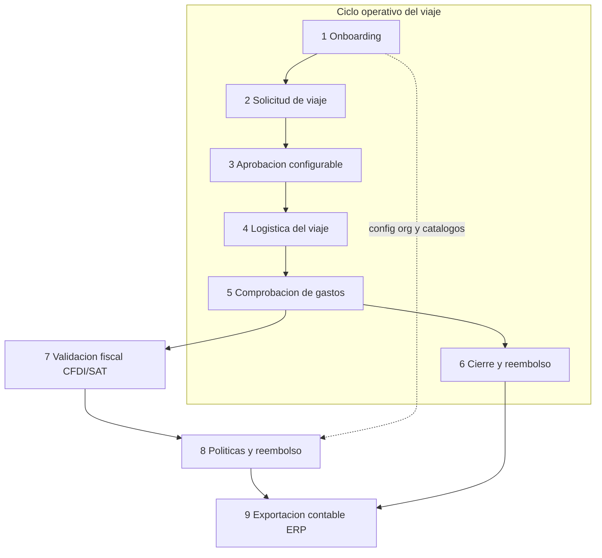
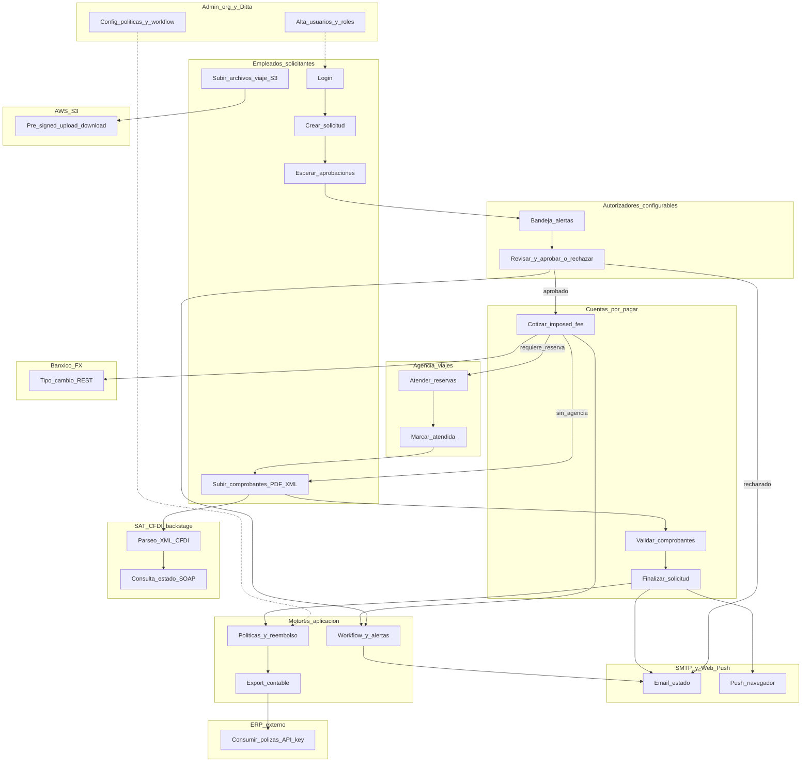
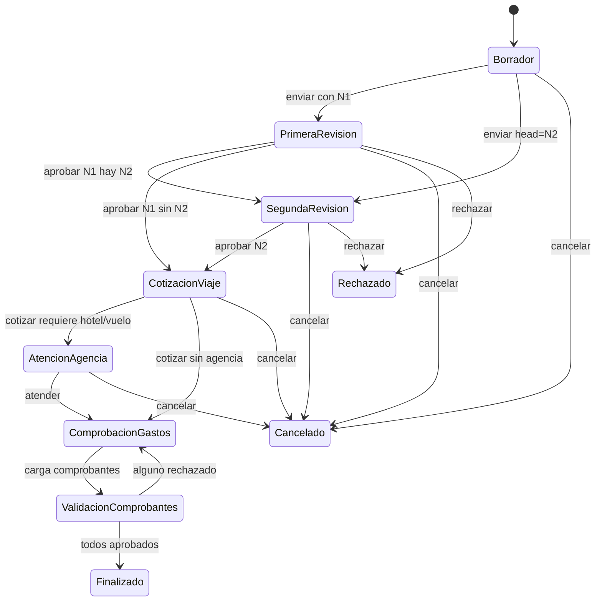

# Mapa Global de Operaciones — Service Blueprint

| Metadato | Valor |
|----------|--------|
| **Versión** | 1.0.1 |
| **Última actualización** | 2026-06-06 |
| **Responsables** | Héctor Lugo · Mariano Carretero |
| **Verificación de conteos** | 2026-06-06 contra `TC3005B.501-Backend` |
| **Documento padre** | [Documento de Arquitectura](documento-arquitectura.md) |
| **Diagramas C4** | [diagramas-c4.md](diagramas-c4.md) |

Este documento describe el **Service Blueprint** de CocoAPI / CocoScheme: actores, canales, macro-procesos, flujos de intercambio, sistemas habilitadores y swimlanes. Para capas técnicas y despliegue, ver [Diagramas C4](diagramas-c4.md) y [Flujos](flujos.md).

---

## 1. Actores — ¿Quién?

Los actores **no están hardcodeados** como seis roles fijos. Cada organización recibe un catálogo base de roles al sembrarse (`DEFAULT_ROLES` en [bootstrapOrganization.js](../../../TC3005B.501-Backend/prisma/seedHelpers/bootstrapOrganization.js)) y puede ampliarlos vía onboarding JSON/CSV ([onboardingImportRoutes](../../../TC3005B.501-Backend/routes/onboardingImportRoutes.js)). La autorización efectiva proviene de **permisos granulares** (48 códigos `resource:action`) agrupados en paquetes de control de acceso basado en roles (**RBAC**) — ver [permisos.md](permisos.md) y [Nomenclatura](#nomenclatura).

### Roles base por organización

| Rol | Ámbito | Responsabilidad de negocio |
|-----|--------|----------------------------|
| **Solicitante** | Por org | Captura solicitudes de viaje, borradores, comprobantes y consulta reembolsos. |
| **N1 / N2** | Por org | Autorizadores configurables (primer y segundo nivel). Topes de monto por defecto: 50 000 / 500 000 MXN. |
| **Cuentas por pagar (CxP)** | Por org | Cotiza viajes, valida comprobantes, cierra solicitudes. |
| **Agencia de viajes** | Por org | Atiende reservas de hotel/vuelo cuando la ruta lo requiere. |
| **Administrador** | Por org | Gestiona usuarios, roles, catálogos y políticas de su organización. |
| **Observador** | Por org | Solo lectura y notificaciones (`TravelNotifyOnly`); no autoriza. |
| **Admin Ditta** | Solo org ROOT | Superadmin cross-tenant; gestiona organizaciones cliente. |

### Resolución dinámica de aprobadores

El motor de workflow ([workflowRulesEngine.js](../../../TC3005B.501-Backend/services/workflowRulesEngine.js), [approverResolver.js](../../../TC3005B.501-Backend/services/approverResolver.js)) determina aprobadores por **atributos y reglas** (`WorkflowRule`), no solo por el nombre del rol. Puede omitir N2, saltar agencia o reasignar según configuración — ver [flujos.md — Estados de solicitud](flujos.md#5-estados-de-solicitud-request_status).

### Front-stage vs back-stage

| Tipo | Actores / sistemas |
|------|-------------------|
| **Front-stage** | Empleados (solicitantes), autorizadores, CxP (cotización visible), agencia |
| **Back-stage** | CxP (validación fiscal), motores de política/reembolso, exportación ERP, SAT, Banxico, S3, SMTP, Web Push |
| **Soporte** | Admin org, Admin Ditta, operador ERP externo (API key) |

---

## 2. Canales — ¿Dónde?

| Canal | Tecnología | Puerto | Usuarios |
|-------|------------|--------|----------|
| **Web App** | Astro 5.7 + React 19 + Tailwind 4 (SSR) | 4321 HTTPS | Todos los actores humanos |
| **API REST** | Express 4.18 + Node 22 HTTPS | 3000 | Frontend, integraciones ERP |
| **Email** | Nodemailer → SMTP (Gmail u org-config) | — | Notificaciones de estado |
| **Web Push** | VAPID (`web-push`) | — | Alertas en navegador |
| **Cookies HttpOnly** | JWT Bearer + CSRF | — | Sesión autenticada (1 h) |
| **API externa ERP** | `/api/external/*` + `X-API-Key` | 3000 | Sistemas contables externos |

Diagramas de navegación pantalla a pantalla: [Flujos de pantallas por rol](../guias-usuario/flujos-pantallas-por-rol.md).

---

## 3. Macro-procesos — ¿Qué?

El sistema opera sobre **9 macro-procesos**. Los seis primeros cubren el ciclo operativo del viaje; los tres últimos transversalizan fiscal, políticas y contabilidad.

| # | Macro-proceso | Descripción | APIs / servicios clave |
|---|---------------|-------------|------------------------|
| 1 | **Onboarding** | Alta de organizaciones (Ditta), usuarios individual/CSV/JSON, asignación de roles y permisos | `/api/organizations`, `/api/onboarding/import`, `/api/admin` |
| 2 | **Solicitud de viaje** | Captura de rutas, fechas, montos; borradores | `/api/applicant`, `applicantService` |
| 3 | **Aprobación configurable** | N1/N2 o reglas de workflow; sustitutos temporales | `/api/authorizer`, `/api/solicitudes`, `workflowRulesEngine`, `approvalSubstituteService` |
| 4 | **Logística del viaje** | Cotización CxP, reservas Duffel, atención agencia | `/api/accounts-payable`, `/api/travel-agent`, `/api/flights`, `/api/hotels`, `duffel*` |
| 5 | **Comprobación de gastos** | Recibos, upload PDF/XML, gasto por tramo | `/api/applicant`, `/api/files`, `/api/viajes`, `receiptFileService` |
| 6 | **Cierre y reembolso** | Validación CxP, wallet, finalización | `/api/accounts-payable`, `refundRuleEngine`, `reimbursementTimeService` |
| 7 | **Validación fiscal (CFDI/SAT)** | Parseo XML, consulta estado SAT, metadata en PostgreSQL | `/api/comprobantes`, `/api/files`, `satConsultaService`, `cfdiParserService`, GridFS |
| 8 | **Políticas y reembolso** | Topes viáticos, excepciones, plazos, motor de reglas | `/api/policies`, `/api/viaticos-policy`, `/api/refunds`, `/api/workflow-rules`, `policyService`, `viaticasPolicyService` |
| 9 | **Exportación contable (ERP)** | Pólizas AV/GV, catálogo contable, API M2M | `/api/export`, `/api/chart-of-accounts`, `/api/external`, `accountingExportService` |

> **Nota:** La lógica de wallet, alertas y transiciones de estado vive en **servicios de aplicación** (no en triggers SQL). El scheduler Node ejecuta jobs de escalación y plazos de reembolso (`services/scheduler/`).

---

## 4. Flujos de intercambio — ¿Qué se mueve?

| Tipo | De → A | Intercambio | Protocolo / mecanismo |
|------|--------|-------------|----------------------|
| Información | Solicitante → Sistema | Rutas, fechas, montos, notas | `POST /api/applicant/*` JSON |
| Información | Sistema → Autorizadores | Alertas de bandeja | PostgreSQL `Alert` + `/api/authorizer` |
| Información | Sistema → Usuario | Email / push de cambio de estado | SMTP + `webPushService` |
| Información | Admin → Sistema | Usuarios, roles, departamentos | `/api/admin`, onboarding import |
| Documentos | Solicitante → GridFS | PDF/XML de CFDI | `POST /api/files` → MongoDB GridFS |
| Documentos | Sistema → CxP | Descarga comprobantes | `GET /api/files` stream GridFS |
| Documentos | Solicitante → S3 | Archivos generales de viaje | Pre-signed URL (`storageService`, TTL 15 min) |
| Fiscal | Sistema → SAT | Consulta estado CFDI | **SOAP/HTTPS** WSDL SAT; config org `OrganizationIntegration` tipo SAT |
| Fiscal | Sistema → PostgreSQL | Metadata CFDI (`CfdiComprobante`) | Prisma tras parseo XML |
| Financiero | Sistema → Banxico | Tipo de cambio USD→MXN | **REST** serie SF43718; respaldo DOF |
| Financiero | Sistema → Wallet | Reembolso / descuento | `refundRuleEngine`, `accountsPayableService` |
| Contable | ERP → Sistema | Consumo de pólizas exportadas | **REST + API Key** `/api/external/*` |
| Contable | Sistema → ERP | Export pólizas AV/GV | `/api/export` |
| Autenticación | Usuario → Sistema | Credenciales | `POST /api/user/login` → bcrypt + JWT |
| Autenticación | Sistema → Usuario | JWT httpOnly + CSRF | Cookie `token` + `GET /api/user/csrf-token` |
| Multi-tenant | Admin Ditta → Sistema | Contexto de org activa | Header `X-Organization-Id` + RLS |

---

## 5. Sistemas habilitadores — ¿Con qué?

| Sistema | Función | Tecnología |
|---------|---------|------------|
| **Plataforma Web** | UI para todos los actores | Astro 5.7 SSR + React 19 + Tailwind 4 |
| **API Application** | Punto central HTTPS, seguridad en capas | Express 4.18 + JWT + RBAC + CSRF + rate-limit |
| **Base relacional** | Dominio de negocio multi-tenant | PostgreSQL 16 + Prisma 6.16 + RLS (38 tablas) |
| **Almacén CFDI** | Binarios PDF/XML de comprobantes | MongoDB 7 GridFS (`fileStorage`) |
| **Object storage** | Archivos generales de viaje | AWS S3 (LocalStack en dev); SSE-S3 |
| **Motor de reglas** | Workflow, políticas, reembolsos | Servicios Node (`workflowRulesEngine`, `policyService`, `refundRuleEngine`) |
| **Scheduler** | Escalación de aprobación, plazos reembolso | `services/scheduler/` (cron Node) |
| **Integraciones** | SAT, Banxico, Duffel, SMTP, Web Push | Ver [documento-arquitectura — Arquitectura de Aplicación](documento-arquitectura.md#2-arquitectura-de-aplicación) |
| **CI/CD** | Build, test, publicación de imágenes | GitHub Actions → GHCR |

> Redis no forma parte del stack actual; el rate-limiting y la caché de tipo de cambio operan en memoria del proceso Node.

---

## 6. Service Blueprint — Swimlanes

Diagrama de **quién hace qué en cada etapa**, incluyendo integraciones externas:

---

## 7. Máquina de estados de la solicitud

Flujo verificado en backend (motor de reglas puede saltar pasos):

Detalle de reglas: [flujos.md — Estados de solicitud](flujos.md#5-estados-de-solicitud-request_status).

---

## 8. Resumen — quién interactúa con qué

| Actor | Sistemas / integraciones | Momento del flujo |
|-------|-------------------------|-------------------|
| Empleado / Solicitante | Web App, API, GridFS, S3 | Solicitud, comprobación, archivos |
| Autorizador (N1/N2 u otro) | Web App, API, alertas, email/push | Aprobación |
| Cuentas por pagar | Web App, API, GridFS, Banxico | Cotización, validación fiscal, cierre |
| Agencia | Web App, API, Duffel (indirecto vía CxP) | Reservas |
| Admin org | Web App, API, políticas, workflow rules | Configuración |
| Admin Ditta | Web App, API, multi-tenant, orgs | Cross-tenant |
| Operador ERP | `/api/external`, PostgreSQL (vía API) | Exportación contable |
| SAT | SOAP (backend) | Validación CFDI |
| Banxico | REST (backend) | Tipo de cambio |
| AWS S3 | Pre-signed URLs | Archivos de viaje |
| SMTP / Web Push | Backend | Notificaciones |

---

## Referencias cruzadas

- [Documento de Arquitectura](documento-arquitectura.md) — visión unificada (negocio, aplicación, datos, infraestructura, requerimientos no funcionales)
- [Diagramas C4](diagramas-c4.md) — Context, Container, Component
- [Flujos](flujos.md) — API, estados, secuencia CFDI
- [Multi-tenancy](multi-tenancy.md) — aislamiento por organización
- [Permisos](permisos.md) — sistema de permisos granular
- [Lista de Procesos](lista-procesos.md) — inventario granular de 167 endpoints por dominio, tipo y trigger
- [Diagramas de Procesos](diagramas-procesos.md) — diagramas de secuencia y flujo detallados por macro-proceso

---

## Nomenclatura

| Término | Significado |
|---------|-------------|
| **API** | Application Programming Interface — interfaz HTTP (`/api/*`) entre frontend, usuarios y sistemas externos. |
| **AWS** | Amazon Web Services — nube donde se aloja S3 en producción. |
| **CFDI** | Comprobante Fiscal Digital por Internet — factura electrónica mexicana (XML/PDF). |
| **CI/CD** | Continuous Integration / Continuous Delivery — pipeline de pruebas, build y publicación (GitHub Actions → GHCR). |
| **CSRF** | Cross-Site Request Forgery — protección contra peticiones mutantes falsificadas desde otro sitio. |
| **CxP** | Cuentas por pagar — rol que cotiza viajes y valida comprobantes. |
| **ERP** | Enterprise Resource Planning — sistema contable externo que consume pólizas vía `/api/external`. |
| **GHCR** | GitHub Container Registry — registro de imágenes Docker del proyecto. |
| **GridFS** | Almacén de archivos en MongoDB usado para PDF/XML de comprobantes. |
| **HTTPS** | HTTP sobre TLS — comunicación cifrada entre navegador y API. |
| **JWT** | JSON Web Token — token de sesión firmado (cookie httpOnly + Bearer). |
| **N1 / N2** | Autorizador de primer y segundo nivel en la cadena de aprobación. |
| **RBAC** | Role-Based Access Control — control de acceso basado en roles; permisos asignados a roles, grupos y usuarios. |
| **REST** | Representational State Transfer — estilo de API HTTP con recursos y verbos (GET, POST, …). |
| **RLS** | Row-Level Security — políticas de PostgreSQL que filtran filas por `organization_id`. |
| **ROOT** | Organización raíz (Ditta, `id=1`); única con operación cross-tenant. |
| **SAT** | Servicio de Administración Tributaria (México) — validación de estado de CFDI vía SOAP. |
| **S3** | Amazon Simple Storage Service — almacén de archivos generales de viaje (URLs prefirmadas). |
| **SOAP** | Simple Object Access Protocol — protocolo XML usado por el web service del SAT. |
| **SMTP** | Simple Mail Transfer Protocol — envío de correos de notificación. |
| **SSE-S3** | Server-Side Encryption con claves gestionadas por S3 — cifrado en reposo de archivos. |
| **SSR** | Server-Side Rendering — páginas generadas en servidor (Astro + Node). |
| **VAPID** | Voluntary Application Server Identification — claves para notificaciones Web Push en navegador. |
| **Web Push** | Notificaciones push del navegador (estándar W3C, librería `web-push`). |
