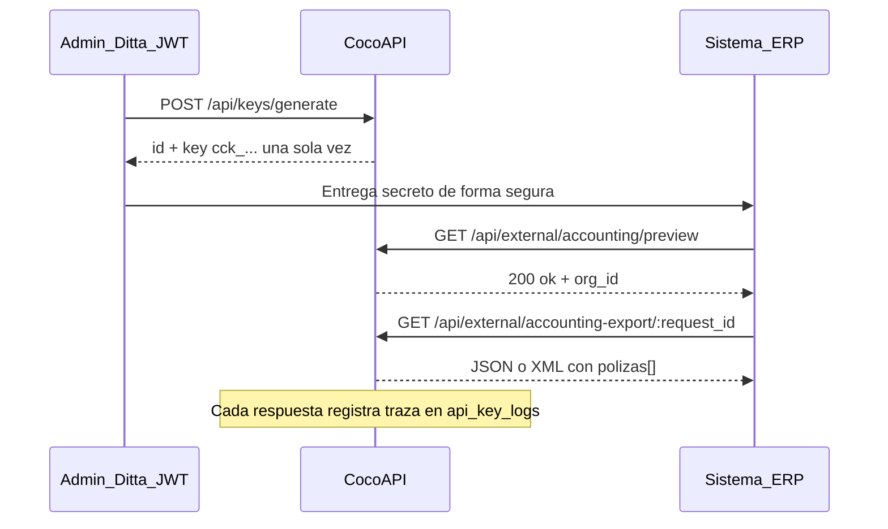

# API de integración contable (ERP)

**Este archivo es la referencia canónica** para que sistemas ERP externos consuman pólizas contables de CocoAPI (US-11, US-17). Cubre autenticación por API Key, endpoints bajo `/api/external/*` y el ciclo de vida de claves en el panel admin.

---

## Resumen

CocoAPI expone una **API machine-to-machine (M2M)** ERP-agnóstica: no replica el modelo contable del ERP del cliente, sino que entrega **pólizas AV/GV** ya armadas a partir de solicitudes de viaje **Finalizadas**. El integrador almacena el secreto `cck_...` generado por un administrador Ditta y consulta los endpoints de exportación con la cabecera `X-API-Key` (o `Authorization: Bearer`).

| Historia | Alcance |
|----------|---------|
| **US-11** | Exportación de pólizas contables (AV anticipo, GV comprobación) |
| **US-17** | Autenticación de sistemas externos vía API Key por organización |

> [!NOTE]
> Swagger en `/api-docs` documenta la **administración** de claves (`/api/keys/*`), pero **no** los endpoints de consumo `/api/external/*`. Esta página cubre ese hueco.

---

## Flujo de integración



1. Un **Administrador Ditta** (o admin de organización con permiso `api_key:manage`) genera una clave en `/admin/api-keys` o vía `POST /api/keys/generate`.
2. El secreto `cck_...` se entrega **una sola vez** al equipo que opera el ERP; CocoAPI solo persiste el hash.
3. El ERP consume `/api/external/*` con `X-API-Key`; no necesita CSRF ni cookie de sesión.
4. Cada llamada queda auditada en `api_key_logs` (endpoint, código HTTP, timestamp).

---

## Autenticación (consumo ERP)

### Cabeceras aceptadas

| Cabecera | Ejemplo |
|----------|---------|
| `X-API-Key` | `X-API-Key: cck_a1b2c3...` |
| `Authorization` | `Authorization: Bearer cck_a1b2c3...` |

### Scope requerido

Al generar la clave, el objeto `scope` debe incluir el permiso `accounting:export`:

```json
{
  "permissions": ["accounting:export"]
}
```

### Exenciones y transporte

- Las rutas `/api/external/*` están **exentas de CSRF** (integración M2M).
- El servidor de desarrollo usa **HTTPS** con certificado autofirmado (`https://localhost:3000`). En producción, usar el host y certificado del despliegue.
- RLS (Row Level Security): la clave solo ve datos de la **organización** a la que pertenece.

### Errores de autenticación

| HTTP | Código | Causa típica |
|------|--------|--------------|
| **401** | `INVALID_API_KEY` | Cabecera ausente, secreto desconocido, clave revocada o vencida |
| **403** | `INSUFFICIENT_API_KEY_SCOPE` | La clave es válida pero su `scope.permissions` no incluye `accounting:export` |

Formato de respuesta estándar:

```json
{
  "statusCode": 401,
  "message": "Invalid or revoked API key",
  "error": "INVALID_API_KEY"
}
```

---

## Obtener una API Key (lado admin)

### Pantalla

Los roles **Administrador Ditta** y **Administrador de organización** acceden a **LLAVES API** en `/admin/api-keys`. Ver [Manual Admin Ditta](../guias-usuario/manual-admin.md#llaves-api).

### Generar clave — `POST /api/keys/generate`

Requiere sesión JWT, permiso `api_key:manage`, token CSRF en mutaciones y (si aplica) cabecera `X-Organization-Id` para impersonación.

**Cuerpo de ejemplo** (alineado con Newman M3-QA2):

```json
{
  "org_id": "101",
  "name": "erp-produccion-acme",
  "scope": { "permissions": ["accounting:export"] },
  "expires_at": "2027-12-31T23:59:59Z"
}
```

**Respuesta 201** (secreto visible **solo en esta respuesta**):

```json
{
  "id": 42,
  "org_id": "101",
  "name": "erp-produccion-acme",
  "key": "cck_a1b2c3d4e5f6...",
  "scope": { "permissions": ["accounting:export"] },
  "expires_at": "2027-12-31T23:59:59.000Z",
  "active": true,
  "created_at": "2026-06-01T12:00:00.000Z",
  "created_by": 1
}
```

| Campo | Validación |
|-------|------------|
| `name` | String 1–120 caracteres |
| `org_id` | Entero positivo (string o número) |
| `scope` | Objeto JSON con `permissions: string[]` no vacío |
| `expires_at` | Fecha ISO 8601 **en el futuro** |

### Revocar — `DELETE /api/keys/{id}/revoke`

Revoca la clave; consumos posteriores devuelven **401**. Requiere JWT + `api_key:manage`.

### Listar por organización — `GET /api/keys/org/{orgId}`

Devuelve metadatos de claves (id, nombre, scope, fechas, `active`). **Nunca** incluye el secreto ni el hash.

### Consultar auditoría — `GET /api/keys/{id}/logs`

Parámetros opcionales: `limit` (1–200, default 50), `cursor` (id numérico para paginación). Cada fila registra `endpoint` (p. ej. `GET /api/external/accounting/preview`) y `response_code`.

---

## Endpoints de consumo (`/api/external`)

Todos requieren API Key válida con `accounting:export`. Aplican **rate limiting** (`generalRateLimiter`).

| Método | Ruta | Propósito |
|--------|------|-----------|
| GET | `/api/external/accounting/preview` | Smoke test de autenticación |
| GET | `/api/external/accounting-export/{request_id}` | Pólizas de una solicitud finalizada |
| GET | `/api/external/accounting-export?from=&to=` | Pólizas por rango de fechas |
| GET | `/api/external/export/contable?date_from=&date_to=&status=&format=` | Alias M2M de `/api/export/contable` |

### `GET /api/external/accounting/preview`

Verifica que la clave es válida y devuelve el `org_id` asociado.

**Respuesta 200:**

```json
{
  "ok": true,
  "org_id": "101",
  "message": "read-only accounting integration preview"
}
```

### `GET /api/external/accounting-export/{request_id}`

Exporta pólizas de **una** solicitud de viaje.

| Parámetro | Ubicación | Regla |
|-----------|-----------|-------|
| `request_id` | path | Entero positivo |
| `format` | query (opcional) | `json` (default) o `xml` |

**Precondición:** la solicitud debe estar en estado **Finalizado** (id 8). Si no, responde **409**:

```json
{
  "error": "Request not finalized. Accounting export is only available once the request is in status 'Finalizado'."
}
```

Otros códigos: **404** (solicitud inexistente), **400** (validación de póliza / longitudes SAP estrictas).

Tras exportar correctamente, el request se marca `isExported=true` y se persisten las pólizas en `accounting_poliza`.

### `GET /api/external/accounting-export?from=&to=`

Exporta pólizas de **todas** las solicitudes finalizadas cuyas fechas caen en el rango.

| Parámetro | Regla |
|-----------|-------|
| `from` | ISO 8601 (obligatorio) |
| `to` | ISO 8601 (obligatorio) |
| `format` | `json` o `xml` (opcional) |

El límite superior `to` es **inclusivo hasta las 23:59:59** del día indicado. Si `from` > `to`, responde **400**.

### `GET /api/external/export/contable`

Alias ERP del endpoint interno `GET /api/export/contable`. Mismo handler y misma lógica de negocio; solo cambia el mecanismo de autenticación (API Key en lugar de JWT + rol Cuentas por pagar).

| Parámetro | Regla |
|-----------|-------|
| `date_from` | ISO 8601 (obligatorio) |
| `date_to` | ISO 8601 (opcional; default: hoy) |
| `status` | Si vale `Sincronizado`, incluye registros ya exportados (modo re-export / `force`) |
| `format` | `json` (default) o `xml` |

Por defecto devuelve solo solicitudes **no exportadas** (`isExported=false`). Tras generar las pólizas, marca los requests como exportados.

---

## Formato de respuesta

### JSON (default)

```json
{
  "polizas": [
    {
      "header": {
        "ID_VIAJE": "12345",
        "DOC_TYPE": "AV",
        "HEADER_TXT": "Anticipo viaje",
        "COMP_CODE": "1000",
        "PSTNG_DATE": "2026-05-15",
        "CURRENCY": "MXN",
        "EXCH_RATE": 1
      },
      "detalles": [
        {
          "ITEMNO_ACC": 1,
          "SHKZG": "S",
          "GL_ACCOUNT": "1000",
          "ITEM_TEXT": "Anticipo empleado",
          "AMT_DOCCUR": 1000,
          "VENDOR_NO": "00000001234"
        },
        {
          "ITEMNO_ACC": 2,
          "SHKZG": "H",
          "GL_ACCOUNT": "1001",
          "ITEM_TEXT": "Banco anticipos",
          "AMT_DOCCUR": 1000
        }
      ]
    }
  ]
}
```

> Los campos exactos dependen del catálogo GL, mapeo de gastos e impuestos de la organización. La forma anterior coincide con los tests E2E en `accountingExport.e2e.test.js`.

#### Tipos de póliza

| `DOC_TYPE` | Significado |
|------------|-------------|
| **AV** | Anticipo de viaje (solo si la solicitud tiene `imposedFee` > 0) |
| **GV** | Comprobación de gastos (con o sin anticipo) |

#### Campos del header

| Campo | Descripción |
|-------|-------------|
| `ID_VIAJE` | ID de la solicitud (máx. 10 caracteres SAP) |
| `DOC_TYPE` | `AV` o `GV` |
| `HEADER_TXT` | Texto de cabecera (máx. 25) |
| `COMP_CODE` | Código de sociedad (máx. 4) |
| `PSTNG_DATE` | Fecha de contabilización `YYYY-MM-DD` |
| `CURRENCY` | Moneda (p. ej. `MXN`, `USD`) |
| `EXCH_RATE` | Tipo de cambio (4 decimales; 1 para MXN) |

#### Campos de detalle (`detalles[]`)

| Campo | Descripción |
|-------|-------------|
| `ITEMNO_ACC` | Número de partida |
| `SHKZG` | `S` = debe (cargo), `H` = haber |
| `GL_ACCOUNT` | Cuenta mayor (máx. 10) |
| `ITEM_TEXT` | Texto de partida (máx. 50) |
| `AMT_DOCCUR` | Importe en moneda del documento |
| `COSTCENTER` | Centro de costos (obligatorio en cuentas que lo exijan) |
| `VENDOR_NO` | Número de proveedor/empleado (máx. 11) |

Cada póliza debe cuadrar: suma de cargos (`S`) = suma de abonos (`H`).

### XML

Solicitar con `?format=xml` o cabecera `Accept: application/xml`. El documento raíz es `<Polizas>` con nodos `<Poliza>`, cada uno con `<Cabecera>` y `<Detalles>/<Detalle>`.

```xml
<?xml version="1.0" encoding="UTF-8"?>
<Polizas>
  <Poliza>
    <Cabecera>
      <ID_VIAJE>12345</ID_VIAJE>
      <DOC_TYPE>GV</DOC_TYPE>
      ...
    </Cabecera>
    <Detalles>
      <Detalle>
        <ITEMNO_ACC>1</ITEMNO_ACC>
        <SHKZG>S</SHKZG>
        ...
      </Detalle>
    </Detalles>
  </Poliza>
</Polizas>
```

> CocoAPI **no** expone CSV en export contable (solo JSON y XML).

---

## Ejemplos `curl`

Base URL de desarrollo: `https://localhost:3000`. Usa `-k` si el certificado es autofirmado.

### 1. Preview (smoke test)

```sh
curl -k -s \
  -H "X-API-Key: cck_TU_SECRETO_AQUI" \
  "https://localhost:3000/api/external/accounting/preview"
```

### 2. Export por solicitud

```sh
curl -k -s \
  -H "X-API-Key: cck_TU_SECRETO_AQUI" \
  "https://localhost:3000/api/external/accounting-export/12345?format=json"
```

### 3. Export contable por rango

```sh
curl -k -s \
  -H "X-API-Key: cck_TU_SECRETO_AQUI" \
  "https://localhost:3000/api/external/export/contable?date_from=2026-01-01&date_to=2026-12-31&format=json"
```

### Generar clave (admin, con JWT)

```sh
curl -k -s -X POST \
  -H "Authorization: Bearer TU_JWT_ADMIN" \
  -H "x-csrf-token: TU_CSRF" \
  -H "Content-Type: application/json" \
  -H "X-Organization-Id: 101" \
  -d '{"org_id":"101","name":"erp-qa","scope":{"permissions":["accounting:export"]},"expires_at":"2027-12-31T23:59:59Z"}' \
  "https://localhost:3000/api/keys/generate"
```

> No pegues secretos reales en documentación ni en repositorios. Rota y revoca claves de prueba tras las validaciones.

---

## `/api/export/contable` vs `/api/external/export/contable`

| Aspecto | `/api/export/contable` | `/api/external/export/contable` |
|---------|------------------------|----------------------------------|
| Autenticación | JWT + rol **Cuentas por pagar** | API Key + scope `accounting:export` |
| CSRF | Requerido en mutaciones de sesión | No aplica |
| Handler | `AccountingExportController.exportContable` | **Mismo handler** |
| Caso de uso | Operador CxP en la UI / Postman con sesión | Job nocturno del ERP, ETL, middleware contable |

El endpoint equivalente para usuarios autenticados en bandeja CxP es también `GET /api/accounts-payable/accounting-export/:request_id` (documentado en Swagger M1).

---

## Auditoría y límites

- **Auditoría:** cada respuesta de `/api/external/*` inserta en `api_key_logs` el método, path y código HTTP final. Los logs de aplicación **no** imprimen el id de clave ni el org en texto claro.
- **Rate limiting:** `generalRateLimiter` aplica a rutas admin y external; ante exceso de peticiones el cliente recibe **429**.
- **Longitudes SAP:** con `ACCOUNTING_EXPORT_STRICT_LENGTHS=1` en el entorno, campos que excedan longitudes SAP devuelven **400** en lugar de truncarse en silencio.

---

## Pruebas y evidencia

| Artefacto | Cobertura |
|-----------|-----------|
| Newman **M3-QA2** | Ciclo generate → preview → export → logs → revoke → 401 |
| [`reporte-ejecucion.md`](../qa/reporte-ejecucion.md) (sección 3.2) | M3-Integration 29/29 assertions |
| [`M3-QA2-newman-report.json`](../qa/evidencias/newman/M3-QA2-newman-report.json) | Evidencia JSON de la corrida |
| `accountingExport.e2e.test.js` | Pólizas AV/GV, JSON/XML, errores 404/409 |
| `apiKeys.e2e.test.js` | Ciclo de vida API Key (suite M3) |

Matriz de trazabilidad: **US-11** y **US-17** en [`matriz-trazabilidad.md`](../qa/matriz-trazabilidad.md).

---

## Documentos relacionados

- [Flujos y pantallas — API REST (sección 6)](../arquitectura-datos/flujos.md#6-api-rest--modulos-y-entidades-principales) — mapa de prefijos `/api/keys` y `/api/external`
- [Service Blueprint](../arquitectura-datos/service-blueprint.md) — macro-proceso de exportación ERP
- [Setup Backend (sección 10)](../getting-started/setup-backend.md#10-documentacion-de-la-api-swagger) — Swagger UI (`/api-docs`; cubre admin keys, no external)
- [Validación CFDI / SAT](documentacion-api-sat.md) — patrón de documentación de integración externa
- [Manual Admin Ditta — Llaves API](../guias-usuario/manual-admin.md#llaves-api) — pantalla `/admin/api-keys`

---

*Fuente canónica de implementación: `routes/externalApiKeyRoutes.js`, `routes/apiKeyRoutes.js`, `middleware/apiKeyAuth.js`, `services/accountingExportService.js`.*
