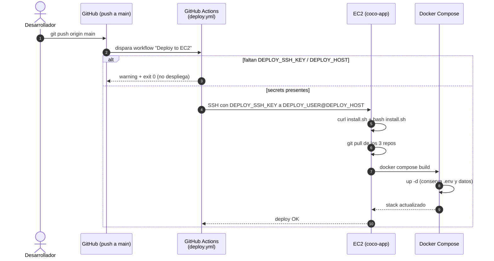

# Despliegue en AWS (producción)

Runbook para desplegar **coco** (`TC3005B.501-Backend` Express/Node +
`TC3005B.501-Frontend` Astro SSR) en una sola instancia EC2 con Docker Compose,
TLS vía Caddy y archivos en S3. Un comando levanta todo de cero.

> **Importante:** Esta arquitectura **reemplazó Mongo por S3 + Postgres**. Ya no existe
> `MONGO_URI`: los archivos viven en un bucket S3 privado (SSE-S3 + block public
> access) y los datos en Postgres (co-locado o externo tipo RDS). Ver
> [Arquitectura en la nube](arquitectura-datos/arquitectura-nube.md) para el
> diagrama de lo que levanta el auto-setup y la ruta recomendada a producción.

> **Tip:** Todos los scripts viven en `cocowiki/deploy/`. Son **idempotentes**:
> re-ejecutarlos reutiliza lo existente (provisión) o hace pull + rebuild
> (instalación). Los repos son **públicos**, así que la instancia los clona sin
> autenticación.

---

## 1. Resumen y requisitos

Una instancia EC2 **ARM (t4g.small, Amazon Linux 2023 arm64)** corre los
contenedores con Docker Compose. Solo Caddy se expone a Internet (80/443).

| Dónde | Herramienta | Notas |
|-------|-------------|-------|
| Tu equipo | **AWS CLI v2** | `aws configure` con un usuario con permisos EC2/S3/IAM. |
| Tu equipo | **git** | Para clonar este repo (`cocowiki`) y correr los scripts de `deploy/`. |
| Tu equipo | **OpenSSH** (`ssh`, `scp`) · **curl** · **bash** | Los scripts de `deploy/` son `bash`. En **Windows** corren bajo **WSL2** o **Git Bash**, no en PowerShell ni cmd. |
| AWS | VPC `vpc-0f7bd8ada126a095b` (10.0.0.0/24) | Existente, en `us-east-1`. Overridable con `VPC_ID`. |
| AWS | Presupuesto | ≈ **\$12–15/mes** corriendo; presupuesto del proyecto **\$56**. |

> **Importante:** Los tres scripts de `deploy/` (`deploy-all.sh`, `aws-provision.sh`,
> `aws-teardown.sh`) son **bash** y corren en **tu equipo**, no en AWS. Funcionan
> igual en Linux, macOS y Windows; en Windows necesitas un entorno bash —**WSL2**
> (recomendado) o **Git Bash**— porque no corren en PowerShell ni cmd. La parte
> que sí corre en la instancia (`install.sh`) no requiere nada extra en tu equipo.

### Instalar los requisitos (Linux · macOS · Windows)

Elige tu sistema; al final verifica e introduce credenciales en
[Verificar y configurar](#verificar-y-configurar).

#### macOS

`ssh`, `scp`, `curl` y `bash` ya vienen con macOS. Falta **AWS CLI v2** y, según
tu equipo, **git**. La vía estándar es [Homebrew](https://brew.sh):

```sh
# Instala Homebrew si no lo tienes:
/bin/bash -c "$(curl -fsSL https://raw.githubusercontent.com/Homebrew/install/HEAD/install.sh)"

# Herramientas:
brew install awscli git
```

> Sin Homebrew, AWS CLI v2 también se instala con el `.pkg` oficial
> ([guía AWS](https://docs.aws.amazon.com/cli/latest/userguide/getting-started-install.html)).

#### Linux — Debian / Ubuntu

```sh
# git, cliente SSH, curl y unzip (este último lo usa el instalador de AWS CLI):
sudo apt update
sudo apt install -y git openssh-client curl unzip

# AWS CLI v2 (el paquete de apt suele ser v1; usa el instalador oficial):
curl -fsSL "https://awscli.amazonaws.com/awscli-exe-linux-$(uname -m).zip" -o awscliv2.zip
unzip -q awscliv2.zip && sudo ./aws/install && rm -rf aws awscliv2.zip
```

#### Linux — Fedora / RHEL / CentOS

```sh
sudo dnf install -y git openssh-clients curl unzip
curl -fsSL "https://awscli.amazonaws.com/awscli-exe-linux-$(uname -m).zip" -o awscliv2.zip
unzip -q awscliv2.zip && sudo ./aws/install && rm -rf aws awscliv2.zip
```

#### Linux — Arch / Manjaro

```sh
sudo pacman -S --needed git openssh curl aws-cli-v2
```

#### Windows — WSL2 (recomendado)

WSL2 te da un Ubuntu real donde los scripts bash corren sin cambios.

```powershell
# En PowerShell como administrador (instala WSL2 + Ubuntu; pide reinicio):
wsl --install
```

Reinicia, abre **Ubuntu** desde el menú Inicio y dentro de WSL sigue los pasos de
**Debian / Ubuntu** de arriba.

> **Tip:** Guarda el repo `cocowiki` y el `coco-deploy.pem` **dentro** del sistema de
> archivos de WSL (`~/...`), no en `/mnt/c/...`: en `/mnt/c` el `chmod 400` del
> `.pem` no "pega" y `ssh` rechaza la llave por permisos demasiado abiertos.

#### Windows — Git Bash (alternativa sin WSL)

[Git para Windows](https://git-scm.com/download/win) trae **Git Bash** con
`bash`, `ssh`, `scp` y `curl`. Corre todos los comandos `./xxx.sh` desde la
ventana de **Git Bash**, no desde PowerShell.

```powershell
# Con winget (Windows 10/11):
winget install -e --id Git.Git
winget install -e --id Amazon.AWSCLI
```

> Con Chocolatey sería `choco install git awscli`. Tras instalar AWS CLI quizá
> debas reabrir Git Bash para que `aws` aparezca en el PATH.

### Verificar y configurar

En tu terminal (Terminal/iTerm en macOS, tu shell en Linux, **WSL** o **Git
Bash** en Windows):

```sh
aws --version     # debe decir aws-cli/2.x
git --version
ssh -V
curl --version
```

Luego configura tus credenciales AWS (un usuario con permisos EC2/S3/IAM):

```sh
aws configure     # Access Key, Secret Key, región us-east-1, output json
```

### Componentes del stack


> Este es el despliegue **actual** (un solo EC2, por el presupuesto del proyecto
> ~\$56). Más abajo está la arquitectura **recomendada para producción**; la
> comparativa completa y las fuentes citadas están en
> **[Arquitectura en la nube](arquitectura-datos/arquitectura-nube.md)**.

- **caddy** termina TLS. Por defecto usa un certificado **auto-firmado**
  (`tls internal`, funciona con solo la IP/DNS de EC2). Enruta `/api/*` al
  backend **sin quitar el prefijo** y todo lo demás al frontend.
- **backend** sirve HTTPS auto-firmado en `:3000`, todas las rutas bajo `/api`.
  Solo accesible dentro de la red Docker.
- **frontend** sirve Astro SSR en HTTP plano `:4321`, solo interno.
- **postgres** es opcional (perfil `localdb`); puedes usar una BD externa.
- **S3** guarda los archivos. El backend obtiene credenciales del **IAM
  instance role** de la EC2 — sin llaves estáticas.

### Arquitectura recomendada para producción

Lo de arriba es lo que cabe en el presupuesto del proyecto (~\$56) y por eso corre
**todo co-locado en un solo EC2**. Para producción real (alta disponibilidad,
DNS propio y seguridad) la arquitectura recomendada es **multi-AZ**:


- **Borde (DNS + seguridad):** Route 53 (DNS + health checks) → CloudFront (CDN) →
  **AWS WAF** (reglas L7), con TLS válido de **ACM**.
- **Cómputo:** Application Load Balancer repartiendo entre **2 AZ**; apps en
  **subnets privadas** (ECS Fargate o EC2 Auto Scaling Group).
- **Datos:** **RDS PostgreSQL Multi-AZ** (primary + standby, failover automático) +
  S3 privado servido vía CloudFront (OAC).
- **Seguridad / operación:** Secrets Manager (rotación), IAM por tarea
  (least-privilege), Security Groups por capa (ALB→App→RDS), CloudWatch.

Qué queda **conscientemente pendiente** hoy por presupuesto: HA multi-AZ, BD
gestionada con failover, DNS propio + TLS válido, WAF/seguridad perimetral y
subnets privadas. Comparativa completa, specs y fuentes citadas en
**[Arquitectura en la nube](arquitectura-datos/arquitectura-nube.md)**.

---

## 2. Opción A — un solo comando (`deploy-all.sh`)

Orquesta TODO de cero a corriendo: provisiona la infra, espera SSH, copia y
corre `install.sh` en la instancia (build + up + seeders). Desde tu equipo
(Linux/macOS, o Windows vía WSL2/Git Bash):

```sh
cd cocowiki/deploy
./deploy-all.sh                 # seeding demo por defecto
./deploy-all.sh --seed=admin    # solo reference + admin (sin datos demo)
./deploy-all.sh --seed=none     # solo el esquema (sin admin)
```

Lo que hace, en orden:

1. Corre `aws-provision.sh` (escribe `coco-infra.env` con instancia, EIP, bucket…).
2. Espera a que el SSH responda.
3. SSH a la instancia, descarga `install.sh` y lo corre **no interactivo**:
   pre-responde el bucket S3 del paso 1, deja el host público en auto-detección
   (IMDSv2) y genera un password aleatorio para el Postgres co-locado.

Al terminar imprime la URL (`https://<host>`) y el comando SSH. Acepta el
certificado auto-firmado en el navegador (ver [sección 7](#7-tls--dominio)).

> **Nota:** `deploy-all.sh` **propaga** a la instancia las variables de integración que
> tengas exportadas en tu shell (ver [tabla de variables](#5-variables-de-entorno)):
> `BRANCH_BACKEND/FRONTEND/COCOWIKI`, `MAIL_*`, `VAPID_*`, `BANXICO_API_KEY`,
> `DUFFEL_ACCESS_TOKEN`, `FLIGHT_PROVIDER`, `DITTA_ADMIN_INITIAL_PASSWORD`,
> `AES_SECRET_KEY`, `JWT_SECRET`. Las que dejes vacías se autogeneran en la
> instancia.

---

## 3. Opción B — dos pasos manuales

### 3.1 Paso 1 — provisionar AWS (`aws-provision.sh`)

```sh
cd cocowiki/deploy
./aws-provision.sh
```

Crea (etiquetando todo `Project=coco` y reutilizando lo existente):

1. **Subnet pública** `10.0.0.0/25` + **Internet Gateway** + **route table**
   (`0.0.0.0/0 → igw`). Habilita además **DNS hostnames** en la VPC.
2. **Security group** `coco-sg`: SSH (22) solo desde **tu IP** (detectada vía
   `checkip.amazonaws.com`), HTTP (80) y HTTPS (443) públicos.
3. **Bucket S3** `coco-consulting-prod-<account-id>` con **block public access**
   y **SSE-S3 (AES256)**.
4. **IAM role** `coco-ec2-role` + **instance profile** `coco-ec2-profile` con
   permisos S3 mínimos (`PutObject/GetObject/DeleteObject` sobre `bucket/*` y
   `ListBucket` sobre el bucket).
5. **Key pair** `coco-deploy` → guarda `coco-deploy.pem` local con `chmod 400`.
6. **Instancia** `t4g.small` (AL2023 arm64, 30 GB gp3) con
   **IMDSv2 obligatorio y hop-limit 2** (para que el contenedor del backend
   pueda asumir el instance role).
7. **Elastic IP** asociada.

Imprime IP/DNS público, el comando `ssh`, el bucket+región para el install y un
recordatorio de costos. También escribe `coco-infra.env` (lo consume
`deploy-all.sh`).

> **Nota:** Variables overridables: `VPC_ID`, `REGION`, `INSTANCE_TYPE`. Ej.:
> `INSTANCE_TYPE=t4g.medium ./aws-provision.sh`.

### 3.2 Paso 2 — instalar el stack en la EC2 (`install.sh`)

Conéctate por SSH (usa el comando que imprimió el paso 1):

```sh
ssh -i coco-deploy.pem ec2-user@ec2-XX-XX-XX-XX.compute-1.amazonaws.com
```

Dentro de la instancia, descarga y ejecuta `install.sh` (auto-clona los 3 repos):

```sh
curl -fsSL https://raw.githubusercontent.com/coconsulting2/cocowiki/main/deploy/install.sh -o install.sh
bash install.sh                 # --seed=demo por defecto
```

`install.sh` hace, en orden:

1. Instala **git, docker y el plugin compose** (dnf en AL2023 / apt en Ubuntu;
   binario arm64 para AL2023). Habilita docker y agrega tu usuario al grupo.
2. Crea un **swapfile de 4 GB** si no hay swap (evita OOM en `astro build`).
3. Clona/actualiza los **tres repos** como hermanos en `/opt/coco/`
   (`COCO_HOME` configurable): `cocowiki`, `TC3005B.501-Backend`,
   `TC3005B.501-Frontend`.
4. Genera `.env` **interactivo** (si no existe) — ver los prompts abajo.
5. Decide el perfil de Postgres (local con `--profile localdb` vs externo).
6. `docker compose build` + `up -d` (arranca Postgres antes del backend si es
   co-locado, porque el entrypoint corre `prisma db push` al iniciar).
7. Corre seeders demo si aplica, espera health e imprime estado + URL.

#### Prompts interactivos del `.env`

| Prompt | Default | Qué hace |
|--------|---------|----------|
| DB host | `postgres` | `postgres`/`localhost`/vacío → contenedor local (perfil `localdb`); otro host → BD externa. |
| DB port / nombre / usuario | `5432` / `coco` / `coco` | Partes de la conexión. |
| DB password | — (oculto) | Se **URL-encodea** al ensamblar `DATABASE_URL`. |
| Host público | DNS de EC2 (auto vía IMDSv2) | Deriva `PUBLIC_API_BASE_URL=https://<host>/api`, `CORS_ORIGIN` y `SITE_ADDRESS`. |
| `AWS_REGION` | `us-east-1` | Región del bucket. |
| `AWS_S3_BUCKET` | — (requerido) | El bucket del paso 1. |

> **Importante:** Deja `AWS_ACCESS_KEY_ID`/`AWS_SECRET_ACCESS_KEY` **en blanco** en EC2: el
> instance role provee las credenciales automáticamente. Solo se usan para
> correr el stack fuera de EC2.

> **Tip:** Re-ejecutar `bash install.sh` hace `git pull` + rebuild + `up -d` conservando
> el `.env` existente. Para regenerar el `.env`, bórralo
> (`/opt/coco/cocowiki/deploy/.env`) y vuelve a correr.

#### Flags de `install.sh` (y `deploy-all.sh`)

| Flag | Efecto |
|------|--------|
| `--seed=demo` (default) | Reference + admin + **todos** los seeders demo. |
| `--seed=admin` | Solo reference + admin (sin datos demo/UAT). |
| `--seed=none` | Solo el esquema (sin datos; no habrá admin para login). |
| `--force-seed` | Re-corre los seeders demo aunque el `.env` ya exista (re-deploy). |

> Por defecto los seeders demo solo corren en la **instalación inicial**; en
> re-deploys (CI/CD o re-ejecución) se omiten salvo `--force-seed`, para no
> resetear datos. Ver [sección 6](#6-seeding).

---

## 4. Cómo fluyen los archivos a S3

El backend usa el SDK de AWS apuntando a `AWS_S3_BUCKET` en `AWS_REGION`. Al
correr en EC2, el SDK obtiene credenciales temporales del **IAM instance role**
vía IMDSv2 — por eso el provision fija `HttpPutResponseHopLimit=2` (hop extra
para que el contenedor Docker, no solo el host, alcance el endpoint de
metadatos). No hay llaves estáticas que rotar.

Cargas y descargas de comprobantes/archivos pasan por el backend
(`/api/files/...`), que lee/escribe objetos en el bucket privado. El bucket
tiene **block public access** y **SSE-S3**, por lo que los objetos no son
accesibles públicamente.

---

## 5. Variables de entorno

**Fuente única de verdad en el servidor:** `cocowiki/deploy/.env` (chmod 600,
gitignored). `install.sh` lo genera desde `.env.example`.

- **Se autogeneran** (cripto, `openssl rand`, persistidos en el `.env`):
  `AES_SECRET_KEY` (32 chars), `JWT_SECRET`, `CHAT_CURSOR_SECRET` y
  `CHAT_MESSAGE_SECRET` (64 hex c/u).
- **Se auto-ensamblan/auto-detectan:** `DATABASE_URL` (de las partes
  `POSTGRES_*`, con el password URL-encoded), `PUBLIC_HOST` /
  `PUBLIC_API_BASE_URL` / `CORS_ORIGIN` / `SITE_ADDRESS` (del host público
  detectado por IMDSv2).
- **A editar tú** (integraciones; vacías = feature deshabilitado): SMTP, VAPID,
  Banxico, Duffel, Wise. Pásalas por entorno a `install.sh`/`deploy-all.sh` o
  edítalas a mano en el `.env`.

### Cómo provees las variables de integración (dónde van)

Las integraciones (SMTP, VAPID, Banxico, Duffel, Wise, scheduler) **no se
preguntan interactivamente**: o las tomas de tu entorno, o las editas en el
`.env` del servidor. Solo se escriben al `.env` si traen valor; vacías = feature
apagado.

#### Opción A — `deploy-all.sh` (desde tu equipo)

**Recomendado — archivo auto-cargado.** Pon tus integraciones en
`deploy/coco-secrets.env` y `deploy-all.sh` las **carga y reenvía solo**, sin que
exportes nada a mano. Hay una plantilla lista:

```sh
cd cocowiki/deploy
cp coco-secrets.env.example coco-secrets.env   # rellena solo lo que uses
# edita coco-secrets.env ...
./deploy-all.sh                                # detecta el archivo y lo carga
```

`coco-secrets.env` está **gitignored** (lleva secretos; nunca se commitea). Para
usar otra ruta: `SECRETS_FILE=/ruta/a/archivo ./deploy-all.sh`.

**Alternativa — exportar en el shell.** Si prefieres no usar archivo, exporta las
claves antes de correr (`deploy-all.sh` reenvía una **lista fija** e `install.sh`
las escribe en el `.env`):

```sh
cd cocowiki/deploy
export MAIL_USER="notificaciones@tudominio.com" MAIL_PASSWORD="app-password"
export DUFFEL_ACCESS_TOKEN="duffel_live_xxx" FLIGHT_PROVIDER="duffel"
export WISE_CLIENT_ID="xxx" WISE_CLIENT_SECRET="xxx" SCHEDULER_ENABLED="true"
./deploy-all.sh
```

La carga del archivo es **aditiva**: una clave que solo exportes en tu shell (y
no esté en el archivo) se sigue respetando; si está en ambos, gana el archivo.

> **Importante:** `deploy-all.sh` solo reenvía estas claves: `BRANCH_BACKEND/FRONTEND/COCOWIKI`,
> `MAIL_USER/PASSWORD/SMTP_HOST/SMTP_PORT`, `VAPID_PUBLIC_KEY/PRIVATE_KEY/MAILTO`,
> `BANXICO_API_KEY`, `DUFFEL_ACCESS_TOKEN`, `FLIGHT_PROVIDER`,
> `WISE_CLIENT_ID/CLIENT_SECRET`, `SCHEDULER_ENABLED`,
> `DITTA_ADMIN_INITIAL_PASSWORD`, `AES_SECRET_KEY`, `JWT_SECRET`. Cualquier otra
> variable **no se reenvía** — edítala directo en el `.env` del servidor (abajo).

#### Opción B — manual (dentro de la instancia)

Dos formas:

**(a) Pasándolas a `install.sh`** al instalar (mismo nombre, inline; mismas
claves que arriba):

```sh
MAIL_USER="..." MAIL_PASSWORD="..." DUFFEL_ACCESS_TOKEN="..." \
WISE_CLIENT_ID="..." WISE_CLIENT_SECRET="..." SCHEDULER_ENABLED="true" \
bash install.sh
```

**(b) Editando el `.env` directamente** (tras la primera instalación) y
recreando los contenedores para que el backend las relea:

```sh
cd /opt/coco/cocowiki/deploy
sudo nano .env                                   # chmod 600, propiedad de ec2-user
sudo docker compose -f docker-compose.prod.yml up -d
```

> **Importante:** El `.env` vive **solo en el servidor**
> (`/opt/coco/cocowiki/deploy/.env`, chmod 600, gitignored). Nunca lo subas a
> git ni pongas secretos en los scripts. En EC2 deja
> `AWS_ACCESS_KEY_ID`/`AWS_SECRET_ACCESS_KEY` vacíos: el instance role los provee.

#### Verificar qué variables quedaron cargadas en producción

Para confirmar qué integraciones están realmente puestas **sin imprimir los
secretos** (solo marca presencia y longitud), desde tu equipo:

```sh
ssh -i coco-deploy.pem ec2-user@<host> '
  for k in MAIL_USER MAIL_PASSWORD DUFFEL_ACCESS_TOKEN FLIGHT_PROVIDER \
           BANXICO_API_KEY WISE_CLIENT_ID WISE_CLIENT_SECRET \
           VAPID_PUBLIC_KEY VAPID_PRIVATE_KEY SCHEDULER_ENABLED; do
    v=$(grep "^$k=" /opt/coco/cocowiki/deploy/.env | cut -d= -f2-)
    [ -z "$v" ] && echo "$k = (vacío)" || echo "$k = SET (${#v} chars)"
  done'
```

Para listar solo **qué claves** existen en el `.env` (sin valores):

```sh
ssh -i coco-deploy.pem ec2-user@<host> "grep -oE '^[A-Z_]+=' /opt/coco/cocowiki/deploy/.env"
```

> **Nota:** Si editaste el `.env` pero la app sigue sin ver la integración,
> recrea los contenedores (`docker compose ... up -d`). `PUBLIC_API_BASE_URL` y
> `PUBLIC_IS_DEV` además requieren **rebuild** del frontend (ver [§8](#8-tls--dominio)),
> pero las integraciones del backend bastan con `up -d`.

### 5.1 Tabla de referencia completa

| Variable | Origen | Descripción |
|----------|--------|-------------|
| `PUBLIC_HOST` | auto (IMDSv2) | DNS/IP público de EC2 o tu dominio. |
| `SITE_ADDRESS` | auto (= host) | Host que Caddy usa para emitir el cert. Dominio real ⇒ ACME. |
| `ACME_EMAIL` | editar (opcional) | Email para avisos de Let's Encrypt (solo con dominio). |
| `PUBLIC_API_BASE_URL` | auto | URL del API inyectada en el **bundle del navegador** (build-time). Termina en `/api`. |
| `PUBLIC_IS_DEV` | fijo `false` | Modo dev del frontend (build-time). |
| `CORS_ORIGIN` | auto | Origen permitido por CORS en el backend (= origen público https). |
| `DATABASE_URL` | auto-ensamblado | Cadena Postgres completa. Con BD externa puedes ponerla directa. |
| `POSTGRES_HOST` | prompt | `postgres`/`localhost`/vacío ⇒ contenedor local; otro ⇒ BD externa. |
| `POSTGRES_PORT` | prompt (`5432`) | Puerto Postgres. |
| `POSTGRES_DB` | prompt (`coco`) | Nombre de la BD. |
| `POSTGRES_USER` | prompt (`coco`) | Usuario Postgres. |
| `POSTGRES_PASSWORD` | prompt (oculto) | Password del Postgres co-locado / externo. |
| `AWS_REGION` | prompt (`us-east-1`) | Región del bucket S3. |
| `AWS_S3_BUCKET` | prompt (requerido) | Bucket privado del archivo. |
| `AWS_ACCESS_KEY_ID` | vacío en EC2 | Solo fuera de EC2; en EC2 lo provee el instance role. |
| `AWS_SECRET_ACCESS_KEY` | vacío en EC2 | Idem. |
| `AES_SECRET_KEY` | autogenerado | Cifrado simétrico (32 chars exactos). |
| `JWT_SECRET` | autogenerado | Firma de tokens JWT. |
| `CHAT_CURSOR_SECRET` | autogenerado | Cifrado de cursores de comentarios/chat (64 hex). |
| `CHAT_MESSAGE_SECRET` | autogenerado | Cifrado de mensajes de comentarios/chat (64 hex). |
| `SEED_DUMMY_DATA` | flag `--seed` | `true` ⇒ entrypoint del backend corre `seed.js dev`. |
| `SEED_DEMO` | flag `--seed` | `true` ⇒ `install.sh` corre los seeders demo post-up. |
| `DITTA_ADMIN_INITIAL_PASSWORD` | editar (opcional) | Password inicial de `admin_ditta`. Vacío ⇒ default `Ditta!Admin#2026`. |
| `MAIL_USER` / `MAIL_PASSWORD` | editar | Credenciales SMTP de notificaciones. |
| `MAIL_SMTP_HOST` / `MAIL_SMTP_PORT` | editar | Host/puerto SMTP (ej. `smtp.office365.com` / `587`). |
| `DUFFEL_ACCESS_TOKEN` | editar | Token API de Duffel (vuelos/hospedaje). |
| `FLIGHT_PROVIDER` | editar | Proveedor de vuelos activo (ej. `duffel`). |
| `BANXICO_API_KEY` | editar | API key de Banxico (tipo de cambio MXN). **Nombre correcto** (ver nota). |
| `WISE_CLIENT_ID` / `WISE_CLIENT_SECRET` | editar | Credenciales de Wise (pagos/transferencias). |
| `VAPID_PUBLIC_KEY` / `VAPID_PRIVATE_KEY` | editar | Claves VAPID (web push). |
| `VAPID_MAILTO` | editar | `mailto:` de contacto VAPID. |
| `SCHEDULER_ENABLED` | editar | `true` para habilitar tareas programadas/cron. |

### 5.2 Variables LEGACY que ya NO se usan

> **Advertencia:** Si vienes de una config vieja, **no** copies estas variables — el stack las
> ignora o fallan:
>
> | Variable vieja | Reemplazo |
> |----------------|-----------|
> | `MONGO_URI` | **Eliminada.** Los archivos van a **S3**, no a GridFS/Mongo. |
> | `DB_HOST` / `DB_PORT` / `DB_NAME` / `DB_USER` / `DB_PASSWORD` (estilo MySQL `:3306`) | El backend usa **PostgreSQL** vía `DATABASE_URL` (o las partes `POSTGRES_*`). |
> | `PORT` / `NODE_ENV` | Los **fija el contenedor** (`3000` / `production`). |
> | `BANXICO_TOKEN` | Es **`BANXICO_API_KEY`** — el backend lee ese nombre. |

---

## 6. Seeding

El backend trae tres seeders en `prisma/`:

| Seeder | Qué crea |
|--------|----------|
| `seed.js` | Datos de referencia + admin Ditta. Con el arg `dev` agrega además orgs cliente (TechCorp, Logística) + 3 admins. |
| `seed-usability.js` | Tenant CocoUAT (org 101) + usuarios UAT + solicitudes de ejemplo. |
| `seed.demo.js` | Capa demo extra: viaje multidestino, comprobante internacional. |

**Receta full-demo** de los mantenedores (`demo_db`) = `seed.js dev` +
`seed-usability.js` + `seed.demo.js`.

**Cómo lo orquesta nuestro deploy según `--seed`:**

| Modo | `seed.js dev` (entrypoint, `SEED_DUMMY_DATA=true`) | `seed-usability.js` + `seed.demo.js` (post-up, `install.sh`) |
|------|:---:|:---:|
| `--seed=demo` (default) | | |
| `--seed=admin` | | |
| `--seed=none` | | |

> Los seeders demo post-up solo corren en la instalación inicial; en re-deploys
> se omiten salvo `--force-seed`.

### Credenciales demo

| Usuario | Password | Rol |
|---------|----------|-----|
| `admin_ditta` | valor de `DITTA_ADMIN_INITIAL_PASSWORD` (default `Ditta!Admin#2026`) | Admin Ditta (ROOT) |
| `angel.montemayor` | `Fuego2026!` | Solicitante |
| `santino.im` | `Fuego2026!` | N1 (jefe directo) |
| `kevin.esquivel` | `Fuego2026!` | N2 (jefe de área) |
| `eder.cantero` | `Fuego2026!` | CxP (cuentas por pagar) |
| `erick.morales` | `Fuego2026!` | Agencia |

---

## 7. CI/CD — auto-deploy en push a `main`

El workflow `.github/workflows/deploy.yml` (en **cocowiki** y en ambos repos de
app) hace SSH a la instancia en cada push a `main` (o manual vía
`workflow_dispatch`) y re-corre `install.sh`, que hace `git pull` + rebuild +
`up -d`.

**Secrets requeridos** (Settings → Secrets and variables → Actions):

| Secret | Contenido |
|--------|-----------|
| `DEPLOY_SSH_KEY` | Clave privada (contenido de `coco-deploy.pem`). |
| `DEPLOY_HOST` | DNS/IP público de la instancia (la Elastic IP). |
| `DEPLOY_USER` | Usuario SSH (opcional; default `ec2-user`). |

> Si faltan `DEPLOY_SSH_KEY`/`DEPLOY_HOST`, el job termina **OK sin desplegar**
> (no rompe el CI). Hay un `concurrency: deploy-ec2` para no solapar deploys.



---

## 8. TLS / dominio

Por defecto Caddy sirve un **certificado auto-firmado** (`tls internal`), que
funciona con solo la IP/DNS de EC2 sin dominio.

### 8.1 Self-signed (default) — aceptar la advertencia

El navegador mostrará **"conexión no privada" / "no es de confianza"**. Es
esperado. Para entrar:

- **Chrome/Edge:** clic en **Avanzado** → **Continuar a `<host>` (no seguro)**.
- **Firefox:** **Avanzado** → **Aceptar el riesgo y continuar**.
- **Safari:** **Mostrar detalles** → **visitar este sitio web**.

> Caddy usa `default_sni {$SITE_ADDRESS}` para servir el cert correcto incluso
> a clientes que entran por IP literal (sin SNI).

### 8.2 Pasar a Let's Encrypt con dominio real

1. Apunta el registro **A/AAAA** de tu dominio a la **Elastic IP** de la
   instancia.
2. En `/opt/coco/cocowiki/deploy/.env` define:
   ```
   SITE_ADDRESS=tudominio.com
   ACME_EMAIL=tu@correo.com
   PUBLIC_HOST=tudominio.com
   PUBLIC_API_BASE_URL=https://tudominio.com/api
   CORS_ORIGIN=https://tudominio.com
   ```
3. En `deploy/Caddyfile`, **comenta o borra** la línea `tls internal` (para que
   Caddy use ACME automático).
4. Re-ejecuta `bash install.sh` (rebuild para reinyectar `PUBLIC_API_BASE_URL`
   en el bundle del navegador). Caddy emitirá y renovará el certificado solo.

> **Nota:** `PUBLIC_API_BASE_URL` y `PUBLIC_IS_DEV` se **inyectan en el bundle del
> navegador en tiempo de build**. Cambiar el host requiere **rebuild** del
> frontend, no solo reiniciar.

---

## 9. Teardown y control de costos

### 9.1 Pausar / reanudar (sin destruir)

| Acción | Comando |
|--------|---------|
| **Pausar** (deja de cobrar cómputo) | `aws ec2 stop-instances --instance-ids <id> --region us-east-1` |
| **Reanudar** | `aws ec2 start-instances --instance-ids <id> --region us-east-1` |

`t4g.small` + EBS + EIP ≈ **\$12–15/mes** mientras corre. Presupuesto del
proyecto: **\$56**. Detenida, solo cobran EBS + EIP (centavos).

### 9.2 Destruir todo (`aws-teardown.sh`)

Borra **todo lo etiquetado `Project=coco`** (instancia → EIP → SG → route table
→ IGW → subnet → IAM role/profile → key pair → bucket S3):

```sh
cd cocowiki/deploy
./aws-teardown.sh                 # pide confirmación (escribe 'destroy')
./aws-teardown.sh --yes           # sin confirmación (automatización)
KEEP_BUCKET=1 ./aws-teardown.sh   # conserva el bucket S3 y sus datos
```

> **Advertencia:** Sin `KEEP_BUCKET=1`, el teardown **vacía y borra el bucket S3** (pierdes los
> archivos). El `.pem` local NO se borra.

---

## 10. Troubleshooting

| Problema | Posible causa / solución |
|----------|---------------------------|
| Navegador advierte "conexión no privada" | Esperado con cert auto-firmado. Acéptalo (ver 8.1) o configura un dominio real (8.2). |
| Frontend carga pero el login falla / CORS | Revisa que `PUBLIC_API_BASE_URL` apunte al host público con `/api` y `CORS_ORIGIN` al origen `https://<host>`. Cambiar el host requiere **rebuild** del frontend. |
| Build OOM / instancia se cuelga | Verifica el swap: `swapon --show`. `install.sh` crea 4 GB; en `t4g.small` (2 GB RAM) es necesario. |
| `502`/`503` desde Caddy en `/api/*` | El backend aún no está sano. `cd /opt/coco/cocowiki/deploy && sudo docker compose -f docker-compose.prod.yml logs -f backend`. |
| Contenedores que reinician en bucle | `sudo docker compose -f docker-compose.prod.yml ps` y `logs <servicio>`. Suele faltar una variable requerida en el `.env` (el compose usa `${VAR:?...}`). |
| Errores de S3 / `AccessDenied` | Confirma IMDSv2 con hop-limit 2 (lo fija el provision) y que el instance profile `coco-ec2-profile` esté adjunto. Revisa `AWS_S3_BUCKET`/`AWS_REGION` en `.env`. |
| Migraciones no corren | El backend corre `prisma db push` cuando `RUN_MIGRATIONS=true` (ya está en el compose). Revisa `DATABASE_URL` y logs del backend. |
| Postgres local no levanta | Asegúrate de que `POSTGRES_PASSWORD` esté seteado; el perfil `localdb` solo se activa si el host es `postgres`/`localhost`. |
| Seeders demo no corrieron | Solo corren en instalación inicial; usa `bash install.sh --force-seed` para forzarlos. |
| Una integración (correo, Duffel, Wise…) no funciona | Verifica que la variable llegó al `.env` del servidor (ver [§5 · Verificar qué quedó cargado](#verificar-qué-variables-quedaron-cargadas-en-producción)). Si está vacía, edítala en `/opt/coco/cocowiki/deploy/.env` o re-despliega con `coco-secrets.env`, y recrea contenedores (`up -d`). |
| Ver logs de todo | `cd /opt/coco/cocowiki/deploy && sudo docker compose -f docker-compose.prod.yml logs -f` |
| Estado de contenedores | `cd /opt/coco/cocowiki/deploy && sudo docker compose -f docker-compose.prod.yml ps` |

---

## 11. Enlaces relacionados

- [Arquitectura en la nube](arquitectura-datos/arquitectura-nube.md) — diagrama del auto-setup vs. arquitectura recomendada de producción.
- [Setup con Docker (desarrollo)](setup-docker.md)
- [Setup Backend](setup-backend.md) · [Setup Frontend](setup-frontend.md)
- Archivos de despliegue: `cocowiki/deploy/` — `deploy-all.sh`, `aws-provision.sh`,
  `install.sh`, `aws-teardown.sh`, `docker-compose.prod.yml`, `Caddyfile`,
  `.env.example`.
